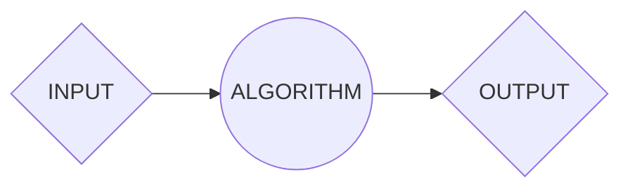
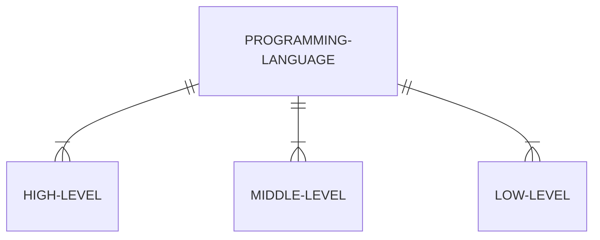
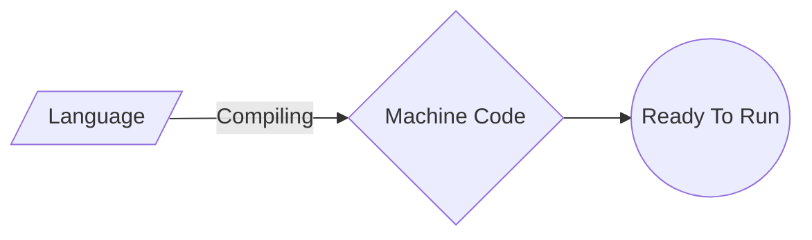
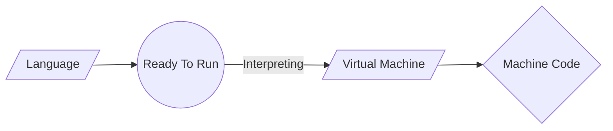

## Introduction

We will go over the language's historical evolution, its applications and relevance, the intricate compilation process, and fundamental programming concepts that are shared across many of the most popular programming languages.

Although this isn't an exhaustive guide, it provides a panoramic overview, offering coding novices a high-level understanding of pivotal C concepts. While each programming language possesses unique syntax and methodologies, a solid grasp of these universal principles will undoubtedly enhance your coding journey and facilitate the assimilation of new technologies in the future.

## Computational Thinking

> *"Solving human's problems by analisis and system conception that simulate human behavior against that problem."*

That was a phrase that i heard from a incredible teacher in my first year of **Computer Engineer** in **Universidade de São Paulo (USP)**, and it really changed my mentality as a student.

Computational Thinking is a *problem-solving* technique that imitates the process computer programmers go through when writing computer programmes and algorithms. This process requires programmers to break down complex problems and scenarios into bite size pieces that can be fully understood in order to then develop solutions that are clear to both computers and humans. 

In short, computational thinking encourages people to approach any problem in a systematic manner, and to develop and articulate solutions in terms that are simple enough to be executed by a computer – or another person. 

#### Four main aspects of Computational Thinking

* **Decomposition:** Breaking down a big problem into small, manageable parts
* **Pattern Recognition:** Observing similarities and patterns in these smaller parts, to help us solve complex problems more efficiently
* **Abstraction:** Identifying and extracting the important parts of the problem
* **Algorithm:** Creating the step-by-step instructions of solving the problem

> *"Computational thinking is a way humans solve problems; it is not trying to get humans to think like computers. Computers are dull and boring; humans are clever and imaginative. We humans make computers exciting."* Jeanette M. Wing,


## Algorithm

An algorithm is a procedure used for solving a problem or performing a computation. Algorithms act as an exact list of instructions that conduct specified actions step by step in either hardware- or software-based routines.

Algorithms are more than just programming, they are specifications for performing calculations, data processing, automated reasoning or decision making for example.

### How do Algorithms Work

Algorithms work by following a set of instructions or rules to complete a task or solve a problem. They can be expressed as natural languages, programming languages, pseudocode, flowcharts and control tables. 


> *Input: The collected data that will be passed to the algorithm*  
> *Algorithm: The input will be passed to the processing unit, producing the desired output.*  
> *Ouput: The outcome expected or result of the program.*

#

### You may ignore it, but you use algorithms everyday

Every time you cook or play a song, you follow a set of steps to produce a final product of your expectative. If you were asked to write down instructions to make your own recipe, you could create your own algorithm. 

As instance, you can simply do an algorithm to check whether a number is prime or not.

```
Step 1: Start
Step 2: Declare variables n, i, flag.
Step 3: Initialize variables
        flag ← 1
        i ← 2  
Step 4: Read n from the user.
Step 5: Repeat the steps until i=(n/2)
     5.1 If remainder of n÷i equals 0
            flag ← 0
            Go to step 6
     5.2 i ← i+1
Step 6: If flag = 0
           Display n is not prime
        else
           Display n is prime
Step 7: Stop 
```
#

### Types of Algorithms:

There are several types of algorithms, all designed to accomplish different tasks:

* **Brute Force Algorithm:** It is the simplest approach for a problem. A brute force algorithm is the first approach that comes to finding when we see a problem.

* **Recursive Algorithm:** A recursive algorithm is based on recursion. In this case, a problem is broken into several sub-parts and called the same function again and again.

* **Backtracking Algorithm:** The backtracking algorithm basically builds the solution by searching among all possible solutions. Using this algorithm, we keep on building the solution following criteria. Whenever a solution fails we trace back to the failure point and build on the next solution and continue this process till we find the solution or all possible solutions are looked after.

* **Searching Algorithm:** Searching algorithms are the ones that are used for searching elements or groups of elements from a particular data structure. They can be of different types based on their approach or the data structure in which the element should be found.

* **Hashing Algorithm:** Hashing algorithms work similarly to the searching algorithm. But they contain an index with a key ID. In hashing, a key is assigned to specific data.

* **Divide and Conquer Algorithm:** This algorithm breaks a problem into sub-problems, solves a single sub-problem and merges the solutions together to get the final solution. It consists of the following three steps: Divide , Solve and Combine.

* **Dynamic Programming Algorithm:** This algorithm uses the concept of using the already found solution to avoid repetitive calculation of the same part of the problem. It divides the problem into smaller overlapping subproblems and solves them.


## Pseudocode

Pseudocode is an informal way of programming description that does not require any strict *programming language synta*x or *underlying technology* considerations. Although pseudocode is a *syntax-free* description of an algorithm, it must provide a full description of the algorithm’s logic so that moving from pseudocode to implementation is merely a task of translating each line into code. Therefore, pseudocode it is used for creating an outline or a rough draft of a program.

### Advantages of Pseudocode

* Improves the readability of any approach. It’s one of the best approaches to start implementation of an algorithm.
* Acts as a bridge between the program and the algorithm or flowchart. Also works as a rough documentation, so the program of one developer can be understood easily when a pseudocode is written out. In industries, the approach of documentation is essential. And that’s where a pseudocode proves vital.
* The main goal of a pseudocode is to explain what exactly each line of a program should do, hence making the code construction phase easier for the programmer.

#

### How to Write a Pseudocode

Pseudo-code is an informal way to express the design of a computer program or an algorithm. The aim is to get the idea quickly and also easy to read without details. There are several ways of writing pseudo-code;
there are no strict rules, but always try to reduce ambiguity between what you are required to do and what you express.

#### Add Two Numbers
```julia
BEGIN
DECLARE AN INTEGER VARIABLE a    // a is the value of the first number
DECLARE AN INTEGER VARIABLE b    // b is the value of the second number
DECLARE AN INTEGER VARIABLE sum  // sum is the sum between a and b

PRINT ("INPUT NUMEBR 1: ")       // The program outputs the message  "INPUT NUMEBR 1: ".
INPUT a                          // The value passed is stored in a variable

PRINT ("INPUT NUMEBR 2: ")       // The program outputs the message  "INPUT NUMEBR 2: "
INPUT b                          // The value passed is stored in b variable

sum <- a + b                     // The sum between a and b is store in the sum variable
PRINT sum                        // The program outputs the determined result
END
```
> ***This pseudocode describes a program that takes two numbers as input from the user, adds them together and outputs the sum.***

#### Check a Number is Positive or Negative

```julia
BEGIN
DECLARE AN INTEGER NUMBER num        // num is the value of the given number 
 
PRINT ("ENTER A NUMBER: ")           // The program outputs the message "ENTER A NUMBER: ".
INPUT num                            // The value passed is stored in num variable
 
IF num > 0 THEN                      // The program checks if "num" is greater than zero.
  PRINT ("GIVEN NUMBER IS POSITIVE"  // If checks, outputs the message "GIVEN NUMBER IS POSITIVE".
ELSE IF num < 0 THEN                 // The program checks if "num" is less than zero
  PRINT ("GIVEN NUMBER IS NEGATIVE"  // If checks, outputs the message "GIVEN NUMBER IS NEGATIVE".
ELSE                                 // If neither condition checked do the following command
  PRINT ("GIVEN NUMBER IS ZERO")     // The program outputs the message "GIVEN NUMBER IS ZERO".
ENDIF
END
```

> ***This pseudocode describes a program that determines if a number entered by the user is positive, negative, or zero.***

## Programming Language

A programming language is a way for programmers (developers) to communicate with computers. Programming languages consist of a set of rules that allows string values to be converted into various ways of generating machine code, or, in the case of visual programming languages, graphical elements.

### Low-Level vs. High-Level Programming Languages
Programming languages fall into two most usual classifications — low-level and high-level.

#### Low-Level
Low-Level programming languages are closer to *machine code*, or *binary*. Therefore, they’re more difficult for humans **to read**. The benefit of *low-level languages* is that they’re **fast** and offer **precise control** over how the computer will function.

#### High-Level
High-Level programming languages are closer to how **humans communicat**e. *High-level languages* use words (like object, order, run, class, etc.) that are closer to the words we use in our everyday lives. This means they’re easier to understand than *low-level programming languages*, although they do take more **time to translate** into *machine code* for the computer.



> ***A middle-level programming lies between the low-level and high-level programming language. It's advantages are that it supports the features of high-level programming, it is a user-friendly language, and closely related to machine language and human language.***

#

### Interpreted vs. Compiled Languages 

Programming languages can be broadly categorized into two types based on how they are processed: compiled and interpreted. 

#### Compiled Languages

Compiled programming languages are those in which the *source code* is compiled into *machine code* before it is executed. Machine code is a *low-level language* that can be executed directly by the computer’s CPU. When a program written in a compiled language is compiled, the source code is converted into an executable file that can be run on the target machine. However, the compiled code is hardware dependent.



> ***Examples: C, C++, C#, CLEO, COBOL, etc.***

#### Interpreted Languages

Interpreted programming languages, on the other hand, are those in which the source code is executed directly by an interpreter, without being compiled into machine code first. The interpreter reads the source code line by line and executes each line as it is read. The interpreter is responsible for translating the source code into machine code at runtime.



> ***Examples: JavaScript, Perl, Python, BASIC, etc.***

## Introduction to C Programming Language

C stands out as a powerful, low-level programming language renowned for its efficiency and versatility. Unlike Python, C emphasizes manual memory management and explicit variable type declarations. Its design philosophy prioritizes performance and control over ease of use, making it a preferred choice for systems programming and other scenarios where direct control over hardware is crucial.

One of C's distinctive features is its static typing, requiring explicit variable type declarations, which allows for efficient memory allocation and manipulation. This design choice gives developers fine-grained control over hardware resources, making C suitable for tasks like device drivers, operating systems, and embedded systems programming.

C's syntax is not as forgiving as Python's, and it doesn't utilize significant indentation for code structuring. Instead, C relies on braces to define code blocks, which can be challenging for newcomers but offers precise control over program flow.

The language's versatility allows developers to implement various programming paradigms, including procedural, object-oriented, and low-level programming. C is often chosen for its ability to produce efficient and fast-running code, making it an ideal language for performance-critical applications.

C was created by [Dennis Ritchie](https://en.wikipedia.org/wiki/Dennis_Ritchie) in the early 1970s at Bell Labs as an evolution of the [B programming language](https://en.wikipedia.org/wiki/B_(programming_language)). The language gained popularity due to its simplicity, efficiency, and ability to access low-level features of computer hardware. Over the years, C has influenced the development of many other programming languages, including C++, C#, and Objective-C.

#

### Why Do People Use C?

As developers explore the programming landscape, the choice of C is often influenced by its specific strengths and use cases. Here are some primary factors frequently cited by C developers:

1. **Performance:**  
   C is known for its high performance, making it a preferred language for applications where speed is critical. Its efficient memory management and low-level access to hardware contribute to its reputation as one of the fastest programming languages.

2. **Control Over Hardware:**  
   C provides direct access to memory addresses and hardware resources, allowing developers precise control over system-level details. This feature is crucial for systems programming, device drivers, and other scenarios where low-level control is essential.

3. **Efficient Memory Management:**  
   Unlike languages with automatic garbage collection, C requires manual memory management. While this adds complexity, it allows developers to fine-tune memory usage for optimal performance, making it suitable for resource-constrained environments.

4. **Portability:**  
   C programs can be highly portable across different platforms, with compilers available for a wide range of architectures. This portability is valuable for developing software that needs to run on diverse hardware.

5. **Legacy Systems and Embedded Systems:**  
   Many legacy systems and embedded systems are written in C due to its efficiency and ability to interact with hardware at a low level. C's small runtime footprint also makes it suitable for embedded systems with limited resources.

6. **Extensive Libraries:**  
   C has a rich set of libraries, and its influence on other languages means that many libraries are written in or have bindings for C. This extensive library support is beneficial for developers working on a variety of projects.

While C's syntax and manual memory management can be challenging for beginners, its power and efficiency make it a language of choice for experienced developers working on performance-critical applications.

#

### What Can I Do with C?

C's capabilities extend across a broad spectrum of applications, from systems programming to embedded systems development. Here are some common use cases for C:

1. **Systems Programming:** C is widely used for systems programming tasks, including the development of operating systems, device drivers, and system utilities. Its low-level access to hardware and efficient memory management make it well-suited for these applications.

2. **Embedded Systems Development:** Many embedded systems, such as those in IoT devices, microcontrollers, and real-time systems, are programmed in C. The language's ability to interact with hardware at a low level is crucial for developing software for these systems.

3. **Game Development:** C has been a popular choice for game development, especially for performance-intensive tasks like graphics rendering and physics simulations. While higher-level languages like C++ are now commonly used in game development, C still plays a significant role in certain aspects.

4. **Compilers and Interpreters:** C is often used to write compilers and interpreters for other programming languages. Its efficiency and ability to generate optimized machine code make it suitable for this purpose.

5. **Networking Software:** C is commonly employed for developing networking software, including protocols, network drivers, and server applications. Its performance and low-level control are advantageous in networking contexts.

6. **Operating Systems Development:** C is the language of choice for developing operating systems due to its ability to interact with hardware at a low level. Many popular operating systems, including Unix, Linux, and portions of Windows, are written in C.

7. **High-Performance Computing:** C is well-suited for high-performance computing applications, such as scientific simulations and data processing, where efficient use of computational resources is crucial.

While C may not be as beginner-friendly as some higher-level languages, its efficiency and control over hardware make it an essential tool for developers working on a diverse range of projects.

#

### C as a Compiler and Software Package

Unlike Python, which is primarily interpreted, C is typically compiled before execution. Compilation is the process of translating human-readable source code into machine-readable binary code that can be executed by a computer. This compiled code is then executed directly by the computer's hardware.

Upon installation of a C compiler on a machine, developers can use it to compile their C source code into executable files. The compilation process involves several steps, including preprocessing, compiling, assembling, and linking. The result is an executable file that can be run independently of the original source code.

C compilers are available for various platforms, and the compiled code is often platform-specific. This means that developers may need to recompile their code when moving it to a different platform.

In summary:
- **Compilation Process:** C code is compiled into machine-readable code before execution.
- **Executable Files:** The result of compilation is an executable file that can be run independently.
- **Platform-Specific:** Compiled code is often platform-specific, requiring recompilation for different platforms.

C can be obtained from various sources, including official websites of compiler vendors or package managers on [Unix-like systems](https://en.wikipedia.org/wiki/Unix-like#:~:text=Some%20well-known%20examples%20of,used%20on%20Unix-like%20systems.). The installation process typically involves downloading the compiler package and following the provided instructions.

#

### What Are C’s Technical Strengths?

C's technical strengths contribute to its enduring popularity and continued use in various domains. Here are some key technical features that make C a powerful programming language:

**1. Low-Level Access:**  
   C provides low-level access to memory addresses and hardware resources, allowing developers to write code that interacts closely with the underlying system. This level of control is essential for systems programming and tasks requiring precise management of hardware resources.

**2. Efficiency and Performance:**  
   C is known for its efficiency and high performance. The language's minimal runtime overhead and direct control over hardware resources make it suitable for applications where speed is a critical factor, such as operating systems and performance-intensive computations.

**3. Manual Memory Management:**  
   While manual memory management adds complexity, it provides developers with fine-grained control over memory usage. This control is crucial for optimizing performance in resource-constrained environments and applications with specific memory requirements.

**4. Portability:**  
   C programs can be highly portable across different platforms. As long as a C compiler is

 available for a specific architecture, C code can be compiled and run on that platform with minimal modification. This portability is advantageous for developers working on cross-platform projects.

**5. Versatility:**  
   C's versatility allows developers to implement various programming paradigms, including procedural, object-oriented, and low-level programming. This flexibility makes C suitable for a wide range of applications, from systems programming to embedded systems development.

**6. Influence on Other Languages:**  
   C has had a significant influence on the development of many other programming languages, including C++, C#, and Objective-C. Concepts and features introduced in C have shaped the design of subsequent languages, making C a foundational language in the programming landscape.

**7. Standardization:**  
   C has undergone standardization processes, with the most widely adopted standard being the ANSI C standard. This standardization ensures a consistent and well-defined set of features across different compilers, promoting code portability and interoperability.

**8. Compilation Model:**  
   The compilation model of C allows developers to produce standalone executable files, providing a level of abstraction between source code and machine code. This model allows for efficient execution and distribution of compiled programs.

In summary, C's technical strengths, including low-level access, efficiency, manual memory management, portability, versatility, influence on other languages, standardization, and the compilation model, make it a robust and enduring programming language.

### Downsides of C

While C has many strengths, it is essential to consider its downsides. One primary drawback is its learning curve and the potential for error due to manual memory management. C has a steeper learning curve compared to higher-level languages, especially for beginners. The manual memory management and low-level features can be challenging to grasp initially. Manual memory management in C can lead to errors such as memory leaks, buffer overflows, and dangling pointers. Developers must be meticulous in managing memory to avoid these issues.

C lacks modern abstractions found in higher-level languages, such as garbage collection and advanced data structures. Developers need to implement these features manually, adding complexity to the code. While C offers portability, writing platform-specific code may be necessary for certain tasks, complicating cross-platform development. C code can be verbose compared to higher-level languages, and achieving certain tasks may require more lines of code, potentially leading to increased development time. The standard library of C is relatively minimal compared to some higher-level languages, and developers may need to rely on third-party libraries for certain functionalities.

Despite these downsides, C remains a powerful language with a rich history and continues to be widely used in various domains.

#

### The C Programming Environment

Unlike Python's interactive shell or IDLE, C developers typically use a combination of text editors and command-line tools for coding and compiling. Popular text editors for C development include [Visual Studio Code](https://code.visualstudio.com), [Sublime Text](https://www.sublimetext.com), and [Vim](https://www.vim.org), which provide features like syntax highlighting and code completion.

The typical C development workflow involves writing C source code files with a text editor and then using a C compiler to translate the source code into machine-readable binary code. The compiled executable can then be run independently of the source code.


> ***Note:** Note: Visual Studio Code (IDE).*

#

### GCC Basics

When GCC starts, the primary C shell window opens, initiating an interactive session with the familiar >>> prompt. This main window functions as an interactive testing tool where code is executed immediately after input. Syntax-directed colorization is employed in both the main window and text edit windows, highlighting keywords and literals to provide a clearer view of code components.

GCC uses menus with keyboard shortcuts for various operations. To create or edit a source code file, users can open a text edit window through the File menu. Syntax-directed colorization is applied to provide a visual distinction between different components in the code.

Running a file of code in GCC involves selecting the file's text edit window, opening the Run menu, and choosing the Run Module option. C prompts users to save the file if changes have been made. The output and any error messages generated by the script are displayed in the main interactive window, indicating the script's execution.

Despite its advantages, it's worth noting that GCC's execution speed may not match that of fully compiled languages like C and C++. However, for many developers, the benefits of GCC's ease of use and integrated features outweigh the potential downsides related to execution speed.

</img>

> ***Note:** Note: CMD.*
#

### Using GCC

Utilizing GCC provides a free, user-friendly, and portable environment for C language development, especially suitable for newcomers to C programming. While it may not offer the advanced features of some commercial IDEs, it simplifies the learning process by hiding certain details and not assuming prior experience with system command lines. However, there are some considerations and common pitfalls that GCC beginners should be aware of:

1. **Explicitly Add ".c" Extension:** When saving files in GCC, users must explicitly add the ".c" extension to filenames. GCC does not automatically append this extension, and failing to add it manually may cause issues when importing files.

2. **Run Module Option:** To run scripts in GCC, it is recommended to use the Run→Run Module option in text edit windows rather than interactive imports and reloads. This ensures the most current version of the file is executed, and GCC prompts users to save changes if necessary.

3. **Reload Modules When Testing Interactively:** When using GCC, reloading modules is only necessary for modules being tested interactively. The Run→Run Module option automatically runs the current version of both the top-level file and any imported modules.

4. **Customization:** GCC allows customization of text fonts, colors, key combinations, and indentation settings. Users can access these options through the Configure and Help menus.

5. **No Clear-Screen Option:** GCC currently lacks a clear-screen option. Users can press and hold the Enter key or use a C loop to print blank lines if they want to clear the interactive window's text.

6. **Compatibility with GUI tkinter and Threaded Programs:** Certain advanced C/tkinter programs may not work well with GCC, especially those involving multithreading. It is recommended to use other options, such as icon clicks or system command lines, to launch GUI programs edited in GCC.

7. **Connection Errors:** If connection errors arise, starting GCC in single-process mode using the -n command-line flag may resolve the issue. This is particularly useful in cases where communication between separate user and GUI processes encounters problems.

8. **Beware of GCC Usability Features:** GCC introduces some usability features that may not apply outside its environment. Variables in scripts automatically show up in the GCC interactive session, and the directory of a recently run file is automatically added to the module import search path. While these features can be handy in GCC, users should be aware that they are specific to GCC and may not behave the same way outside the IDE.

#

### Advanced GCC Tools

Beyond basic editing and running capabilities, GCC provides advanced features such as a point-and-click program debugger and an object browser. These features can enhance the development and debugging process, offering more insights into code behavior. Here's an overview of these advanced tools:

**Debugger:**
- **Breakpoints:** Easily set breakpoints in your code by right-clicking on lines in the text edit windows, allowing you to halt code execution at specific points for detailed inspection.
- **Variable Inspection:** The debugger facilitates the inspection of variable values during runtime, offering valuable insights into your program's state.
- **Execution Watching:** Follow the execution flow by stepping through your code, line by line.

**Object Browser:**
- **Access:** The object browser is accessible through the File menu in GCC.
- **Navigation:** Utilize the browser to traverse the module search path, exploring files and objects. Clicking on a file or object opens the corresponding source in a text edit window.

**Quick Error Navigation:**
- **Fast Error Resolution:** Accelerate error resolution by right-clicking on the text of an error message to quickly jump to the line of code where the error occurred. This feature simplifies the debugging process and speeds up error resolution.

**Text Editor Tools:**
- **Advanced Text Operations:** GCC's text editor provides a range of programmer-friendly tools, including automatic indentation and advanced text and file search operations.
- **Intuitive GUI Interactions:** Leveraging intuitive GUI interactions, GCC promotes user-friendliness and encourages experimentation with its tools.

These advanced features make GCC a powerful integrated development environment (IDE) for C language, providing a comprehensive set of tools for editing, running, debugging, and exploring code. Experimenting with these tools within the live system will help users become familiar with their functionalities and enhance their C development experience.

#

### Other Development Environments

In addition to GCC, which is a standard and free option for C language development, there are several other IDEs available that offer more advanced features and are widely used in the programming community. A popular alternative is [Code::Blocks](http://www.codeblocks.org/), which offers a user-friendly graphical interface and C language support.

Another robust option is [Dev-C++](https://sourceforge.net/projects/orwelldevcpp/), a complete environment that includes syntax coloring, advanced text editing, debugging, and even a graphical user interface (GUI) builder for interactive development.

The [Eclipse IDE](https://www.eclipse.org/ide/) is also a powerful choice, providing features such as autocompletion, automatic indentation, and debugging tools for C developers.

JetBrains' [CLion](https://www.jetbrains.com/clion/) is a professional option that offers advanced features like static code analysis and test support, making it suitable for complex C language projects.

There are several other options, such as [Geany](https://www.geany.org/), [Visual Studio Code](https://code.visualstudio.com/), [Sublime Text](https://www.sublimetext.com/), and [Atom](https://atom.io/), each with its own features and advantages. The choice between these IDEs often depends on personal preferences and specific project requirements. Trying out different environments can help developers find the tool that best suits their needs and workflow.


## Conclusion

In conclusion, this exploration provides an overview of the C programming language, highlighting its strengths, use cases, technical features, and downsides. C's efficiency, low-level access, and versatility make it a crucial tool for developers working on performance-critical applications, systems programming, and embedded systems development.

Whether you're a newcomer considering the challenges of manual memory management or an experienced developer leveraging C's power for high-performance computing, understanding the nuances of C is essential for making informed decisions in your programming journey. C's enduring influence on the programming landscape and its foundational role in shaping other languages underscore its significance in the world of software development.


---
