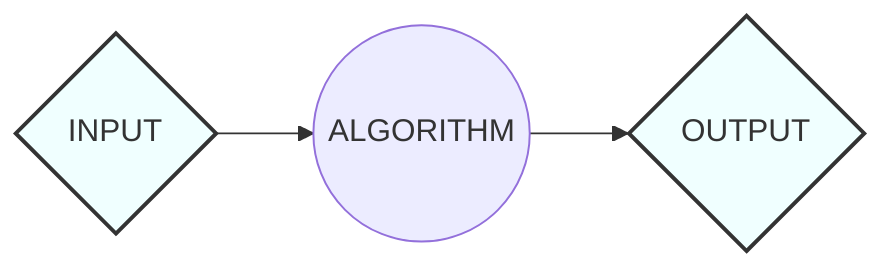
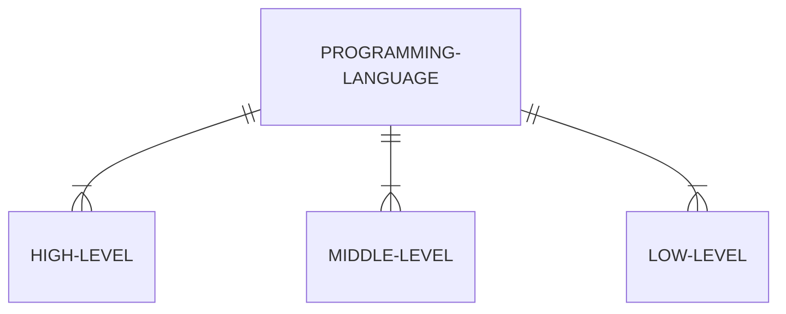
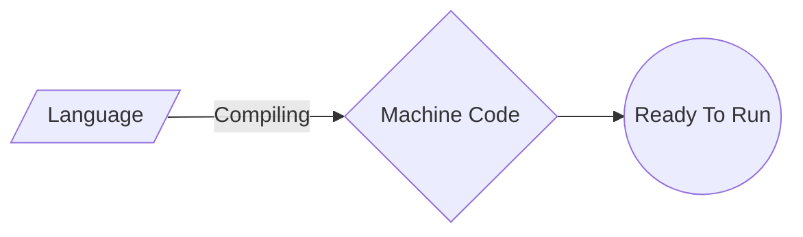
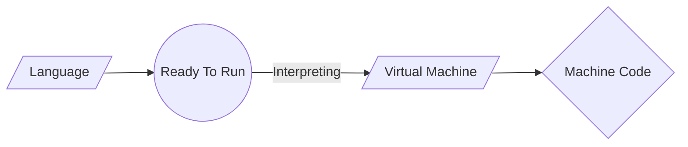

## Introduction

We will go over the language's historical evolution, its applications and relevance, the intricate compilation process, and fundamental programming concepts that are shared across many of the most popular programming languages.

Although this isn't an exhaustive guide, it provides a panoramic overview, offering coding novices a high-level understanding of pivotal C concepts. While each programming language possesses unique syntax and methodologies, a solid grasp of these universal principles will undoubtedly enhance your coding journey and facilitate the assimilation of new technologies in the future.

## Computational Thinking

> *"Solving human's problems by analisis and system conception that simulate human behavior against that problem."*

That was a phrase that i heard from a incredible teacher in my first year of **Computer Engineer** in **Universidade de São Paulo (USP)**, and it really changed my mentality as a student.

Computational Thinking is a *problem-solving* technique that imitates the process computer programmers go through when writing computer programmes and algorithms. This process requires programmers to break down complex problems and scenarios into bite size pieces that can be fully understood in order to then develop solutions that are clear to both computers and humans. 

In short, computational thinking encourages people to approach any problem in a systematic manner, and to develop and articulate solutions in terms that are simple enough to be executed by a computer – or another person. 

#### Four main aspects of Computational Thinking

* **Decomposition:** Breaking down a big problem into small, manageable parts
* **Pattern Recognition:** Observing similarities and patterns in these smaller parts, to help us solve complex problems more efficiently
* **Abstraction:** Identifying and extracting the important parts of the problem
* **Algorithm:** Creating the step-by-step instructions of solving the problem

> *"Computational thinking is a way humans solve problems; it is not trying to get humans to think like computers. Computers are dull and boring; humans are clever and imaginative. We humans make computers exciting."* Jeanette M. Wing,


## Algorithm

An algorithm is a procedure used for solving a problem or performing a computation. Algorithms act as an exact list of instructions that conduct specified actions step by step in either hardware- or software-based routines.

Algorithms are more than just programming, they are specifications for performing calculations, data processing, automated reasoning or decision making for example.

### How do Algorithms Work

Algorithms work by following a set of instructions or rules to complete a task or solve a problem. They can be expressed as natural languages, programming languages, pseudocode, flowcharts and control tables. 


> *Input: The collected data that will be passed to the algorithm*  
> *Algorithm: The input will be passed to the processing unit, producing the desired output.*  
> *Ouput: The outcome expected or result of the program.*

#

### You may ignore it, but you use algorithms everyday

Every time you cook or play a song, you follow a set of steps to produce a final product of your expectative. If you were asked to write down instructions to make your own recipe, you could create your own algorithm. 

As instance, you can simply do an algorithm to check whether a number is prime or not.

```
Step 1: Start
Step 2: Declare variables n, i, flag.
Step 3: Initialize variables
        flag ← 1
        i ← 2  
Step 4: Read n from the user.
Step 5: Repeat the steps until i=(n/2)
     5.1 If remainder of n÷i equals 0
            flag ← 0
            Go to step 6
     5.2 i ← i+1
Step 6: If flag = 0
           Display n is not prime
        else
           Display n is prime
Step 7: Stop 
```
#

### Types of Algorithms:

There are several types of algorithms, all designed to accomplish different tasks:

* **Brute Force Algorithm:** It is the simplest approach for a problem. A brute force algorithm is the first approach that comes to finding when we see a problem.

* **Recursive Algorithm:** A recursive algorithm is based on recursion. In this case, a problem is broken into several sub-parts and called the same function again and again.

* **Backtracking Algorithm:** The backtracking algorithm basically builds the solution by searching among all possible solutions. Using this algorithm, we keep on building the solution following criteria. Whenever a solution fails we trace back to the failure point and build on the next solution and continue this process till we find the solution or all possible solutions are looked after.

* **Searching Algorithm:** Searching algorithms are the ones that are used for searching elements or groups of elements from a particular data structure. They can be of different types based on their approach or the data structure in which the element should be found.

* **Hashing Algorithm:** Hashing algorithms work similarly to the searching algorithm. But they contain an index with a key ID. In hashing, a key is assigned to specific data.

* **Divide and Conquer Algorithm:** This algorithm breaks a problem into sub-problems, solves a single sub-problem and merges the solutions together to get the final solution. It consists of the following three steps: Divide , Solve and Combine.

* **Dynamic Programming Algorithm:** This algorithm uses the concept of using the already found solution to avoid repetitive calculation of the same part of the problem. It divides the problem into smaller overlapping subproblems and solves them.


## Pseudocode

Pseudocode is an informal way of programming description that does not require any strict *programming language synta*x or *underlying technology* considerations. Although pseudocode is a *syntax-free* description of an algorithm, it must provide a full description of the algorithm’s logic so that moving from pseudocode to implementation is merely a task of translating each line into code. Therefore, pseudocode it is used for creating an outline or a rough draft of a program.

### Advantages of Pseudocode

* Improves the readability of any approach. It’s one of the best approaches to start implementation of an algorithm.
* Acts as a bridge between the program and the algorithm or flowchart. Also works as a rough documentation, so the program of one developer can be understood easily when a pseudocode is written out. In industries, the approach of documentation is essential. And that’s where a pseudocode proves vital.
* The main goal of a pseudocode is to explain what exactly each line of a program should do, hence making the code construction phase easier for the programmer.

#

### How to Write a Pseudocode

Pseudo-code is an informal way to express the design of a computer program or an algorithm. The aim is to get the idea quickly and also easy to read without details. There are several ways of writing pseudo-code;
there are no strict rules, but always try to reduce ambiguity between what you are required to do and what you express.

#### Add Two Numbers
```julia
BEGIN
DECLARE AN INTEGER VARIABLE a    // a is the value of the first number
DECLARE AN INTEGER VARIABLE b    // b is the value of the second number
DECLARE AN INTEGER VARIABLE sum  // sum is the sum between a and b

PRINT ("INPUT NUMEBR 1: ")       // The program outputs the message  "INPUT NUMEBR 1: ".
INPUT a                          // The value passed is stored in a variable

PRINT ("INPUT NUMEBR 2: ")       // The program outputs the message  "INPUT NUMEBR 2: "
INPUT b                          // The value passed is stored in b variable

sum <- a + b                     // The sum between a and b is store in the sum variable
PRINT sum                        // The program outputs the determined result
END
```
> ***This pseudocode describes a program that takes two numbers as input from the user, adds them together and outputs the sum.***

#### Check a Number is Positive or Negative

```julia
BEGIN
DECLARE AN INTEGER NUMBER num        // num is the value of the given number 
 
PRINT ("ENTER A NUMBER: ")           // The program outputs the message "ENTER A NUMBER: ".
INPUT num                            // The value passed is stored in num variable
 
IF num > 0 THEN                      // The program checks if "num" is greater than zero.
  PRINT ("GIVEN NUMBER IS POSITIVE"  // If checks, outputs the message "GIVEN NUMBER IS POSITIVE".
ELSE IF num < 0 THEN                 // The program checks if "num" is less than zero
  PRINT ("GIVEN NUMBER IS NEGATIVE"  // If checks, outputs the message "GIVEN NUMBER IS NEGATIVE".
ELSE                                 // If neither condition checked the program do the following command
  PRINT ("GIVEN NUMBER IS ZERO")     // The program outputs the message "GIVEN NUMBER IS ZERO".
ENDIF
END
```

> ***This pseudocode describes a program that determines if a number entered by the user is positive, negative, or zero.***

## Programming Language

A programming language is a way for programmers (developers) to communicate with computers. Programming languages consist of a set of rules that allows string values to be converted into various ways of generating machine code, or, in the case of visual programming languages, graphical elements.

### Low-Level vs. High-Level Programming Languages
Programming languages fall into two most usual classifications — low-level and high-level.

#### Low-Level
Low-Level programming languages are closer to *machine code*, or *binary*. Therefore, they’re more difficult for humans **to read**. The benefit of *low-level languages* is that they’re **fast** and offer **precise control** over how the computer will function.

#### High-Level
High-Level programming languages are closer to how **humans communicat**e. *High-level languages* use words (like object, order, run, class, etc.) that are closer to the words we use in our everyday lives. This means they’re easier to understand than *low-level programming languages*, although they do take more **time to translate** into *machine code* for the computer.



> ***A middle-level programming lies between the low-level and high-level programming language. It's advantages are that it supports the features of high-level programming, it is a user-friendly language, and closely related to machine language and human language.***

#

### Interpreted vs. Compiled Languages 

Programming languages can be broadly categorized into two types based on how they are processed: compiled and interpreted. 

#### Compiled Languages

Compiled programming languages are those in which the *source code* is compiled into *machine code* before it is executed. Machine code is a *low-level language* that can be executed directly by the computer’s CPU. When a program written in a compiled language is compiled, the source code is converted into an executable file that can be run on the target machine. However, the compiled code is hardware dependent.



> ***Examples: C, C++, C#, CLEO, COBOL, etc.***

#### Interpreted Languages

Interpreted programming languages, on the other hand, are those in which the source code is executed directly by an interpreter, without being compiled into machine code first. The interpreter reads the source code line by line and executes each line as it is read. The interpreter is responsible for translating the source code into machine code at runtime.



> ***Examples: JavaScript, Perl, Python, BASIC, etc.***

## Introduction To C Language

Created in the 1970s by *Dennis Ritchie*, the c language remains very widely used and influential. By design, C's features cleanly reflect the capabilities of the targeted CPUs. C is commonly used on computer architectures that range from the largest supercomputers to the smallest microcontrollers and embedded systems.

C is an imperative procedural language, supporting structured programming, lexical variable scope and recursion, with a static type system. It was designed to be compiled to provide low-level access to memory and language constructs that map efficiently to machine instructions, all with minimal runtime support.

```c
#include <stdio.h>
#include <stdlib.h>

int main(int argv, char *argc[])
{
  printf("%s\n", "Hello World!");
  return 0;
}
``` 

---
