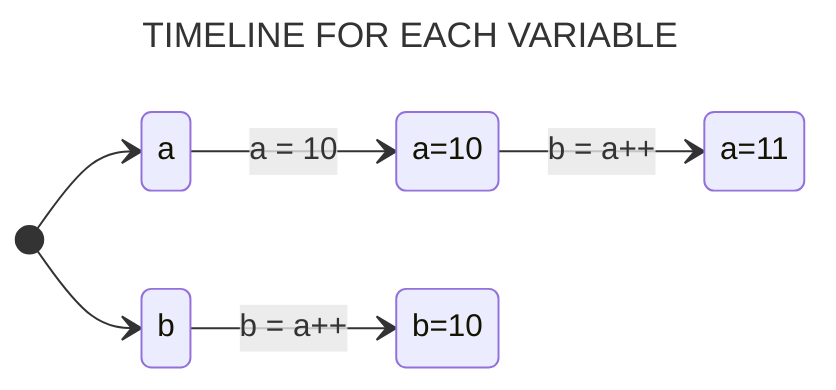

## Introduction

To master C is not just about learning a language; it's about gaining a profound understanding of programming principles. C strikes a balance between abstraction and hardware control, enabling you to craft effective programs and transfer knowledge to other languages.

In this guide, we will delve deep into the key topics encompassing the C language, starting with the most basic concepts and progressing to more advanced subjects. You will learn to write functional code, grasp memory management, and explore the construction of efficient data structures and algorithms.

---

## Variables

Variables hold and point to a value. They act as a *reference* or *abstraction* to literal data. That data is stored in the computer's memory, and takes up an certain amount of space, so we can retrieve it later and use when we need to.

In the simplest terms, you can think of variables as a **named box**. A box that acts as a *storage place* and *location* for holding different information. 

Each box has a **unique name** which acts like a label put on the outside that is a unique identifier, and the information/content lives on the inside. The content is the variable's value.

#### Example: Adding Two Numbers

```c
#include <stdio.h>

int main(int argc, char *argv[])
{
  int a, b, sum;           // Declaring three scope interger variables

  a = 10;                  // Assignment inline of variable a
  b = 5;                   // Assignment inline of variable b

  sum = a + b;             // Assignment to sum variable the result between the sum of a and b
  return 0;
}
```
> *In this example was declared three integer data type variables which were used to store three values: a, b and sum.*

#

### Declaration and Initialization of Variables

The C programming language is a ***strongly statically typed*** language, unlike many other modern programming languages. In ***statically typed*** languages, you need to explicitly declare your variables to be of a certain *data type*. That way the compiler knows during compilation time if the variable is able to perform the actions it was set out and requested to do.

The purpose of specifying the variable type to our compiler (virtual machine) for code interpretation is due to the fact that in C, we are working directly with the allocation of a physical memory space present in the machine in question.

Thus, by indicating the variable *data type* we will work with, our machine will allocate a space of a specific size so that this variable - *access key* - can have a value *assigned* to it.

> [!NOTE]
> *Use the `=` or assignment operator to assign a value to a variable.*

#

### Declaring a Variable

When declaring a new variable in the C language, it's necessary to specify to the compiler what type of data will be assigned to that variable - access key. This way, when compiled in the future (program), the compiler will know what type of information is stored in that particular variable.

```c
#include <stdio.h>

int main(int argc, char *argv[])
{
  int age;     // int is the data type and age is the unique acess key to this variable

  int n1, n2   // We can also declare multiple variables at once.
  return 0;
}
```

> *To declare a variable, you specify the **data type**, and give a **name** - **acess key** - to the variable.*

#### So, what is the difference between initialising and declaring a variable?

#

### Initializing a Variable

When we declare a variable, we are simply defining its *data type* and a *unique access key* for that variable, as shown in the previous example.

We don't need to specify or assign a value immediately to all the variables we declare in our program. By merely declaring a variable, a memory space on our machine has already been reserved for that *access key*.

#### If we declare a variable and assign it a value at once, this is called initialising the variable.

```c
#include<stdio.h>

int main(int argc, char *argv[])
{
  int age = 30; // int n = 30; is initializing the variable. It refers to assigning an initial value.
  return 0;
}
```

> [!IMPORTANTE]
> **If the new value is the same data type, we don't need to include the data type, just the new value. If the data type is different, we will get an error.**

```c
int age = 30;   // initializing the variable with the value of 30

age = 34;      //  the new value of age is 34
```

#

<br>

| BEST PRACTICES FOR NAMING VARIABLES IN C. | 
| --- | 
| Names with leading and trailing underscores are reserved for system purposes and should not be used for any user-created names. If you must have your own private identifiers, begin them with a letter or two identifying the package to which they belong. |
| #define constants should be in all CAPS. |
| Enum constants are Capitalized or in all CAPS |
| Function, typedef, and variable names, as well as struct, union, and enum tag names should be in lower case. |
| Many macro "functions" are in all CAPS. Some macros (such as getchar and putchar) are in lower case since they may also exist as functions. |
| Avoid names that differ only in case, like foo and Foo. Similarly, avoid foobar and foo_bar. The potential for confusion is considerable. |
| Similarly, avoid names that look like each other. On many terminals and printers, 'l', '1' and 'I' look quite similar. A variable named 'l' is particularly bad because it looks so much like the constant '1'. |
| In general, global names (including enums) should have a common prefix identifying the module that they belong with. Globals may alternatively be grouped in a global structure. Typedeffed names often have "_t" appended to their name. |
| Avoid names that might conflict with various standard library names. Some systems will include more library code than you want. Also, your program may be extended someday. |

## The scope of a variable in C

The scope of a variable refers to where the variable can be referenced and accessed from. It is essentially where the variable lives and is valid and how visible it is to the rest of the program.

**Local Scope:** If a variable is declared within a set of culry braces, {}, that will be its scope and we can't access it and use it outside those braces in the rest of the program. 

> *Therefore it is not a good idea to declare variables that way since their scope and use is so limited which can lead to errors. This scope is called local scope.*

**Global Scope:** If variables are declared outside of functions, they have global scope. Having a global scope means they are visible within the whole program and can be accessed from anywhere.

> *But keep in mind that it can be difficult to keep track of them. Also, any changes we make to them along the way can get confusing since they can happen in any part and location of the program.*

```c
#include <stdio.h>

float mean, n1, n2;     // Declaration of global variables.

int main(int argc, char *argv[])
{
  n1 = 10;
  n2 = 8;

  mean = ( n1 + n2 ) / 2;
  printf("%s%f", "Mean: ", mean); 
  return 0;
}
```

## #DEFINE and CONST Variables

When we use define for a constant, the preprocessor generates a C program where the defined constant is searched, and the corresponding tokens are replaced by the given expression. This can save space and increase compilation time.

```c
#define number 10
```

Constant variables are regarded as true variables, not macro definitions. Therefore, they allocate a memory space on your machine, just like any other variable.

```c
const int number = 10;
```

The significant advantage of `const` over `#define` is *type checking*. `#define` cannot be *type-checked*, which can cause issues when determining *data types*. If the variable is instead a constant, we can obtain the *data type* stored in that constant variable.

As const variables are considered variables, we can use pointers on them. This means we can perform type casting, manipulate addresses, and everything else you would be able to do with a regular variable, except altering the data itself, as the data assigned to that constant variable remains constant.

In general, `const` is a better option if we have a choice and it can be successfully applied to the code. There are situations where `#define` cannot be replaced by `const`. For example, `#define` can take parameters.

```c
#include <stdio.h>
#define MULTIPLY(a, b) a*b

int main(int argv, char *argc[])
{
  printf("%d", MULTIPLY(2+3, 3+5)); // The macro is expanded as 2 + 3 * 3 + 5, not as 5*8
  return 0;
}
```

> *We can also remove previously defined macros using `#undef MACRO_NAME`*

```c
#include <stdio.h>
#define LIMIT 100

int main(int argv, char *argc[])
{
  printf("%d", LIMIT);
  #undef LIMIT          // Removing defined macro LIMIT
  
  printf("%d", LIMIT);   // This line causes error as LIMIT is not defined
  return 0;
}
```

#

## Data Types


---

## Operators

C features an extensive set of operators that can be used in the manipulation of variables and constants during program execution.

### Arithmetic Operators

Arithmetic operators are mathematical operators that perform mathematical functions on numbers. 

* `+`  - **Addition Operator**
* `-`  - **Subtraction Operator**
* `*`  - **Multiplication Operator**
* `**` - **Power Operator**
* `/`  - **Division Operator**
* `%`  - **Modulo Division Operator**

A particularity of C relates to the fact that the value returned by an *arithmetic expression* is always of the largest *data type* used in the expression.

#### Example: Division by INTEGER and FLOAT Numbers.

```c
#include <stdio.h>

int main(int argv, char *argc[])
{
  int n1 = 2;
  float n2 = 3.3;

  // We are instructing the program to print an integer value resulting from a division involving a real number
  // which results an error.
  printf("%d", (a / b) );

  // The program will print correctly because it has been instructed to print the result within the realm of real numbers.
  printf("%f", (a / b) );
  return 0;
}
```

> [!NOTE]
> **It is possible to cast the result of some operations, which will be approached later.**

#

### Increment and Decrement Operators

The C language allows the use of the unary operators "++" and "--" to *increment* (add 1) or *decrement* (subtract 1) the value of a variable, respectively.
```julia
++X          // X = X + 1 
X++          // X = X + 1

--X          // X = X - 1 
X--          // X = X - 1 
```
As you can see, these operators can be either *prefixed* or *postfixed*. The difference is that when they are *prefixed*, they increment the variable before using its value. When they are *postfixed*, they use the value of the variable before incrementing it.

#### Example: PostFixed
```julia
int a, b;

a = 10;
b = a++;

FINAL RESULT: a = 11; b = 10;
```



#### Example: PreFixed
```julia
int a, b;

a = 10;
b = ++a;

FINAL RESULT: a = 11; b = 11;
```


#

### Reduced Expressions

Reduced expressions are applied in cases where the same variable is on both sides of the assignment statement. 

| &nbsp;&nbsp;&nbsp;&nbsp;&nbsp;&nbsp;&nbsp;&nbsp;&nbsp;&nbsp;&nbsp;&nbsp;&nbsp;&nbsp;&nbsp;&nbsp;&nbsp;&nbsp;&nbsp;&nbsp;&nbsp;&nbsp;&nbsp;&nbsp;&nbsp;&nbsp;&nbsp;&nbsp;&nbsp;&nbsp;&nbsp;&nbsp;&nbsp;&nbsp;&nbsp;**REDUCED EXPRESSION**&nbsp;&nbsp;&nbsp;&nbsp;&nbsp;&nbsp;&nbsp;&nbsp;&nbsp;&nbsp;&nbsp;&nbsp;&nbsp;&nbsp;&nbsp;&nbsp;&nbsp;&nbsp;&nbsp;&nbsp;&nbsp;&nbsp;&nbsp;&nbsp;&nbsp;&nbsp;&nbsp;&nbsp;&nbsp;&nbsp;&nbsp;&nbsp;&nbsp;&nbsp;&nbsp; | &nbsp;&nbsp;&nbsp;&nbsp;&nbsp;&nbsp;&nbsp;&nbsp;&nbsp;&nbsp;&nbsp;&nbsp;&nbsp;&nbsp;&nbsp;&nbsp;&nbsp;&nbsp;&nbsp;&nbsp;&nbsp;&nbsp;&nbsp;&nbsp;&nbsp;&nbsp;&nbsp;&nbsp;&nbsp;&nbsp;&nbsp;&nbsp;&nbsp;&nbsp;&nbsp;**NORMAL EXPRESSION**&nbsp;&nbsp;&nbsp;&nbsp;&nbsp;&nbsp;&nbsp;&nbsp;&nbsp;&nbsp;&nbsp;&nbsp;&nbsp;&nbsp;&nbsp;&nbsp;&nbsp;&nbsp;&nbsp;&nbsp;&nbsp;&nbsp;&nbsp;&nbsp;&nbsp;&nbsp;&nbsp;&nbsp;&nbsp;&nbsp;&nbsp;&nbsp;&nbsp;&nbsp;&nbsp; |
| :---:                | :---:               |
| **A += 5**          | **A = A + 5**       |
| **B - = 2**        | **B = B – 2**      |
| **C** ***=** **2**           | **C = C * 2**       |
| **D /= 7**           | **D = D / 7**      |
| **E %= 3**           | **E = E % 3**        |

> *Note that this type of expression is very useful for manipulating counting variables and/or accumulators.*

#

### Relational Operators 

Relational operators perform comparisons between expressions, their results are always logical values - *false* equals to 0 and *true* equals to 1.

| &nbsp;&nbsp;&nbsp;&nbsp;&nbsp;&nbsp;&nbsp;&nbsp;&nbsp;&nbsp;&nbsp;&nbsp;&nbsp;&nbsp;&nbsp;&nbsp;&nbsp;&nbsp;&nbsp;&nbsp;&nbsp;&nbsp;&nbsp;&nbsp;&nbsp;&nbsp;&nbsp;&nbsp;&nbsp;&nbsp;&nbsp;&nbsp;&nbsp;&nbsp;&nbsp;&nbsp;&nbsp;&nbsp;&nbsp;&nbsp;&nbsp;&nbsp;&nbsp;&nbsp;&nbsp;&nbsp;**OPERATOR**&nbsp;&nbsp;&nbsp;&nbsp;&nbsp;&nbsp;&nbsp;&nbsp;&nbsp;&nbsp;&nbsp;&nbsp;&nbsp;&nbsp;&nbsp;&nbsp;&nbsp;&nbsp;&nbsp;&nbsp;&nbsp;&nbsp;&nbsp;&nbsp;&nbsp;&nbsp;&nbsp;&nbsp;&nbsp;&nbsp;&nbsp;&nbsp;&nbsp;&nbsp;&nbsp;&nbsp;&nbsp;&nbsp;&nbsp;&nbsp;&nbsp;&nbsp;&nbsp;&nbsp;&nbsp; | &nbsp;&nbsp;&nbsp;&nbsp;&nbsp;&nbsp;&nbsp;&nbsp;&nbsp;&nbsp;&nbsp;&nbsp;&nbsp;&nbsp;&nbsp;&nbsp;&nbsp;&nbsp;&nbsp;&nbsp;&nbsp;&nbsp;&nbsp;&nbsp;&nbsp;&nbsp;&nbsp;&nbsp;&nbsp;&nbsp;&nbsp;&nbsp;&nbsp;&nbsp;&nbsp;&nbsp;&nbsp;&nbsp;&nbsp;&nbsp;&nbsp;&nbsp;&nbsp;&nbsp;&nbsp;&nbsp;**MEANING**&nbsp;&nbsp;&nbsp;&nbsp;&nbsp;&nbsp;&nbsp;&nbsp;&nbsp;&nbsp;&nbsp;&nbsp;&nbsp;&nbsp;&nbsp;&nbsp;&nbsp;&nbsp;&nbsp;&nbsp;&nbsp;&nbsp;&nbsp;&nbsp;&nbsp;&nbsp;&nbsp;&nbsp;&nbsp;&nbsp;&nbsp;&nbsp;&nbsp;&nbsp;&nbsp;&nbsp;&nbsp;&nbsp;&nbsp;&nbsp;&nbsp;&nbsp;&nbsp;&nbsp;&nbsp; |
| :---:                | :---:               |
| `==`         | **EQUAL TO**    |
| `>`         | **GREATER THAN**      |
| `<`          | **LESS THAN**     |
| `>=`          | **GREATER THAN OR EQUAL TO**     |
| `<=`          | **LESS THAN OR EQUAL TO**     |
| `!=`          | **NOT EQUAL TO**     |

#### Example:
```julia
int a = 10;
int b = 5;

a == b (false)

a != b (true)
```

> *When using any relational operator, there is always a return value that can either be true or false, otherwsie knokn as a **Boolean** value in the context of computer programming.*

#

### Logical Operators

Logical operators can be used to combine two or more relational operations into a single conditional test (binary operators AND and OR) or modify the result of a relational operation (unary operator NOT).

| &nbsp;&nbsp;&nbsp;&nbsp;&nbsp;&nbsp;&nbsp;&nbsp;&nbsp;&nbsp;&nbsp;&nbsp;&nbsp;&nbsp;&nbsp;&nbsp;&nbsp;&nbsp;&nbsp;&nbsp;&nbsp;&nbsp;&nbsp;&nbsp;&nbsp;&nbsp;&nbsp;&nbsp;&nbsp;&nbsp;&nbsp;&nbsp;&nbsp;&nbsp;&nbsp;&nbsp;&nbsp;&nbsp;&nbsp;&nbsp;&nbsp;&nbsp;&nbsp;&nbsp;&nbsp;&nbsp;**OPERATOR**&nbsp;&nbsp;&nbsp;&nbsp;&nbsp;&nbsp;&nbsp;&nbsp;&nbsp;&nbsp;&nbsp;&nbsp;&nbsp;&nbsp;&nbsp;&nbsp;&nbsp;&nbsp;&nbsp;&nbsp;&nbsp;&nbsp;&nbsp;&nbsp;&nbsp;&nbsp;&nbsp;&nbsp;&nbsp;&nbsp;&nbsp;&nbsp;&nbsp;&nbsp;&nbsp;&nbsp;&nbsp;&nbsp;&nbsp;&nbsp;&nbsp;&nbsp;&nbsp;&nbsp;&nbsp; | &nbsp;&nbsp;&nbsp;&nbsp;&nbsp;&nbsp;&nbsp;&nbsp;&nbsp;&nbsp;&nbsp;&nbsp;&nbsp;&nbsp;&nbsp;&nbsp;&nbsp;&nbsp;&nbsp;&nbsp;&nbsp;&nbsp;&nbsp;&nbsp;&nbsp;&nbsp;&nbsp;&nbsp;&nbsp;&nbsp;&nbsp;&nbsp;&nbsp;&nbsp;&nbsp;&nbsp;&nbsp;&nbsp;&nbsp;&nbsp;&nbsp;&nbsp;&nbsp;&nbsp;&nbsp;**MEANING**&nbsp;&nbsp;&nbsp;&nbsp;&nbsp;&nbsp;&nbsp;&nbsp;&nbsp;&nbsp;&nbsp;&nbsp;&nbsp;&nbsp;&nbsp;&nbsp;&nbsp;&nbsp;&nbsp;&nbsp;&nbsp;&nbsp;&nbsp;&nbsp;&nbsp;&nbsp;&nbsp;&nbsp;&nbsp;&nbsp;&nbsp;&nbsp;&nbsp;&nbsp;&nbsp;&nbsp;&nbsp;&nbsp;&nbsp;&nbsp;&nbsp;&nbsp;&nbsp;&nbsp;&nbsp;&nbsp; |
| :---:                | :---:               |
| `&&`         | **AND**    |
| `\|\|`       | **OR**      |
| `!`          | **NOT**     |


#### Example: Duple Conditional Test
```c
#include <stdio.h>

int main(int argc, char *argv[])
{
  int a, b, r;
  
  a = 10;
  b = 2;
  
  if ( (b > 0) && (b % 2 == 0) ) 
  {
      r = a / b;
      printf("%s%d", "b is even, result: ", r);
  }
  return 0;
}
```
> *Operands on **both** the left and right sides of && need to be **true** for the condition to be true.*

#### Example: Integer Numbers Greater Than Zero
```c
#include <stdio.h>

int main(int argc, char *argv[])
{
  int a;
  
  a = 3;
  
  if ( (a < 0) || (a == 0) )
    printf("%s", "Only integer numbers greater than zero"); 
  return 0;
}
```
> *At least one or **both** of the operands on the right and left sides of || need to be **true** for the condition to be true.*


#### Example: Even Number
```c
#include <stdio.h>

int main(int argc, char *argv[])
{
  int a;

  a = 2;
    
  if ( !(a % 2 != 0) ) 
    printf("%s", "Even");
  return 0;
}
```
> *This **inverts** the value of the operand. If an operand is true, then the NOT operator makes the condition false and vice versa.*

#

### Ternary Operator 

The ternary operator `?` allows for conditional value assignment to a variable.

```julia
variable = condition ? expression1 (true) : expression2; (false)
```

In this structure, the condition is tested, and if it's **true**, *expression1* is taken; otherwise, *expression2* is adopted. To exemplify its usage, here's a snippet of a program that assigns the variable Z the greater value between variables A and B.

```julia
Z = (A > B) ? A : B;
```

Another way to write this command would be:

```julia
if (A > B)
  Z = A;
else
  Z = B;
```


## CONVERSÃO ENTRE TIPOS DE DADOS 


#

#


Operators
  Assignment operator
  Logical operators
  Comparison operators
Functions
  Function arguments
  Function outputs
  Defining a method
  Calling a function
Boolean Expressions
Conditional Statements
Loops
1. While loops
2. Do-While loops
