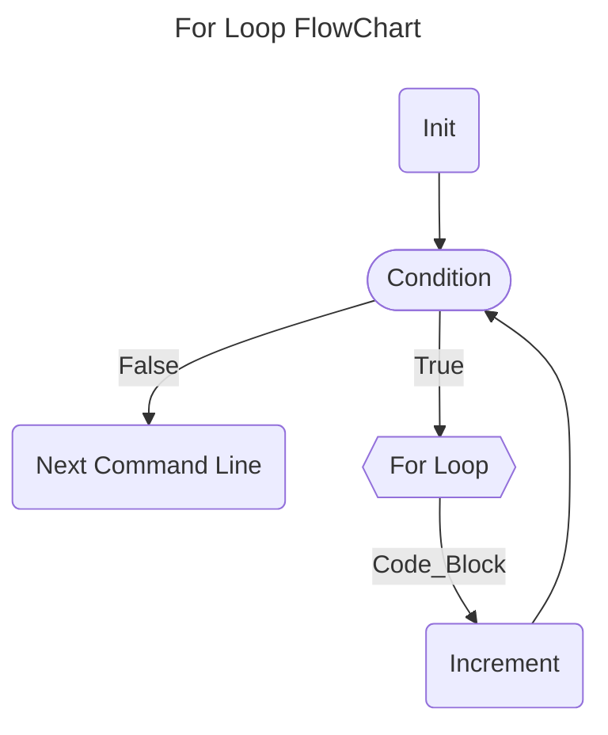

## Introduction

To master C is not just about learning a language; it's about gaining a profound understanding of programming principles. C strikes a balance between abstraction and hardware control, enabling you to craft effective programs and transfer knowledge to other languages.

In this guide, we will delve deep into the key topics encompassing the C language, starting with the most basic concepts and progressing to more advanced subjects. You will learn to write functional code, grasp memory management, and explore the construction of efficient data structures and algorithms.

---

## Directives

During the creation of the *source code*, in addition to regular commands, programmers can use compilation directives. Directives are readily recognized as they often appear at the beginning of source files, starting with the *prefix* `#` followed by the *directive name and its arguments*.

An important example is the `include` directive, which allows you to include the content of another file in the source code. This directive enables the use of inclusion files created by the user or provided with the compiler - typically header files with the ".h" extension.

```c
#include <stdio.h>     // searches for the "stdio.h" file primarily in the include directory (default: C:\TC\INCLUDE).

```

```c
#include "stdio.h"     // searches for the "stdio.h" file primarily in the working directory.
```

> *Regardless of the form used, this command instructs the preprocessor to include the content of the "stdio.h" file as an integral part of the source code file, exactly at that point. This action doesn't physically affect the source code file.*

The table below presents some of the most commonly used header files that can be utilized in program development.

| &nbsp;&nbsp;&nbsp;&nbsp;&nbsp;&nbsp;&nbsp;&nbsp;&nbsp;&nbsp;&nbsp;&nbsp;&nbsp;&nbsp;&nbsp;&nbsp;&nbsp;&nbsp;&nbsp;&nbsp;&nbsp;&nbsp;&nbsp;&nbsp;**File Inclusion**&nbsp;&nbsp;&nbsp;&nbsp;&nbsp;&nbsp;&nbsp;&nbsp;&nbsp;&nbsp;&nbsp;&nbsp;&nbsp;&nbsp;&nbsp;&nbsp;&nbsp;&nbsp;&nbsp;&nbsp;&nbsp;&nbsp;&nbsp;&nbsp; | &nbsp;&nbsp;&nbsp;&nbsp;&nbsp;&nbsp;&nbsp;&nbsp;&nbsp;&nbsp;&nbsp;&nbsp;&nbsp;&nbsp;&nbsp;&nbsp;&nbsp;&nbsp;&nbsp;&nbsp;&nbsp;&nbsp;&nbsp;&nbsp;&nbsp;&nbsp;&nbsp;&nbsp;&nbsp;&nbsp;&nbsp;&nbsp;&nbsp;&nbsp;&nbsp;&nbsp;&nbsp;&nbsp;&nbsp;&nbsp;&nbsp;&nbsp;&nbsp;&nbsp;&nbsp;&nbsp;&nbsp;&nbsp;&nbsp;&nbsp;&nbsp;&nbsp;&nbsp;&nbsp;&nbsp;&nbsp;&nbsp;&nbsp;&nbsp;&nbsp;&nbsp;&nbsp;&nbsp;&nbsp;**Description**&nbsp;&nbsp;&nbsp;&nbsp;&nbsp;&nbsp;&nbsp;&nbsp;&nbsp;&nbsp;&nbsp;&nbsp;&nbsp;&nbsp;&nbsp;&nbsp;&nbsp;&nbsp;&nbsp;&nbsp;&nbsp;&nbsp;&nbsp;&nbsp;&nbsp;&nbsp;&nbsp;&nbsp;&nbsp;&nbsp;&nbsp;&nbsp;&nbsp;&nbsp;&nbsp;&nbsp;&nbsp;&nbsp;&nbsp;&nbsp;&nbsp;&nbsp;&nbsp;&nbsp;&nbsp;&nbsp;&nbsp;&nbsp;&nbsp;&nbsp;&nbsp;&nbsp;&nbsp;&nbsp;&nbsp;&nbsp;&nbsp;&nbsp;&nbsp;&nbsp;&nbsp;&nbsp;&nbsp;&nbsp;|
|:---:| :---: |
| *#include <stdio.h>* | Provides input and output functions |
| *#include <stdlib.h>* | Provides memory allocation and conversion functions |
| *#include <math.h>* | Provides mathematical functions |
| *#include <string.h>* | Provides string manipulation functions |
| *#include <time.h>* | Provides functions to work with time and dates |
| *#include <stdbool.h>* | Provides the bool type and true/false constants |


## Variables

Variables hold and point to a value. They act as a *reference* or *abstraction* to literal data. That data is stored in the computer's memory, and takes up an certain amount of space, so we can retrieve it later and use when we need to.

In the simplest terms, you can think of variables as a **named box**. A box that acts as a *storage place* and *location* for holding different information. 

Each box has a **unique name** which acts like a label put on the outside that is a unique identifier, and the information/content lives on the inside. The content is the variable's value.

#### Example: Adding Two Numbers

```c
#include <stdio.h>

int main(int argc, char *argv[])
{
  int a, b, sum;           // Declaring three scope interger variables

  a = 10;                  // Assignment inline of variable a
  b = 5;                   // Assignment inline of variable b

  sum = a + b;             // Assignment to sum variable the result between the sum of a and b
  return 0;
}
```
> *In this example was declared three integer data type variables - a, b and sum - which were used to store three values*

#

### Declaration and Initialization of Variables

The C programming language is a ***strongly statically typed*** language, unlike many other modern programming languages. In ***statically typed*** languages, you need to explicitly declare your variables to be of a certain *data type*. That way the compiler knows during compilation time if the variable is able to perform the actions it was set out and requested to do.

The purpose of specifying the variable type to our compiler (virtual machine) for code interpretation is due to the fact that in C, we are working directly with the allocation of a physical memory space present in the machine in question.

Thus, by indicating the variable *data type* we will work with, our machine will allocate a space of a specific size so that this variable - *access key* - can have a value *assigned* to it.

> [!NOTE]
> *Use the `=` or assignment operator to assign a value to a variable.*

#

### Declaring a Variable

When declaring a new variable in the C language, it's necessary to specify to the compiler what type of data will be assigned to that variable - access key. This way, when compiled in the future (program), the compiler will know what type of information is stored in that particular variable.

```c
#include <stdio.h>

int main(int argc, char *argv[])
{
  int age;     // int is the data type and age is the unique acess key to this variable

  int n1, n2   // We can also declare multiple variables at once.
  return 0;
}
```

> *To declare a variable, you specify the **data type**, and give a **name** - **acess key** - to the variable.*

#### So, what is the difference between initialising and declaring a variable?

#

### Initializing a Variable

When we declare a variable, we are simply defining its *data type* and a *unique access key* for that variable, as shown in the previous example.

We don't need to specify or assign a value immediately to all the variables we declare in our program. By merely declaring a variable, a memory space on our machine has already been reserved for that *access key*.

#### If we declare a variable and assign it a value at once, this is called initialising the variable.

```c
#include<stdio.h>

int main(int argc, char *argv[])
{
  int age = 30; // int n = 30; is initializing the variable. It refers to assigning an initial value.
  return 0;
}
```

> [!IMPORTANT]
> **If the new value is the same data type, we don't need to include the data type, just the new value. If the data type is different, we will get an error.**

```c
int age = 30;   // initializing the variable with the value of 30

age = 34;      //  the new value of age is 34
```

#

<br>

| BEST PRACTICES FOR NAMING VARIABLES IN C. | 
| --- | 
| Names with leading and trailing underscores are reserved for system purposes and should not be used for any user-created names. If you must have your own private identifiers, begin them with a letter or two identifying the package to which they belong. |
| #define constants should be in all CAPS. |
| Enum constants are Capitalized or in all CAPS |
| Function, typedef, and variable names, as well as struct, union, and enum tag names should be in lower case. |
| Many macro "functions" are in all CAPS. Some macros (such as getchar and putchar) are in lower case since they may also exist as functions. |
| Avoid names that differ only in case, like foo and Foo. Similarly, avoid foobar and foo_bar. The potential for confusion is considerable. |
| Similarly, avoid names that look like each other. On many terminals and printers, 'l', '1' and 'I' look quite similar. A variable named 'l' is particularly bad because it looks so much like the constant '1'. |
| In general, global names (including enums) should have a common prefix identifying the module that they belong with. Globals may alternatively be grouped in a global structure. Typedeffed names often have "_t" appended to their name. |
| Avoid names that might conflict with various standard library names. Some systems will include more library code than you want. Also, your program may be extended someday. |

## The Scope of a Variable in C

The scope of a variable refers to where the variable can be referenced and accessed from. It is essentially where the variable lives and is valid and how visible it is to the rest of the program.


**Local Scope:** If a variable is declared within a set of culry braces, {}, that will be its scope and we can't access it and use it outside those braces in the rest of the program. 

> *Therefore it is not a good idea to declare variables that way since their scope and use is so limited which can lead to errors. This scope is called local scope.*

**Global Scope:** If variables are declared outside of functions, they have global scope. Having a global scope means they are visible within the whole program and can be accessed from anywhere.

> *But keep in mind that it can be difficult to keep track of them. Also, any changes we make to them along the way can get confusing since they can happen in any part and location of the program.*

```c
#include <stdio.h>

float mean, n1, n2;     // Declaration of global variables.

int main(int argc, char *argv[])
{
  n1 = 10;
  n2 = 8;

  mean = ( n1 + n2 ) / 2;
  printf("%s%f", "Mean: ", mean); 
  return 0;
}
```

## #DEFINE and CONST Variables

When we use define for a constant, the preprocessor generates a C program where the defined constant is searched, and the corresponding tokens are replaced by the given expression. This can save space and increase compilation time.

```c
#define NUMBER 10
```

Constant variables are regarded as true variables, not macro definitions. Therefore, they allocate a memory space on your machine, just like any other variable.

```c
const int number = 10;
```

The significant advantage of `const` over `#define` is *type checking*. `#define` cannot be *type-checked*, which can cause issues when determining *data types*. If the variable is instead a constant, we can obtain the *data type* stored in that constant variable.

As const variables are considered variables, we can use pointers on them. This means we can perform type casting, manipulate addresses, and everything else you would be able to do with a regular variable, except altering the data itself, as the data assigned to that constant variable remains constant.

In general, `const` is a better option if we have a choice and it can be successfully applied to the code. There are situations where `#define` cannot be replaced by `const`. For example, `#define` can take parameters.

```c
#include <stdio.h>
#define MULTIPLY(a, b) a*b

int main(int argv, char *argc[])
{
  printf("%d", MULTIPLY(2+3, 3+5)); // The macro is expanded as 2 + 3 * 3 + 5, not as 5*8
  return 0;
}
```

> *We can also remove previously defined macros using `#undef MACRO_NAME`*

```c
#include <stdio.h>
#define LIMIT 100

int main(int argv, char *argc[])
{
  printf("%d", LIMIT);
  #undef LIMIT          // Removing defined macro LIMIT
  
  printf("%d", LIMIT);   // This line causes error as LIMIT is not defined
  return 0;
}
```

## Data Types

During the compilation of the source code, the C compiler seeks to allocate the necessary *memory space* for program execution. While the compiler can determine the *data types* and *memory space* required for constants found in the code, for variables, this is only possible if there is a prior declaration of the *data type* used.

Each *data type* has a predetermined ***memory size requirement*** and an ***associated range of permissible values***. For example, a *character* typically occupies **1 byte**, while an *integer* usually takes up **2 bytes**. However, to ensure the portability of C code, this assumption cannot be taken as true. This is because the size and range of these *data types* vary according to the type of processor and the implementation of the C compiler. 

The ANSI standard stipulates only the minimum range for each data type, not its size in bytes.

| &nbsp;&nbsp;&nbsp;&nbsp;&nbsp;&nbsp;&nbsp;&nbsp;&nbsp;**Types**&nbsp;&nbsp;&nbsp;&nbsp;&nbsp;&nbsp;&nbsp;&nbsp;&nbsp; | &nbsp;&nbsp;&nbsp;&nbsp;&nbsp;&nbsp;&nbsp;&nbsp;&nbsp;&nbsp;&nbsp;&nbsp;&nbsp;&nbsp;&nbsp;&nbsp;&nbsp;&nbsp;&nbsp;&nbsp;&nbsp;&nbsp;&nbsp;&nbsp;&nbsp;&nbsp;&nbsp;**Description**&nbsp;&nbsp;&nbsp;&nbsp;&nbsp;&nbsp;&nbsp;&nbsp;&nbsp;&nbsp;&nbsp;&nbsp;&nbsp;&nbsp;&nbsp;&nbsp;&nbsp;&nbsp;&nbsp;&nbsp;&nbsp;&nbsp;&nbsp;&nbsp;&nbsp;&nbsp;&nbsp; | &nbsp;&nbsp;&nbsp;&nbsp;&nbsp;&nbsp;&nbsp;&nbsp;&nbsp;&nbsp;&nbsp;&nbsp;**Approximate Size**&nbsp;&nbsp;&nbsp;&nbsp;&nbsp;&nbsp;&nbsp;&nbsp;&nbsp;&nbsp;&nbsp;&nbsp; | &nbsp;&nbsp;&nbsp;&nbsp;&nbsp;&nbsp;&nbsp;&nbsp;&nbsp;&nbsp;&nbsp;&nbsp;**Minimum Range**&nbsp;&nbsp;&nbsp;&nbsp;&nbsp;&nbsp;&nbsp;&nbsp;&nbsp;&nbsp;&nbsp;&nbsp;     |
| :---:       | :---:             | :---:                  | :---:                   |
| char      | Character       | 8 bits = 1 byte      | -127 to 127            |
| int       | Integer         | 16 bits = 2 bytes    | -32.767 to 32.767      |
| float     | Floating-Point  | 32 bits = 4 bytes    | 7 digits of precision|
| double    | Double precision Floating-Point  | 64 bits = 8 bytes | 10 digits of precision |
| void     | No Value | |

Elements of the *char type* are typically used to hold values defined by the **ASCII** character set. Elements of the *int* type* generally correspond to the natural size of a word on the host computer. Thus, on a *16-bit machine*, int will likely be **16 bits**, and on a *32-bit machine*, int should be **32 bits**. The exact format of *floating-point* elements depends on how they are implemented.

The range of *float* and *double* types is given in digits of precision. Their magnitudes, however, depend on the method used to represent *floating-point* numbers. Regardless of the method, the number can be very large (the ANSI standard specifies the minimum range as 1x10^-37 to 1x10^37). The *void type* explicitly declares a function that does not return any value or creates generic pointers.

#

### Data Type Modifiers

With the exception of the void and *float types*, the other basic types can be adapted more precisely to the needs of the studied problem. To achieve this, it is necessary to prefix the basic *data type* with one of the ***type modifiers*** (signed, unsigned, long, and short) to alter the meaning of the type.

Usually, only the *long* modifier can be applied to the *double type*. This modification generates a *floating-point type with greater precision*. All four modifiers can be applied to *integers*. The ***short*** and ***long*** modifiers aim to provide different sizes of *integers* (smaller integers - short int or larger integers - long int).

The *unsigned* modifier is used to specify variables without sign. An *unsigned int* will be an integer that takes only positive values.

Below are the permitted data types and their maximum and minimum values in a typical compiler for 16-bit hardware. Also specified in this table is the format that should be used to read the data types using the ***scanf()*** function.

|  &nbsp;&nbsp;&nbsp;&nbsp;&nbsp;&nbsp;&nbsp;&nbsp;&nbsp;&nbsp;&nbsp;&nbsp;&nbsp;&nbsp;&nbsp;&nbsp;&nbsp;**Type**&nbsp;&nbsp;&nbsp;&nbsp;&nbsp;&nbsp;&nbsp;&nbsp;&nbsp;&nbsp;&nbsp;&nbsp;&nbsp;&nbsp;&nbsp;&nbsp;       | **Number of Bits** |  &nbsp;&nbsp;&nbsp;&nbsp;**scanf Read Format**&nbsp;&nbsp;&nbsp;&nbsp;|   &nbsp;&nbsp;&nbsp;&nbsp;&nbsp;&nbsp;&nbsp;&nbsp;&nbsp;&nbsp;&nbsp;&nbsp;&nbsp;&nbsp;&nbsp;&nbsp;&nbsp;&nbsp;&nbsp;&nbsp;**Start**&nbsp;&nbsp;&nbsp;&nbsp;&nbsp;&nbsp;&nbsp;&nbsp;&nbsp;&nbsp;&nbsp;&nbsp;&nbsp;&nbsp;&nbsp;&nbsp;&nbsp;&nbsp;&nbsp;&nbsp;   |   &nbsp;&nbsp;&nbsp;&nbsp;&nbsp;&nbsp;&nbsp;&nbsp;&nbsp;&nbsp;&nbsp;&nbsp;&nbsp;&nbsp;&nbsp;&nbsp;&nbsp;&nbsp;&nbsp;&nbsp;**End**&nbsp;&nbsp;&nbsp;&nbsp;&nbsp;&nbsp;&nbsp;&nbsp;&nbsp;&nbsp;&nbsp;&nbsp;&nbsp;&nbsp;&nbsp;&nbsp;&nbsp;&nbsp;&nbsp;&nbsp;   |
|:---:|:---:|:---:|:---:|:---:|
|   char          |        **8**       |           *%c*             |    **-128**   |    **127**  |
|   unsigned char |        **8**       |           *%c*             |      **0**    |    **255**  |
|   int          |       **16**       |       *%i or %d*           |  **-32,768**  |  **32,767** |
|   unsigned int  |       **16**       |           *%u*             |      **0**    |  **65,535** |
|   short int     |       **16**       |     *%hi or %hd*           |  **-32,768**  |  **32,767** |
|   unsigned short int|   **16**       |           *%hu*            |      **0**    |  **65,535** |
|   long int     |       **32**       |     *%li or %ld*           |**-2,147,483,648**|**2,147,483,647**|
|   unsigned long int|   **32**       |           *%lu*            |      **0**    |**4,294,967,295**|
|   float         |       **32**       | *%f, %e, or %g*            |  **3.4E-38**  |  **3.4E+38**|
|   double        |       **64**       |*%lf, %le, or %lg*          |**1.7E-308**   |**1.7E+308**|
|   long double   |       **80**       |           *%Lf*            |**3.4E-4932** |**3.4E+4932**|

> *Certainly, it's important to note that the floating-point ranges in the table above are indicated in terms of exponent range, but the numbers can take both positive and negative values.*


## Operators

C features an extensive set of operators that can be used in the manipulation of variables and constants during program execution.

### Arithmetic Operators

Arithmetic operators are mathematical operators that perform mathematical functions on numbers. 

* `+`  - **Addition Operator**
* `-`  - **Subtraction Operator**
* `*`  - **Multiplication Operator**
* `**` - **Power Operator**
* `/`  - **Division Operator**
* `%`  - **Modulo Division Operator**

A particularity of C relates to the fact that the value returned by an *arithmetic expression* is always of the largest *data type* used in the expression.

#### Example: Division by INTEGER and FLOAT Numbers.

```c
#include <stdio.h>

int main(int argv, char *argc[])
{
  int n1 = 2;
  float n2 = 3.3;

  // We are instructing the program to print an integer value resulting from a division involving a real number
  // which results an error.
  printf("%d", (a / b) );

  // The program will print correctly because it has been instructed to print the result within the realm of real numbers.
  printf("%f", (a / b) );
  return 0;
}
```

> [!NOTE]
> **It is possible to cast the result of some operations, which will be approached later.**

#

### Increment and Decrement Operators

The C language allows the use of the unary operators "++" and "--" to *increment* (add 1) or *decrement* (subtract 1) the value of a variable, respectively.
```julia
++X          // X = X + 1 
X++          // X = X + 1

--X          // X = X - 1 
X--          // X = X - 1 
```
As you can see, these operators can be either *prefixed* or *postfixed*. The difference is that when they are *prefixed*, they increment the variable before using its value. When they are *postfixed*, they use the value of the variable before incrementing it.

#### Example: PostFixed
```julia
int a, b;

a = 10;
b = a++;

FINAL RESULT: a = 11; b = 10;
```


#### Example: PreFixed
```julia
int a, b;

a = 10;
b = ++a;

FINAL RESULT: a = 11; b = 11;
```


#

### Reduced Expressions

Reduced expressions are applied in cases where the same variable is on both sides of the assignment statement. 

| &nbsp;&nbsp;&nbsp;&nbsp;&nbsp;&nbsp;&nbsp;&nbsp;&nbsp;&nbsp;&nbsp;&nbsp;&nbsp;&nbsp;&nbsp;&nbsp;&nbsp;&nbsp;&nbsp;&nbsp;&nbsp;&nbsp;&nbsp;&nbsp;&nbsp;&nbsp;&nbsp;&nbsp;&nbsp;&nbsp;&nbsp;&nbsp;&nbsp;&nbsp;&nbsp;**REDUCED EXPRESSION**&nbsp;&nbsp;&nbsp;&nbsp;&nbsp;&nbsp;&nbsp;&nbsp;&nbsp;&nbsp;&nbsp;&nbsp;&nbsp;&nbsp;&nbsp;&nbsp;&nbsp;&nbsp;&nbsp;&nbsp;&nbsp;&nbsp;&nbsp;&nbsp;&nbsp;&nbsp;&nbsp;&nbsp;&nbsp;&nbsp;&nbsp;&nbsp;&nbsp;&nbsp;&nbsp; | &nbsp;&nbsp;&nbsp;&nbsp;&nbsp;&nbsp;&nbsp;&nbsp;&nbsp;&nbsp;&nbsp;&nbsp;&nbsp;&nbsp;&nbsp;&nbsp;&nbsp;&nbsp;&nbsp;&nbsp;&nbsp;&nbsp;&nbsp;&nbsp;&nbsp;&nbsp;&nbsp;&nbsp;&nbsp;&nbsp;&nbsp;&nbsp;&nbsp;&nbsp;&nbsp;**NORMAL EXPRESSION**&nbsp;&nbsp;&nbsp;&nbsp;&nbsp;&nbsp;&nbsp;&nbsp;&nbsp;&nbsp;&nbsp;&nbsp;&nbsp;&nbsp;&nbsp;&nbsp;&nbsp;&nbsp;&nbsp;&nbsp;&nbsp;&nbsp;&nbsp;&nbsp;&nbsp;&nbsp;&nbsp;&nbsp;&nbsp;&nbsp;&nbsp;&nbsp;&nbsp;&nbsp;&nbsp; |
| :---:                | :---:               |
| **A += 5**          | **A = A + 5**       |
| **B - = 2**        | **B = B – 2**      |
| **C** ***=** **2**           | **C = C * 2**       |
| **D /= 7**           | **D = D / 7**      |
| **E %= 3**           | **E = E % 3**        |

> *Note that this type of expression is very useful for manipulating counting variables and/or accumulators.*

#

### Relational Operators 

Relational operators perform comparisons between expressions, their results are always logical values - *false* equals to 0 and *true* equals to 1.

| &nbsp;&nbsp;&nbsp;&nbsp;&nbsp;&nbsp;&nbsp;&nbsp;&nbsp;&nbsp;&nbsp;&nbsp;&nbsp;&nbsp;&nbsp;&nbsp;&nbsp;&nbsp;&nbsp;&nbsp;&nbsp;&nbsp;&nbsp;&nbsp;&nbsp;&nbsp;&nbsp;&nbsp;&nbsp;&nbsp;&nbsp;&nbsp;&nbsp;&nbsp;&nbsp;&nbsp;&nbsp;&nbsp;&nbsp;&nbsp;&nbsp;&nbsp;&nbsp;&nbsp;&nbsp;&nbsp;**OPERATOR**&nbsp;&nbsp;&nbsp;&nbsp;&nbsp;&nbsp;&nbsp;&nbsp;&nbsp;&nbsp;&nbsp;&nbsp;&nbsp;&nbsp;&nbsp;&nbsp;&nbsp;&nbsp;&nbsp;&nbsp;&nbsp;&nbsp;&nbsp;&nbsp;&nbsp;&nbsp;&nbsp;&nbsp;&nbsp;&nbsp;&nbsp;&nbsp;&nbsp;&nbsp;&nbsp;&nbsp;&nbsp;&nbsp;&nbsp;&nbsp;&nbsp;&nbsp;&nbsp;&nbsp;&nbsp; | &nbsp;&nbsp;&nbsp;&nbsp;&nbsp;&nbsp;&nbsp;&nbsp;&nbsp;&nbsp;&nbsp;&nbsp;&nbsp;&nbsp;&nbsp;&nbsp;&nbsp;&nbsp;&nbsp;&nbsp;&nbsp;&nbsp;&nbsp;&nbsp;&nbsp;&nbsp;&nbsp;&nbsp;&nbsp;&nbsp;&nbsp;&nbsp;&nbsp;&nbsp;&nbsp;&nbsp;&nbsp;&nbsp;&nbsp;&nbsp;&nbsp;&nbsp;&nbsp;&nbsp;&nbsp;&nbsp;**MEANING**&nbsp;&nbsp;&nbsp;&nbsp;&nbsp;&nbsp;&nbsp;&nbsp;&nbsp;&nbsp;&nbsp;&nbsp;&nbsp;&nbsp;&nbsp;&nbsp;&nbsp;&nbsp;&nbsp;&nbsp;&nbsp;&nbsp;&nbsp;&nbsp;&nbsp;&nbsp;&nbsp;&nbsp;&nbsp;&nbsp;&nbsp;&nbsp;&nbsp;&nbsp;&nbsp;&nbsp;&nbsp;&nbsp;&nbsp;&nbsp;&nbsp;&nbsp;&nbsp;&nbsp;&nbsp; |
| :---:                | :---:               |
| `==`         | **EQUAL TO**    |
| `>`         | **GREATER THAN**      |
| `<`          | **LESS THAN**     |
| `>=`          | **GREATER THAN OR EQUAL TO**     |
| `<=`          | **LESS THAN OR EQUAL TO**     |
| `!=`          | **NOT EQUAL TO**     |

#### Example:
```julia
int a = 10;
int b = 5;

a == b (false)

a != b (true)
```

> *When using any relational operator, there is always a return value that can either be true or false, otherwsie knokn as a **Boolean** value in the context of computer programming.*

#

### Logical Operators

Logical operators can be used to combine two or more relational operations into a single conditional test (binary operators AND and OR) or modify the result of a relational operation (unary operator NOT).

| &nbsp;&nbsp;&nbsp;&nbsp;&nbsp;&nbsp;&nbsp;&nbsp;&nbsp;&nbsp;&nbsp;&nbsp;&nbsp;&nbsp;&nbsp;&nbsp;&nbsp;&nbsp;&nbsp;&nbsp;&nbsp;&nbsp;&nbsp;&nbsp;&nbsp;&nbsp;&nbsp;&nbsp;&nbsp;&nbsp;&nbsp;&nbsp;&nbsp;&nbsp;&nbsp;&nbsp;&nbsp;&nbsp;&nbsp;&nbsp;&nbsp;&nbsp;&nbsp;&nbsp;&nbsp;&nbsp;**OPERATOR**&nbsp;&nbsp;&nbsp;&nbsp;&nbsp;&nbsp;&nbsp;&nbsp;&nbsp;&nbsp;&nbsp;&nbsp;&nbsp;&nbsp;&nbsp;&nbsp;&nbsp;&nbsp;&nbsp;&nbsp;&nbsp;&nbsp;&nbsp;&nbsp;&nbsp;&nbsp;&nbsp;&nbsp;&nbsp;&nbsp;&nbsp;&nbsp;&nbsp;&nbsp;&nbsp;&nbsp;&nbsp;&nbsp;&nbsp;&nbsp;&nbsp;&nbsp;&nbsp;&nbsp;&nbsp; | &nbsp;&nbsp;&nbsp;&nbsp;&nbsp;&nbsp;&nbsp;&nbsp;&nbsp;&nbsp;&nbsp;&nbsp;&nbsp;&nbsp;&nbsp;&nbsp;&nbsp;&nbsp;&nbsp;&nbsp;&nbsp;&nbsp;&nbsp;&nbsp;&nbsp;&nbsp;&nbsp;&nbsp;&nbsp;&nbsp;&nbsp;&nbsp;&nbsp;&nbsp;&nbsp;&nbsp;&nbsp;&nbsp;&nbsp;&nbsp;&nbsp;&nbsp;&nbsp;&nbsp;&nbsp;**MEANING**&nbsp;&nbsp;&nbsp;&nbsp;&nbsp;&nbsp;&nbsp;&nbsp;&nbsp;&nbsp;&nbsp;&nbsp;&nbsp;&nbsp;&nbsp;&nbsp;&nbsp;&nbsp;&nbsp;&nbsp;&nbsp;&nbsp;&nbsp;&nbsp;&nbsp;&nbsp;&nbsp;&nbsp;&nbsp;&nbsp;&nbsp;&nbsp;&nbsp;&nbsp;&nbsp;&nbsp;&nbsp;&nbsp;&nbsp;&nbsp;&nbsp;&nbsp;&nbsp;&nbsp;&nbsp;&nbsp; |
| :---:                | :---:               |
| `&&`         | **AND**    |
| `\|\|`       | **OR**      |
| `!`          | **NOT**     |


#### Example: Number Delimited By A Range
```c
#include <stdio.h>

int main(int argc, char *argv[])
{
  int a;
  
  a = 3;
  
  if ( (a > 0) && (a < 10) ) 
  {
      printf("%s", "The number is greater than 0 and less than 10 ");
  }
  return 0;
}
```
> *Operands on **both** the left and right sides of && need to be **true** for the condition to be true.*

#### Example: Checking a Negative Number
```c
#include <stdio.h>

int main(int argc, char *argv[])
{
  int a, b;
  
  a = 3;
  b = -2;
  
  if ( (a < 0) || (b < 0) )
    printf("%s", "At least one of the numbers are negative"); 
  return 0;
}
```
> *At least one or **both** of the operands on the right and left sides of || need to be **true** for the condition to be true.*


#### Example: Even Number Using NOT Operator
```c
#include <stdio.h>

int main(int argc, char *argv[])
{
  int a;

  a = 2;
    
  if ( !(a % 2 != 0) ) 
    printf("%s", "Even");
  return 0;
}
```
> *This **inverts** the value of the operand. If an operand is true, then the NOT operator makes the condition false and vice versa.*

#

### Ternary Operator 

The ternary operator `?` allows for conditional value assignment to a variable.

```julia
variable = condition ? expression1 (true) : expression2; (false)
```

In this structure, the condition is tested, and if it's **true**, *expression1* is taken; otherwise, *expression2* is adopted. To exemplify its usage, here's a snippet of a program that assigns the variable Z the greater value between variables A and B.

```julia
Z = (A > B) ? A : B;
```

Another way to write this command would be:

```julia
if (A > B)
  Z = A;
else
  Z = B;
```

#

### Casting Data Types 

When an expression combines variables of different *data types*, the C compiler checks whether conversions between these types are possible. If they are not, the compilation process is halted, and an error message is displayed. Otherwise, the compiler performs all necessary conversions, following the following rules:

1. *All *char* and *short int* values are converted to *int*. All *float* values are converted to *double*.*
2. *For pairs of operands with different types: those with *lower capacity* are converted to those with *higher capacity* (e.g., if one of them is *long double*, the other is also converted to *long double*).*

Furthermore, the programmer can force the result of an expression to be of a specific type. To do this, they should use *cast operators*.

```julia
variable = (datatype) expression;
```
#

#### Example: Explicit Type Casting in C
```c
#include <stdio.h>

int main(int argc, char *argv[])
{
  float number = 32.8;

  int a = (int) number + 10;

  printf("%d", a);
  return 0;
}
```

#### Example: The Conversion of Char to Int
```c
#include <stdio.h>

int main(int argc, char *argv[])
{
  char x;
  int number, total;

  x = 'x';
  number = 10;
  total = (int) x + number;  // total = x + number; also works (rule 1)
  
  printf("%d", total);
  return 0;
}
```

> *Although the compiler performs some conversions automatically as described previously, it's considered a good programming practice to explicitly declare and inform the program about the necessary casting to be done.*

#

### Operator Precedence

Operator precedence defines the order in which operators are evaluated in an expression. It determines how the terms are grouped and how the expression is calculated. Some operators have higher precedence than others. For instance, the *multiplication* operator has a **higher** precedence than the *addition* operator.

| &nbsp;&nbsp;&nbsp;&nbsp;&nbsp;&nbsp;&nbsp;&nbsp;&nbsp;&nbsp;&nbsp;&nbsp;&nbsp;&nbsp;&nbsp;&nbsp;**Category**&nbsp;&nbsp;&nbsp;&nbsp;&nbsp;&nbsp;&nbsp;&nbsp;&nbsp;&nbsp;&nbsp;&nbsp;&nbsp;&nbsp;&nbsp;&nbsp;|	  &nbsp;&nbsp;&nbsp;&nbsp;&nbsp;&nbsp;&nbsp;&nbsp;&nbsp;&nbsp;&nbsp;&nbsp;&nbsp;&nbsp;&nbsp;&nbsp;&nbsp;&nbsp;&nbsp;&nbsp;&nbsp;&nbsp;&nbsp;&nbsp;&nbsp;&nbsp;&nbsp;&nbsp;&nbsp;&nbsp;&nbsp;&nbsp;&nbsp;&nbsp;&nbsp;&nbsp;&nbsp;&nbsp;&nbsp;&nbsp;&nbsp;&nbsp;&nbsp;&nbsp;&nbsp;&nbsp;&nbsp;&nbsp;**Operator**&nbsp;&nbsp;&nbsp;&nbsp;&nbsp;&nbsp;&nbsp;&nbsp;&nbsp;&nbsp;&nbsp;&nbsp;&nbsp;&nbsp;&nbsp;&nbsp;&nbsp;&nbsp;&nbsp;&nbsp;&nbsp;&nbsp;&nbsp;&nbsp;&nbsp;&nbsp;&nbsp;&nbsp;&nbsp;&nbsp;&nbsp;&nbsp;&nbsp;&nbsp;&nbsp;&nbsp;&nbsp;&nbsp;&nbsp;&nbsp;&nbsp;&nbsp;&nbsp;&nbsp;&nbsp;&nbsp;&nbsp;&nbsp;                  | &nbsp;&nbsp;&nbsp;&nbsp;&nbsp;&nbsp;&nbsp;&nbsp;&nbsp;&nbsp;&nbsp;&nbsp;&nbsp;&nbsp;&nbsp;&nbsp;**Associativity**&nbsp;&nbsp;&nbsp;&nbsp;&nbsp;&nbsp;&nbsp;&nbsp;&nbsp;&nbsp;&nbsp;&nbsp;&nbsp;&nbsp;&nbsp;&nbsp;|
| :---:           |         :---:                         | :---:             |
| Postfix	        |   () [] -> . ++ - -                   | Left to right     |
| Unary	          |   + - ! ~ ++ - - (type)* & sizeof	    | Right to left     | 
| Multiplicative	|   * / %	                              | Left to right     | 
| Additive	      |   + -	                                | Left to right     | 
| Shift	          |   << >>	                              | Left to right     | 
| Relational	    |   < <= > >=                           | Left to right     | 
| Equality	      |    == !=	                            | Left to right     | 
| Logical AND	    |    &&	                                | Left to right     | 
| Logical OR	    |    \|\|	                              | Left to right     | 
| Conditional	    |   ?:	                                | Right to left     | 
| Assignment	    |   = += -= *= /= %=>>= <<= &= ^= \|=	  | Right to left     | 

> *Here, operators with the highest precedence appear at the top of the table, those with the lowest appear at the bottom. Within an expression, higher precedence operators will be evaluated first.*

## Input and Output Commands

Data input and output are essential pillars in programming, enabling interaction between programs and users, as well as communication with the external environment. This dynamic allows for acquiring crucial information and presenting processed results.

### Output of Data

The `printf()` function enables the *output* of values (constants, variables, or expression results). This function converts and prints its *arguments* to the standard output following the format specified in the *control string*.

```c
printf("control string", arguments);
```

The *control string*, describes everything that the function will display on the screen. This string not only shows the characters that will be presented but also the respective formats and positions of constants, variables, and expressions listed in the argument list.

```c
int a, b, sum;

a = 2;
b = 3;

sum = a + b;
printf("%s %d %s %d %s %d", "The sum between the numbers:", a, "and", b, "is equals to", sum);
```

In summary, the control string consists of three types of characters:

- **Miscellaneous characters** that will be displayed on the screen (corresponding to the text to be shown).
- **Escape characters "\\"** used to assist in cursor movement on the screen or carriage movement.
- **Format specifier characters "%"** that define the position and manner in which each of the variables in the argument list will be displayed.


|    &nbsp;&nbsp;&nbsp;&nbsp;&nbsp;&nbsp;&nbsp;&nbsp;&nbsp;**Specifier** &nbsp;&nbsp;&nbsp;&nbsp;&nbsp;&nbsp;&nbsp;&nbsp;&nbsp;   |     &nbsp;&nbsp;&nbsp;&nbsp;&nbsp;&nbsp;&nbsp;&nbsp;&nbsp;&nbsp;&nbsp;&nbsp;&nbsp;&nbsp;&nbsp;&nbsp;**Type**&nbsp;&nbsp;&nbsp;&nbsp;&nbsp;&nbsp;&nbsp;&nbsp;&nbsp;&nbsp;&nbsp;&nbsp;&nbsp;&nbsp;&nbsp;&nbsp;     |         &nbsp;&nbsp;&nbsp;&nbsp;&nbsp;&nbsp;&nbsp;&nbsp;&nbsp;&nbsp;&nbsp;&nbsp;&nbsp;&nbsp;&nbsp;&nbsp;&nbsp;&nbsp;&nbsp;&nbsp;&nbsp;&nbsp;&nbsp;&nbsp;&nbsp;&nbsp;&nbsp;&nbsp;&nbsp;&nbsp;&nbsp;&nbsp;&nbsp;&nbsp;&nbsp;**Example**&nbsp;&nbsp;&nbsp;&nbsp;&nbsp;&nbsp;&nbsp;&nbsp;&nbsp;&nbsp;&nbsp;&nbsp;&nbsp;&nbsp;&nbsp;&nbsp;&nbsp;&nbsp;&nbsp;&nbsp;&nbsp;&nbsp;&nbsp;&nbsp;&nbsp;&nbsp;&nbsp;&nbsp;&nbsp;&nbsp;&nbsp;&nbsp;&nbsp;&nbsp;&nbsp;              |       &nbsp;&nbsp;&nbsp;&nbsp;&nbsp;&nbsp;&nbsp;&nbsp;&nbsp;&nbsp;&nbsp;&nbsp;&nbsp;&nbsp;&nbsp;&nbsp;&nbsp;&nbsp;**Output**&nbsp;&nbsp;&nbsp;&nbsp;&nbsp;&nbsp;&nbsp;&nbsp;&nbsp;&nbsp;&nbsp;&nbsp;&nbsp;&nbsp;&nbsp;&nbsp;&nbsp;&nbsp;       |
|:-----------------:|:-------------------:|:---------------------------------:|:----------------------:|
|       **`%c`**      |    ***Character***       |       **`printf("%c", 'A');`**          |           **A**            |
|       **`%d`**     |      ***Integer***        |       **`printf("%d", 42);`**           |           **42**           |
|       **`%f`**      |  ***Floating Point***     |      **`printf("%f", 3.14);`**          |        **3.140000**       |
|      **`%lf`**      |       ***Double***        |   **`printf("%lf", 1.618);`**           |        **1.618000**       |
|       **`%o`**      |       ***Octal***         |        **`printf("%o", 8);`**           |           **10**           |
|       **`%p`**      |      ***Pointer***        | **`int var = 5; printf("%p", &var);`**  |    **Memory address**     |
|       **`%s`**      |       ***String***        | **`printf("%s", "Hello");`**            |         **Hello**         |
|       **`%u`**      | ***Unsigned Integer***    |     **`printf("%u", -42);`**            | **Unpredictable value**   |
|   **`%x or %X`**    |   ***Hexadecimal***       |     **`printf("%x", 255);`**            |           **ff**           |
|       **`%%`**      | ***Percent Symbol***      |         **`printf("%%");`**             |           **%**            |

> *In the table above, there are Some Format Specifiers for the printf() Function, followed by practical examples.*

#

### Input of Data

The `scanf()` function reads characters from the *standard input*, interprets them according to the format specification, and stores the results in variables declared in the program.

```c
scanf("control string", &variable);
```

The *memory address* representation of the variables that will *receive the input data is provided* using the `&` operator *followed by the variable name*. Additionally, this function also uses escape control characters via backslash codesand formatting characters `%`.

```c
int number;

scanf("%d", &number);   // The scanf() function reads the typed number and stores it in the number variable as an integer.
```

| &nbsp;&nbsp;&nbsp;&nbsp;&nbsp;&nbsp;&nbsp;&nbsp;&nbsp;&nbsp;&nbsp;&nbsp;**Specifier**&nbsp;&nbsp;&nbsp;&nbsp;&nbsp;&nbsp;&nbsp;&nbsp;&nbsp;&nbsp;&nbsp;&nbsp; | &nbsp;&nbsp;&nbsp;&nbsp;&nbsp;&nbsp;&nbsp;&nbsp;&nbsp;&nbsp;&nbsp;&nbsp;&nbsp;&nbsp;&nbsp;&nbsp;&nbsp;&nbsp;&nbsp;&nbsp;&nbsp;&nbsp;&nbsp;&nbsp;&nbsp;&nbsp;&nbsp;&nbsp;&nbsp;&nbsp;&nbsp;&nbsp;&nbsp;&nbsp;&nbsp;&nbsp;&nbsp;&nbsp;&nbsp;&nbsp;&nbsp;&nbsp;&nbsp;&nbsp;**Description**&nbsp;&nbsp;&nbsp;&nbsp;&nbsp;&nbsp;&nbsp;&nbsp;&nbsp;&nbsp;&nbsp;&nbsp;&nbsp;&nbsp;&nbsp;&nbsp;&nbsp;&nbsp;&nbsp;&nbsp;&nbsp;&nbsp;&nbsp;&nbsp;&nbsp;&nbsp;&nbsp;&nbsp;&nbsp;&nbsp;&nbsp;&nbsp;&nbsp;&nbsp;&nbsp;&nbsp;&nbsp;&nbsp;&nbsp;&nbsp;&nbsp;&nbsp;&nbsp;&nbsp;                          |  &nbsp;&nbsp;&nbsp;&nbsp;&nbsp;&nbsp;&nbsp;&nbsp;&nbsp;&nbsp;&nbsp;&nbsp;&nbsp;&nbsp;&nbsp;&nbsp;&nbsp;&nbsp;&nbsp;&nbsp;&nbsp;&nbsp;&nbsp;&nbsp;&nbsp;&nbsp;&nbsp;**Example**&nbsp;&nbsp;&nbsp;&nbsp;&nbsp;&nbsp;&nbsp;&nbsp;&nbsp;&nbsp;&nbsp;&nbsp;&nbsp;&nbsp;&nbsp;&nbsp;&nbsp;&nbsp;&nbsp;&nbsp;&nbsp;&nbsp;&nbsp;&nbsp;&nbsp; |
|:-----------------:|:-------------------:|:---------------------------------:|
| **`%d`**        | ***Read an integer***                        | **`scanf("%d", &num);`**            |
| **`%f`**        | ***Read a floating-point number***            | **`scanf("%f", &floatValue);`**     |
| **`%c`**        | ***Read a character***                       | **`scanf("%c", &letter);`**         |
| **`%s`**        | ***Read a string***                          | **`scanf("%s", stringVar);`**       |
| **`%lf`**       | ***Read a double (long float)***             | **`scanf("%lf", &doubleValue);`**   |
| **`%x`**        | ***Read a hexadecimal integer***            | **`scanf("%x", &hexValue);`**       |
| **`%o`**        | ***Read an octal integer***                  | **`scanf("%o", &octValue);`**       |
| **`%u`**        | ***Read an unsigned integer***               | **`scanf("%u", &unsignedValue);`**  |

> *These format specifiers are used with the scanf() function to read data from the standard input.*

## Conditional Statements

Conditional Statements in programming enable the program to make decisions and execute specific code blocks based on certain conditions, enhancing its flexibility and adaptability.

### Conditional Statements and Truth Tables

Conditional Statements in programming enable diverse execution paths based on logical conditions using "if," "else if," and "else" statements. Utilizing truth tables to evaluate conditions, they systematically ensure precise decision-making, enhancing program functionality and reliability.

```c
int number = 10;    

if ( number > 0 )   
  printf("%s", "It's a positive number");  
```

> *For a better understanding, when a conditional statement is executed, two possible outcomes are provided: true and false. In the previous case, the compiler substitutes the variable "number" with its stored value, resulting in the following evaluation: "Is 10 greater than 0?" . In this instance, the answer is true. As a result, the compiler returns a value other than 0 to the "if()" function, permitting the execution of the subsequent command line.*

Boolean expressions are essential in programming, denoting true/false conditions. They employ logical operators (AND, OR, NOT) to combine or negate conditions, enabling intricate decision-making in code. Evaluating these expressions empowers programs to execute tailored actions based on outcomes, optimizing efficiency and functionality.

> *Any result from a comparison that is a non-zero value is treated as true, whereas 0 is interpreted as false.*

<table>
<tr><th>&nbsp;&nbsp;&nbsp;&nbsp;&nbsp;&nbsp;&nbsp;&nbsp;&nbsp;&nbsp;&nbsp;&nbsp;&nbsp;&nbsp;&nbsp;&nbsp;&nbsp;&nbsp;&nbsp;&nbsp;&nbsp;&nbsp;&nbsp;&nbsp;&nbsp;&nbsp;&nbsp;&nbsp;&nbsp;&nbsp;&nbsp;&nbsp;&nbsp;&nbsp;TRUTH TABLE FOR && &nbsp;&nbsp;&nbsp;&nbsp;&nbsp;&nbsp;&nbsp;&nbsp;&nbsp;&nbsp;&nbsp;&nbsp;&nbsp;&nbsp;&nbsp;&nbsp;&nbsp;&nbsp;&nbsp;&nbsp;&nbsp;&nbsp;&nbsp;&nbsp;&nbsp;&nbsp;&nbsp;&nbsp;&nbsp;&nbsp;&nbsp;&nbsp;&nbsp;&nbsp;&nbsp;&nbsp;&nbsp;</th><th>&nbsp;&nbsp;&nbsp;&nbsp;&nbsp;&nbsp;&nbsp;&nbsp;&nbsp;&nbsp;&nbsp;&nbsp;&nbsp;&nbsp;&nbsp;&nbsp;&nbsp;&nbsp;&nbsp;&nbsp;&nbsp;&nbsp;&nbsp;&nbsp;&nbsp;&nbsp;&nbsp;&nbsp;&nbsp;&nbsp;&nbsp;&nbsp;&nbsp;&nbsp;TRUTH TABLE FOR ||&nbsp;&nbsp;&nbsp;&nbsp;&nbsp;&nbsp;&nbsp;&nbsp;&nbsp;&nbsp;&nbsp;&nbsp;&nbsp;&nbsp;&nbsp;&nbsp;&nbsp;&nbsp;&nbsp;&nbsp;&nbsp;&nbsp;&nbsp;&nbsp;&nbsp;&nbsp;&nbsp;&nbsp;&nbsp;&nbsp;&nbsp;&nbsp;&nbsp;&nbsp;&nbsp;&nbsp;&nbsp;&nbsp;&nbsp;&nbsp;&nbsp;</th></tr>
<tr>
  <td>
  
| &nbsp; &nbsp;&nbsp;&nbsp;&nbsp;&nbsp;Operand 1&nbsp;&nbsp;&nbsp;&nbsp;&nbsp;&nbsp;  | &nbsp;&nbsp;&nbsp;&nbsp;&nbsp;&nbsp;Operand 2&nbsp;&nbsp;&nbsp;&nbsp;&nbsp;&nbsp; | &nbsp;&nbsp;&nbsp;&nbsp;&nbsp;Result (&&)&nbsp;&nbsp;&nbsp;&nbsp;&nbsp;|
|:-----------:|:-----------:|:-------------:|
|   **`false`**   |   **`false`**   |    **`false`**    |
|   **`false`**   |   **`true`**   |    **`false`**    |
|   **`true`**   |   **`false`**   |    **`false`**    |
|   **`true`**   |   **`true`**   |    **`true`**    |

</td>
<td>

| &nbsp; &nbsp;&nbsp;&nbsp;&nbsp;&nbsp;Operand 1&nbsp;&nbsp;&nbsp;&nbsp;&nbsp;&nbsp;  | &nbsp;&nbsp;&nbsp;&nbsp;&nbsp;&nbsp;Operand 2&nbsp;&nbsp;&nbsp;&nbsp;&nbsp;&nbsp; | &nbsp;&nbsp;&nbsp;&nbsp;&nbsp;Result ( \|\| )&nbsp;&nbsp;&nbsp;&nbsp;&nbsp;&nbsp;|
|:-----------:|:-----------:|:-------------:|
|   **`false`**   |   **`false`**   |    **`false`**    |
|   **`false`**   |   **`true`**    |     **`true`**    |
|   **`true`**    |   **`false`**   |     **`true`**    |
|   **`true`**    |   **`true`**    |     **`true`**    |

</td></tr> </table>

</td><td>

#

### Conditional Statement - IF Instruction
The *if* statement is the *primary decision-making* command in C programming. It evaluates the specified condition and, if the condition is true (non-zero), the program executes the following code block.
```c
if (condition)
{
  // code block
}
```
> *The code block should be delimited by an opening curly brace and a closing curly brace. However, if the block consists of only a single command, the curly braces become optional and can be omitted.*

#### Example: Negative Numbers
```c
#include <stdio.h>
int main (int argc, char *argv[])
{
  int a, b;
  
  scanf("%d %d", &a, &b);
  if ( (a < 0) && (b < 0) )
   printf("%s\n", "Both numbers are negative");
  return 0;
}
```

#

### Conditional Statement - ELSE Instruction

Including the *else* clause allows a *second code block* to be executed if the condition tested by the *if* statement is false (equal to zero).

```c
if (condition) {
    // code block 1; Executed when the condition is true
} else {
    // code block 2; Executed when the condition is false
}
```

#### Example: Is Even Number
```c
#include <stdio.h>

int main (int argc, char *argv[])
{
  int number;

  scanf("%d", &number);

  if ( number % 2 == 0 )
    printf("%s", "Even Number");
  else
    printf("%s", "Odd Number");
   return 0;
}
```

> *Note that the blocks of commands are indented (line indentation) within their respective structure. While not mandatory, this indentation is crucial for better code clarity, as it visually identifies the beginning and end of each block.*

#

### Conditional Statement - NESTED IF

Nested if statement in C is the nesting of if statement within another if statement and nesting of if statement with an else statement. Once an else statement gets failed there are times when the next execution of statement wants to return a true statement, there we need nesting of if statement to make the entire flow of code in a semantic order. 

```c
if (condition 1)
{
  if (condition 2){
    // if the statement is true, this code block is executed
  }else{
    // if the statement is false, this code block is executed
  }
}else{
  // if the condition 1 statement is false, this code block is executed
}
```

Nested if statement provides better decision making when other conditions are to be analyzed inside the first condition, and so we can include more than one nested if statement inside an if statement to get the required result.


#### Example: Analysis of People of Certain Age Groups 
```c
#include <stdio.h>
int main (int argc, char *argv[])
{
  int age;

  scanf("%d",&age);

  if ( age < 18 )
  {
    printf("Consider as minor \n");
    printf("Not fit for Working");
  }
  else
  {
    if (age >= 18 && age <= 50 )
    {
      printf("He/She is successfully eligible for Working \n");
      printf("Fill all the details and apply for it\n");
    }
    else
    {
      printf("Age is not satisfactory according to the organization norms\n");
      printf("Ready for retirement and can collect pension \n");
    }
  }
  return 0;
}
```

#

### Conditional Statement - ELSE IF Instruction

The *else if* statement is used to create multiple-choice decisions. It functions similarly to the nesting of if statements within the else clauses of higher-level if statements.

```c
if (condition1) {
  // executed if condition1 is true
} else if (condition2) {
  // executed if the condition1 is false and condition2 is true
} else {
  // executed if the condition1 is false and condition2 is false
}
```

In this structure, the conditional expressions are evaluated in order, and if any of them is true, the corresponding block of commands will be executed, and the chain will be terminated (no other conditions in the structure will be tested).

#### Example: Positive or Negative Number
```c
#include <stdio.h>

int main (int argc, char *argv[])
{
  int number = 10; 
  
  if (number > 0) 
    printf("The value is a positive number.");
  else if (number < 0)
    printf("The value is a negative number.");
  else 
    printf("The value is 0.");
return 0;
}
```

#

### Conditional Statement - Switch Statement  

In a *switch* statement, the computer sequentially compares a variable against a list of constants. If one of the constants described in the case clauses matches the current value of the variable, the computer executes the command or block of commands associated with that option.

This type of structure differs from *if* because it can only test for equality, while *if* can evaluate any type of logical expression.

```c
switch (variable)
{
  case condition:
    // code block
    break;
  case condition:
    // code block
    break;
  (...)
  default:
    // code block
}
```

> *The variable and the conditions must be of either int or char data type.*

The *break* command is used to terminate a sequence of commands. Technically, its usage is optional. However, when omitted, the execution will continue with the commands in the next *case* until the computer encounters a *break* or reaches the end of the *switch-case* structure.

The *deafult* clause is also optional and is used to handle cases that do not match any of the conditions tested in the *case* clauses. If not used, no command will be executed if all *case* options fail.

#### Example: Calculator Using The Switch Command
```c
#include <stdio.h>
#include <stdlib.h>

int main (int argc, char *argv[])
{
    char choice;
    int x, y;
 
    printf("Enter the Operator (+,-,*,/)");
    scanf(" %c", &choice);

    printf("Enter the two numbers: ");
    scanf("%d %d", &x, &y);

    switch (choice) 
    {
      case '+':
          printf("%d + %d = %d\n", x, y, x + y);
          break;
      case '-':
          printf("%d - %d = %d\n", x, y, x - y);
          break;
      case '*':
          printf("%d * %d = %d\n", x, y, x * y);
          break;
      case '/':
          printf("%d / %d = %d\n", x, y, x / y);
          break;
      default:
          printf("Invalid Operator Input\n");
    }
    return 0;
}
```

#  

## Loop Structures

Loop structures are fundamental in C programming as they allow the iterative execution of code blocks based on specific conditions. The C language offers three main loop structures: *for*, *while*, and *do-while*. These structures provide efficiency and flexibility in implementing repetitive logic.

### Loop Structures - While Statement

The *while* statement executes a block of commands as long as the specified condition remains true (non-zero). It's used for looping tasks, and the block is executed only if the initial condition is met.

```c
while (condition)
{
  // code block
}
```

The *while* statement is a fundamental looping construct that repeatedly executes a block of commands as long as a specified condition holds *true*. This condition is evaluated at the *beginning of each iteration*, and the loop continues until the condition becomes *false*. 


#### Example: Adding Number Until the Condition is True
```c
#include <stdio.h>

int main(int argc, char *argv[])
{  
  int i, sum;

  sum = i = 0;
  while ( i <= 10 )
  {
    i++;
    sum += 1;
  }

  printf("%d\n", sum);
  return0;
}
```

If the tested condition is a number or a mathematical expression, the loop will be executed until the value of the number or expression becomes equal to zero. 

> *Similar to the if statement, if the command block consists of a single instruction, the curly braces are not necessary.*

#

### Loop Structures - Do-While Statement

The *do-while* loop in C is similar to the *while* loop, with the key distinction that it *executes the code block first before checking the test condition*. In this construct, the instructions within the loop are executed at least once. Moreover, if the tested condition remains true, *the code block will be repeatedly executed until the condition eventually evaluates to false*. 

This loop type ensures the initial execution of the block and is useful when you want to guarantee that the loop's code runs at least once, regardless of the condition's outcome.

```c
do{
  // code block
}while(condition);
```

> *The do-while loop in C ensures that the code block is executed at least once before checking the conditional expression. It's useful when you want to perform an action before testing the condition, ensuring initial execution followed by potential repetition based on the condition's outcome.*


#### Example: Add Numbers Until the User Enters Zero
```c
#include <stdio.h>

int main(int argc, char *argv[])
{  
  double number, sum = 0;

  do {
    printf("Enter a number: ");
    scanf("%lf", &number);
    sum += number;
  }while(number != 0.0);

  printf("%s %2.f", "Sum = ", sum);
  return 0;
}
```

### Loop Structures - For Statement

In the *for loop*, the initialization is executed once at the beginning. Then, the loop continues as long as the condition is true. After each iteration, the increment is performed before checking the condition for the next iteration.

```c
for (initialization; condition; increment) {
    // Code to be executed in each iteration
}
```
In the context of the *for loop* in C programming, three essential components work together to control the loop's behavior:

- **Initialization:** The initial value or setup of the loop variable before starting the loop.
- **Condition:** The expression that is evaluated before each iteration. If it's true, the loop continues; if false, the loop terminates.
- **Increment:** The operation that updates the loop variable after each iteration. It can be an increase or decrease in value.

> *These three sections should be separated by a semicolon (;).*

The *for loop* continues execution while the test result is true. As soon as the condition becomes false (equal to zero), the program's execution will be directed to the commands following the for loop.



#### Example: Add Numbers Until The Condition is True
```c
#include <stdio.h>

int main(int argc, char *argv[])
{
  int sum;
  
  sum = 0;
  for(int i = 0; i < 10; ++i)
    sum += i;
  
  printf("%d\n", sum);
  return 0;
}
```

> *Similar to the while and do-while statement, if the command block consists of a single instruction, the curly braces are not necessary.*

#

### Variation of Structure

If the condition is omitted, the loop will become infinite and can be interrupted by using a control statement (break, return, or goto) in the *for loop's* code block.

> *Any of the three instructions that form the *for loop* can be omitted, although the semicolons must remain.*

```c
#include <stdio.h>

int main(int argc, char *argv[])
{
  int n;
  for (;;)
  {
    scanf("%d", &n);
    if (n == 1)
      break;       // This command will be addressed later.
  }
  return 0;
} 
```

> *This code demonstrates how the break command can be used to prematurely exit a loop based on a specific condition.*

When the *increment part* is omitted, no change is made to the control variable. As a result, the loop will either run infinitely, or this modification should be performed within the *for loop's* command block, as shown in the following example:

```c
#include <stdio.h>

int main(int argc, char *argv[])
{
  int n;
  for (n = 0; n != 123;)
    scanf("%d", &n);
  return 0;
} 
```

> *The program uses a for loop with a condition n != 123. The loop continues until the input value n becomes equal to 123, at which point the loop terminates.*

The *for loop* command allows multiple arguments in all three sections. In this case, *the additional arguments should be separated by commas* (,), as illustrated in the example:

```c
#include <stdio.h>

int main(int argc, char *argv[])
{
  int a, b;
  for (a = 0, b = 20; a < b; ++a, --b)
    printf ("%s %d %s %d\n", "a =", a, "b =", b); 
  return 0;
} 
```

> *The loop condition a < b ensures that the loop runs as long as a is less than b. As the loop progresses, a is incremented while b is decremented, resulting in a change in the comparison between them. The loop continues to run until the condition a < b becomes false.*

Finally, both *initialization* and *increment* can be placed outside the *for loop's control parentheses*, as shown in the example:

```c
#include <stdio.h>

int main(int argc, char *argv[])
{
  int a ;

  a = 0;  
  for (; a < 10 ;){
    printf ("%s %d\n", "a =", a);
    a++;
  }
  return 0;
} 
```

> *The loop condition is specified as a < 10, meaning the loop will continue as long as a is less than 10. The a value is then incremented using the a++; statement, ensuring that the loop progresses toward the exit condition.*

## Jump Statements

Jump Statements are used to control the execution flow of a program. They allow the program to skip to a specific part of the code, exit a loop prematurely, or return from a function. Some examples of jump statements include break, continue, return, and goto. These commands are powerful but should be used with caution to maintain code readability and structure.


---


Functions
  Function arguments
  Function outputs
  Defining a method
  Calling a function
Boolean Expressions
Conditional Statements
Loops
1. While loops
2. Do-While loops
