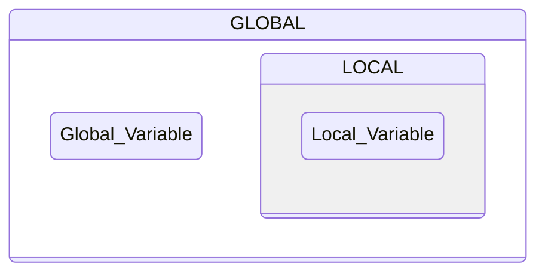
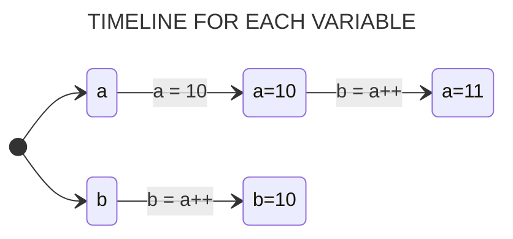
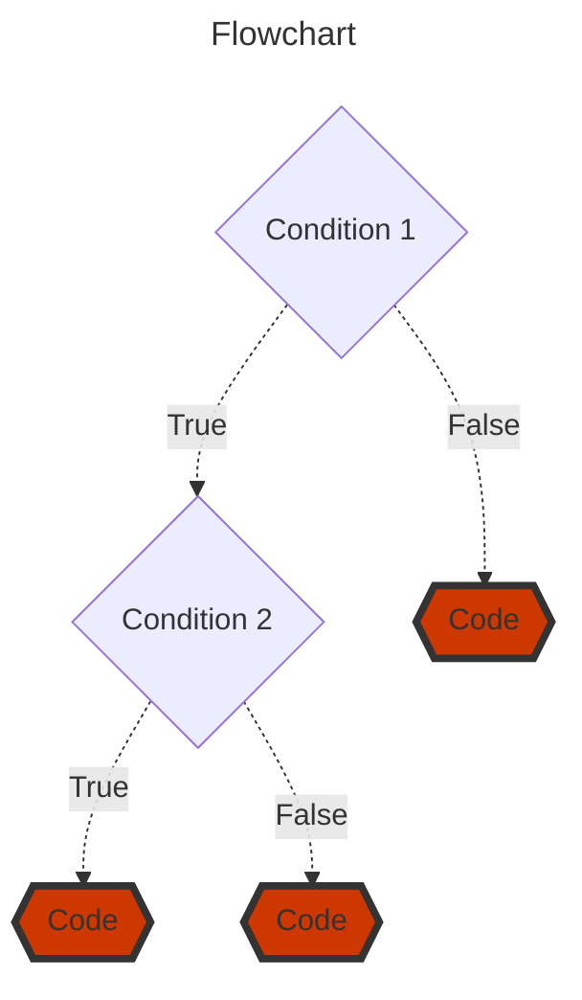
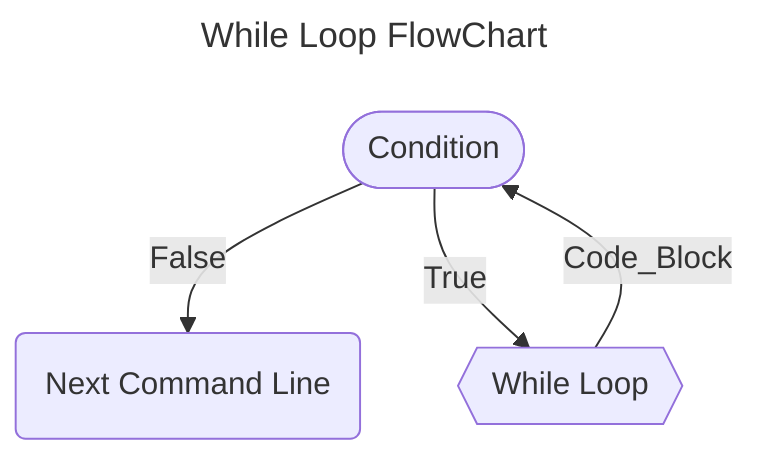
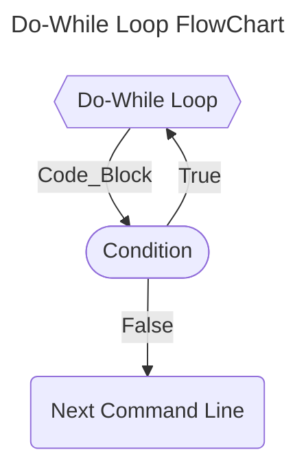
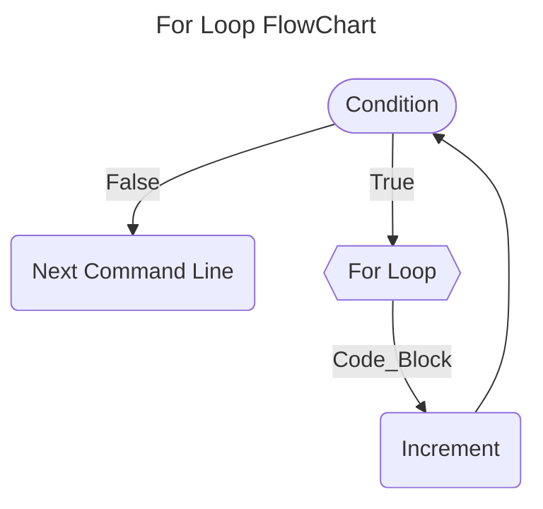

## Introduction

To master C is not just about learning a language; it's about gaining a profound understanding of programming principles. C strikes a balance between abstraction and hardware control, enabling you to craft effective programs and transfer knowledge to other languages.

In this guide, we will delve deep into the key topics encompassing the C language, starting with the most basic concepts and progressing to more advanced subjects. You will learn to write functional code, grasp memory management, and explore the construction of efficient data structures and algorithms.

---

## Directives

During the creation of the *source code*, in addition to regular commands, programmers can use compilation directives. Directives are readily recognized as they often appear at the beginning of source files, starting with the *prefix* `#` followed by the *directive name and its arguments*.

An important example is the `include` directive, which allows you to include the content of another file in the source code. This directive enables the use of inclusion files created by the user or provided with the compiler - typically header files with the ".h" extension.

```c
#include <stdio.h>     // searches for the "stdio.h" file primarily in the include directory (default: C:\TC\INCLUDE).

```

```c
#include "stdio.h"     // searches for the "stdio.h" file primarily in the working directory.
```

> *Regardless of the form used, this command instructs the preprocessor to include the content of the "stdio.h" file as an integral part of the source code file, exactly at that point. This action doesn't physically affect the source code file.*

The table below presents some of the most commonly used header files that can be utilized in program development.

| &nbsp;&nbsp;&nbsp;&nbsp;&nbsp;&nbsp;&nbsp;&nbsp;&nbsp;&nbsp;&nbsp;&nbsp;&nbsp;&nbsp;&nbsp;&nbsp;&nbsp;&nbsp;&nbsp;&nbsp;&nbsp;&nbsp;&nbsp;&nbsp;**File Inclusion**&nbsp;&nbsp;&nbsp;&nbsp;&nbsp;&nbsp;&nbsp;&nbsp;&nbsp;&nbsp;&nbsp;&nbsp;&nbsp;&nbsp;&nbsp;&nbsp;&nbsp;&nbsp;&nbsp;&nbsp;&nbsp;&nbsp;&nbsp;&nbsp; | &nbsp;&nbsp;&nbsp;&nbsp;&nbsp;&nbsp;&nbsp;&nbsp;&nbsp;&nbsp;&nbsp;&nbsp;&nbsp;&nbsp;&nbsp;&nbsp;&nbsp;&nbsp;&nbsp;&nbsp;&nbsp;&nbsp;&nbsp;&nbsp;&nbsp;&nbsp;&nbsp;&nbsp;&nbsp;&nbsp;&nbsp;&nbsp;&nbsp;&nbsp;&nbsp;&nbsp;&nbsp;&nbsp;&nbsp;&nbsp;&nbsp;&nbsp;&nbsp;&nbsp;&nbsp;&nbsp;&nbsp;&nbsp;&nbsp;&nbsp;&nbsp;&nbsp;&nbsp;&nbsp;&nbsp;&nbsp;&nbsp;&nbsp;&nbsp;&nbsp;&nbsp;&nbsp;&nbsp;&nbsp;**Description**&nbsp;&nbsp;&nbsp;&nbsp;&nbsp;&nbsp;&nbsp;&nbsp;&nbsp;&nbsp;&nbsp;&nbsp;&nbsp;&nbsp;&nbsp;&nbsp;&nbsp;&nbsp;&nbsp;&nbsp;&nbsp;&nbsp;&nbsp;&nbsp;&nbsp;&nbsp;&nbsp;&nbsp;&nbsp;&nbsp;&nbsp;&nbsp;&nbsp;&nbsp;&nbsp;&nbsp;&nbsp;&nbsp;&nbsp;&nbsp;&nbsp;&nbsp;&nbsp;&nbsp;&nbsp;&nbsp;&nbsp;&nbsp;&nbsp;&nbsp;&nbsp;&nbsp;&nbsp;&nbsp;&nbsp;&nbsp;&nbsp;&nbsp;&nbsp;&nbsp;&nbsp;&nbsp;&nbsp;&nbsp;|
|:---:| :---: |
| *#include <stdio.h>* | Provides input and output functions |
| *#include <stdlib.h>* | Provides memory allocation and conversion functions |
| *#include <math.h>* | Provides mathematical functions |
| *#include <string.h>* | Provides string manipulation functions |
| *#include <time.h>* | Provides functions to work with time and dates |
| *#include <stdbool.h>* | Provides the bool type and true/false constants |


## Variables

Variables hold and point to a value. They act as a *reference* or *abstraction* to literal data. That data is stored in the computer's memory, and takes up an certain amount of space, so we can retrieve it later and use when we need to.

In the simplest terms, you can think of variables as a **named box**. A box that acts as a *storage place* and *location* for holding different information. 

Each box has a **unique name** which acts like a label put on the outside that is a unique identifier, and the information/content lives on the inside. The content is the variable's value.

#### Example: Adding Two Numbers

```c
#include <stdio.h>

int main(int argc, char *argv[])
{
  int a, b, sum;           // Declaring three scope interger variables

  a = 10;                  // Assignment inline of variable a
  b = 5;                   // Assignment inline of variable b

  sum = a + b;             // Assignment to sum variable the result between the sum of a and b
  return 0;
}
```
> *In this example was declared three integer data type variables - a, b and sum - which were used to store three values*

#

### Declaration and Initialization of Variables

The C programming language is a ***strongly statically typed*** language, unlike many other modern programming languages. In ***statically typed*** languages, you need to explicitly declare your variables to be of a certain *data type*. That way the compiler knows during compilation time if the variable is able to perform the actions it was set out and requested to do.

The purpose of specifying the variable type to our compiler (virtual machine) for code interpretation is due to the fact that in C, we are working directly with the allocation of a physical memory space present in the machine in question.

Thus, by indicating the variable *data type* we will work with, our machine will allocate a space of a specific size so that this variable - *access key* - can have a value *assigned* to it.

> [!NOTE]
> *Use the `=` or assignment operator to assign a value to a variable.*

#

### Declaring a Variable

When declaring a new variable in the C language, it's necessary to specify to the compiler what type of data will be assigned to that variable - access key. This way, when compiled in the future (program), the compiler will know what type of information is stored in that particular variable.

```c
#include <stdio.h>

int main(int argc, char *argv[])
{
  int age;     // int is the data type and age is the unique acess key to this variable

  int n1, n2   // We can also declare multiple variables at once.
  return 0;
}
```

> *To declare a variable, you specify the **data type**, and give a **name** - **acess key** - to the variable.*

#### So, what is the difference between initialising and declaring a variable?

#

### Initializing a Variable

When we declare a variable, we are simply defining its *data type* and a *unique access key* for that variable, as shown in the previous example.

We don't need to specify or assign a value immediately to all the variables we declare in our program. By merely declaring a variable, a memory space on our machine has already been reserved for that *access key*.

#### If we declare a variable and assign it a value at once, this is called initialising the variable.

```c
#include<stdio.h>

int main(int argc, char *argv[])
{
  int age = 30; // int n = 30; is initializing the variable. It refers to assigning an initial value.
  return 0;
}
```

```c
int age = 30;   // initializing the variable with the value of 30

age = 34;      //  the new value of age is 34
```

> [!IMPORTANT]
> **If the new value is the same data type, we don't need to include the data type, just the new value. If the data type is different, we will get an error.**

#

<br>

| BEST PRACTICES FOR NAMING VARIABLES IN C. | 
| --- | 
| Names with leading and trailing underscores are reserved for system purposes and should not be used for any user-created names. If you must have your own private identifiers, begin them with a letter or two identifying the package to which they belong. |
| #define constants should be in all CAPS. |
| Enum constants are Capitalized or in all CAPS |
| Function, typedef, and variable names, as well as struct, union, and enum tag names should be in lower case. |
| Many macro "functions" are in all CAPS. Some macros (such as getchar and putchar) are in lower case since they may also exist as functions. |
| Avoid names that differ only in case, like foo and Foo. Similarly, avoid foobar and foo_bar. The potential for confusion is considerable. |
| Similarly, avoid names that look like each other. On many terminals and printers, 'l', '1' and 'I' look quite similar. A variable named 'l' is particularly bad because it looks so much like the constant '1'. |
| In general, global names (including enums) should have a common prefix identifying the module that they belong with. Globals may alternatively be grouped in a global structure. Typedeffed names often have "_t" appended to their name. |
| Avoid names that might conflict with various standard library names. Some systems will include more library code than you want. Also, your program may be extended someday. |

## The Scope of a Variable in C

The scope of a variable refers to where the variable can be referenced and accessed from. It is essentially where the variable lives and is valid and how visible it is to the rest of the program.



**Local Scope:** If a variable is declared within a set of culry braces, {}, that will be its scope and we can't access it and use it outside those braces in the rest of the program. 

> *Therefore it is not a good idea to declare variables that way since their scope and use is so limited which can lead to errors. This scope is called local scope.*

**Global Scope:** If variables are declared outside of functions, they have global scope. Having a global scope means they are visible within the whole program and can be accessed from anywhere.

> *But keep in mind that it can be difficult to keep track of them. Also, any changes we make to them along the way can get confusing since they can happen in any part and location of the program.*

```c
#include <stdio.h>

float mean, n1, n2;     // Declaration of global variables.

int main(int argc, char *argv[])
{
  n1 = 10;
  n2 = 8;

  mean = ( n1 + n2 ) / 2;
  printf("%s%f", "Mean: ", mean); 
  return 0;
}
```

## #DEFINE and CONST Variables

When we use define for a constant, the preprocessor generates a C program where the defined constant is searched, and the corresponding tokens are replaced by the given expression. This can save space and increase compilation time.

```c
#define NUMBER 10
```

Constant variables are regarded as true variables, not macro definitions. Therefore, they allocate a memory space on your machine, just like any other variable.

```c
const int number = 10;
```

The significant advantage of `const` over `#define` is *type checking*. `#define` cannot be *type-checked*, which can cause issues when determining *data types*. If the variable is instead a constant, we can obtain the *data type* stored in that constant variable.

As const variables are considered variables, we can use pointers on them. This means we can perform type casting, manipulate addresses, and everything else you would be able to do with a regular variable, except altering the data itself, as the data assigned to that constant variable remains constant.

In general, `const` is a better option if we have a choice and it can be successfully applied to the code. There are situations where `#define` cannot be replaced by `const`. For example, `#define` can take parameters.

```c
#include <stdio.h>
#define MULTIPLY(a, b) a*b

int main(int argc, char *argv[])
{
  printf("%d", MULTIPLY(2+3, 3+5));
  return 0;
}
```
> *The macro is expanded as 2 + 3 * 3 + 5, not as 5\*8*


```c
#include <stdio.h>
#define LIMIT 100

int main(int argc, char *argv[])
{
  printf("%d", LIMIT);
  #undef LIMIT          // Removing defined macro LIMIT
  
  printf("%d", LIMIT);   // This line causes error as LIMIT is not defined
  return 0;
}
```
> *We can also remove previously defined macros using `#undef MACRO_NAME`*


## Data Types

During the compilation of the source code, the C compiler seeks to allocate the necessary *memory space* for program execution. While the compiler can determine the *data types* and *memory space* required for constants found in the code, for variables, this is only possible if there is a prior declaration of the *data type* used.

Each *data type* has a predetermined ***memory size requirement*** and an ***associated range of permissible values***. For example, a *character* typically occupies **1 byte**, while an *integer* usually takes up **2 bytes**. However, to ensure the portability of C code, this assumption cannot be taken as true. This is because the size and range of these *data types* vary according to the type of processor and the implementation of the C compiler. 

The ANSI standard stipulates only the minimum range for each data type, not its size in bytes.

| &nbsp;&nbsp;&nbsp;&nbsp;&nbsp;&nbsp;&nbsp;&nbsp;&nbsp;**Types**&nbsp;&nbsp;&nbsp;&nbsp;&nbsp;&nbsp;&nbsp;&nbsp;&nbsp; | &nbsp;&nbsp;&nbsp;&nbsp;&nbsp;&nbsp;&nbsp;&nbsp;&nbsp;&nbsp;&nbsp;&nbsp;&nbsp;&nbsp;&nbsp;&nbsp;&nbsp;&nbsp;&nbsp;&nbsp;&nbsp;&nbsp;&nbsp;&nbsp;&nbsp;&nbsp;&nbsp;**Description**&nbsp;&nbsp;&nbsp;&nbsp;&nbsp;&nbsp;&nbsp;&nbsp;&nbsp;&nbsp;&nbsp;&nbsp;&nbsp;&nbsp;&nbsp;&nbsp;&nbsp;&nbsp;&nbsp;&nbsp;&nbsp;&nbsp;&nbsp;&nbsp;&nbsp;&nbsp;&nbsp; | &nbsp;&nbsp;&nbsp;&nbsp;&nbsp;&nbsp;&nbsp;&nbsp;&nbsp;&nbsp;&nbsp;&nbsp;**Approximate Size**&nbsp;&nbsp;&nbsp;&nbsp;&nbsp;&nbsp;&nbsp;&nbsp;&nbsp;&nbsp;&nbsp;&nbsp; | &nbsp;&nbsp;&nbsp;&nbsp;&nbsp;&nbsp;&nbsp;&nbsp;&nbsp;&nbsp;&nbsp;&nbsp;**Minimum Range**&nbsp;&nbsp;&nbsp;&nbsp;&nbsp;&nbsp;&nbsp;&nbsp;&nbsp;&nbsp;&nbsp;&nbsp;     |
| :---:       | :---:             | :---:                  | :---:                   |
| char      | Character       | 8 bits = 1 byte      | -127 to 127            |
| int       | Integer         | 16 bits = 2 bytes    | -32.767 to 32.767      |
| float     | Floating-Point  | 32 bits = 4 bytes    | 7 digits of precision|
| double    | Double precision Floating-Point  | 64 bits = 8 bytes | 10 digits of precision |
| void     | No Value | |

Elements of the *char type* are typically used to hold values defined by the **ASCII** character set. Elements of the *int* type* generally correspond to the natural size of a word on the host computer. Thus, on a *16-bit machine*, int will likely be **16 bits**, and on a *32-bit machine*, int should be **32 bits**. The exact format of *floating-point* elements depends on how they are implemented.

The range of *float* and *double* types is given in digits of precision. Their magnitudes, however, depend on the method used to represent *floating-point* numbers. Regardless of the method, the number can be very large (the ANSI standard specifies the minimum range as 1x10^-37 to 1x10^37). The *void type* explicitly declares a function that does not return any value or creates generic pointers.

#

### Data Type Modifiers

With the exception of the void and *float types*, the other basic types can be adapted more precisely to the needs of the studied problem. To achieve this, it is necessary to prefix the basic *data type* with one of the ***type modifiers*** (signed, unsigned, long, and short) to alter the meaning of the type.

Usually, only the *long* modifier can be applied to the *double type*. This modification generates a *floating-point type with greater precision*. All four modifiers can be applied to *integers*. The ***short*** and ***long*** modifiers aim to provide different sizes of *integers* (smaller integers - short int or larger integers - long int).

The *unsigned* modifier is used to specify variables without sign. An *unsigned int* will be an integer that takes only positive values.

Below are the permitted data types and their maximum and minimum values in a typical compiler for 16-bit hardware. Also specified in this table is the format that should be used to read the data types using the ***scanf()*** function.

|  &nbsp;&nbsp;&nbsp;&nbsp;&nbsp;&nbsp;&nbsp;&nbsp;&nbsp;&nbsp;&nbsp;&nbsp;&nbsp;&nbsp;&nbsp;&nbsp;&nbsp;**Type**&nbsp;&nbsp;&nbsp;&nbsp;&nbsp;&nbsp;&nbsp;&nbsp;&nbsp;&nbsp;&nbsp;&nbsp;&nbsp;&nbsp;&nbsp;&nbsp;       | **Number of Bits** |  &nbsp;&nbsp;&nbsp;&nbsp;**scanf Read Format**&nbsp;&nbsp;&nbsp;&nbsp;|   &nbsp;&nbsp;&nbsp;&nbsp;&nbsp;&nbsp;&nbsp;&nbsp;&nbsp;&nbsp;&nbsp;&nbsp;&nbsp;&nbsp;&nbsp;&nbsp;&nbsp;&nbsp;&nbsp;&nbsp;**Start**&nbsp;&nbsp;&nbsp;&nbsp;&nbsp;&nbsp;&nbsp;&nbsp;&nbsp;&nbsp;&nbsp;&nbsp;&nbsp;&nbsp;&nbsp;&nbsp;&nbsp;&nbsp;&nbsp;&nbsp;   |   &nbsp;&nbsp;&nbsp;&nbsp;&nbsp;&nbsp;&nbsp;&nbsp;&nbsp;&nbsp;&nbsp;&nbsp;&nbsp;&nbsp;&nbsp;&nbsp;&nbsp;&nbsp;&nbsp;&nbsp;**End**&nbsp;&nbsp;&nbsp;&nbsp;&nbsp;&nbsp;&nbsp;&nbsp;&nbsp;&nbsp;&nbsp;&nbsp;&nbsp;&nbsp;&nbsp;&nbsp;&nbsp;&nbsp;&nbsp;&nbsp;   |
|:---:|:---:|:---:|:---:|:---:|
|   char          |        **8**       |           *%c*             |    **-128**   |    **127**  |
|   unsigned char |        **8**       |           *%c*             |      **0**    |    **255**  |
|   int          |       **16**       |       *%i or %d*           |  **-32,768**  |  **32,767** |
|   unsigned int  |       **16**       |           *%u*             |      **0**    |  **65,535** |
|   short int     |       **16**       |     *%hi or %hd*           |  **-32,768**  |  **32,767** |
|   unsigned short int|   **16**       |           *%hu*            |      **0**    |  **65,535** |
|   long int     |       **32**       |     *%li or %ld*           |**-2,147,483,648**|**2,147,483,647**|
|   unsigned long int|   **32**       |           *%lu*            |      **0**    |**4,294,967,295**|
|   float         |       **32**       | *%f, %e, or %g*            |  **3.4E-38**  |  **3.4E+38**|
|   double        |       **64**       |*%lf, %le, or %lg*          |**1.7E-308**   |**1.7E+308**|
|   long double   |       **80**       |           *%Lf*            |**3.4E-4932** |**3.4E+4932**|

> *Certainly, it's important to note that the floating-point ranges in the table above are indicated in terms of exponent range, but the numbers can take both positive and negative values.*


## Operators

C features an extensive set of operators that can be used in the manipulation of variables and constants during program execution.

### Arithmetic Operators

Arithmetic operators are mathematical operators that perform mathematical functions on numbers. 

* `+`  - **Addition Operator**
* `-`  - **Subtraction Operator**
* `*`  - **Multiplication Operator**
* `**` - **Power Operator**
* `/`  - **Division Operator**
* `%`  - **Modulo Division Operator**

A particularity of C relates to the fact that the value returned by an *arithmetic expression* is always of the largest *data type* used in the expression.

#### Example: Division by INTEGER and FLOAT Numbers.

```c
#include <stdio.h>

int main(int argc, char *argv[])
{
  int n1 = 2;
  float n2 = 3.3;

  // We are instructing the program to print an integer value resulting from a division involving a real number
  // which results an error.
  printf("%d", (a / b) );

  // The program will print correctly because it has been instructed to print the result within the realm of real numbers.
  printf("%f", (a / b) );
  return 0;
}
```

> [!NOTE]
> **It is possible to cast the result of some operations, which will be approached later.**

#

### Increment and Decrement Operators

The C language allows the use of the unary operators "++" and "--" to *increment* (add 1) or *decrement* (subtract 1) the value of a variable, respectively.
```julia
++X          // X = X + 1 
X++          // X = X + 1

--X          // X = X - 1 
X--          // X = X - 1 
```
As you can see, these operators can be either *prefixed* or *postfixed*. The difference is that when they are *prefixed*, they increment the variable before using its value. When they are *postfixed*, they use the value of the variable before incrementing it.

#### Example: PostFixed
```julia
int a, b;

a = 10;
b = a++;

FINAL RESULT: a = 11; b = 10;
```



#### Example: PreFixed
```julia
int a, b;

a = 10;
b = ++a;

FINAL RESULT: a = 11; b = 11;
```


#

### Reduced Expressions

Reduced expressions are applied in cases where the same variable is on both sides of the assignment statement. 

| &nbsp;&nbsp;&nbsp;&nbsp;&nbsp;&nbsp;&nbsp;&nbsp;&nbsp;&nbsp;&nbsp;&nbsp;&nbsp;&nbsp;&nbsp;&nbsp;&nbsp;&nbsp;&nbsp;&nbsp;&nbsp;&nbsp;&nbsp;&nbsp;&nbsp;&nbsp;&nbsp;&nbsp;&nbsp;&nbsp;&nbsp;&nbsp;&nbsp;&nbsp;&nbsp;**REDUCED EXPRESSION**&nbsp;&nbsp;&nbsp;&nbsp;&nbsp;&nbsp;&nbsp;&nbsp;&nbsp;&nbsp;&nbsp;&nbsp;&nbsp;&nbsp;&nbsp;&nbsp;&nbsp;&nbsp;&nbsp;&nbsp;&nbsp;&nbsp;&nbsp;&nbsp;&nbsp;&nbsp;&nbsp;&nbsp;&nbsp;&nbsp;&nbsp;&nbsp;&nbsp;&nbsp;&nbsp; | &nbsp;&nbsp;&nbsp;&nbsp;&nbsp;&nbsp;&nbsp;&nbsp;&nbsp;&nbsp;&nbsp;&nbsp;&nbsp;&nbsp;&nbsp;&nbsp;&nbsp;&nbsp;&nbsp;&nbsp;&nbsp;&nbsp;&nbsp;&nbsp;&nbsp;&nbsp;&nbsp;&nbsp;&nbsp;&nbsp;&nbsp;&nbsp;&nbsp;&nbsp;&nbsp;**NORMAL EXPRESSION**&nbsp;&nbsp;&nbsp;&nbsp;&nbsp;&nbsp;&nbsp;&nbsp;&nbsp;&nbsp;&nbsp;&nbsp;&nbsp;&nbsp;&nbsp;&nbsp;&nbsp;&nbsp;&nbsp;&nbsp;&nbsp;&nbsp;&nbsp;&nbsp;&nbsp;&nbsp;&nbsp;&nbsp;&nbsp;&nbsp;&nbsp;&nbsp;&nbsp;&nbsp;&nbsp; |
| :---:                | :---:               |
| **A += 5**          | **A = A + 5**       |
| **B - = 2**        | **B = B – 2**      |
| **C** ***=** **2**           | **C = C * 2**       |
| **D /= 7**           | **D = D / 7**      |
| **E %= 3**           | **E = E % 3**        |

> *Note that this type of expression is very useful for manipulating counting variables and/or accumulators.*

#

### Relational Operators 

Relational operators perform comparisons between expressions, their results are always logical values - *false* equals to 0 and *true* equals to 1.

| &nbsp;&nbsp;&nbsp;&nbsp;&nbsp;&nbsp;&nbsp;&nbsp;&nbsp;&nbsp;&nbsp;&nbsp;&nbsp;&nbsp;&nbsp;&nbsp;&nbsp;&nbsp;&nbsp;&nbsp;&nbsp;&nbsp;&nbsp;&nbsp;&nbsp;&nbsp;&nbsp;&nbsp;&nbsp;&nbsp;&nbsp;&nbsp;&nbsp;&nbsp;&nbsp;&nbsp;&nbsp;&nbsp;&nbsp;&nbsp;&nbsp;&nbsp;&nbsp;&nbsp;&nbsp;&nbsp;**OPERATOR**&nbsp;&nbsp;&nbsp;&nbsp;&nbsp;&nbsp;&nbsp;&nbsp;&nbsp;&nbsp;&nbsp;&nbsp;&nbsp;&nbsp;&nbsp;&nbsp;&nbsp;&nbsp;&nbsp;&nbsp;&nbsp;&nbsp;&nbsp;&nbsp;&nbsp;&nbsp;&nbsp;&nbsp;&nbsp;&nbsp;&nbsp;&nbsp;&nbsp;&nbsp;&nbsp;&nbsp;&nbsp;&nbsp;&nbsp;&nbsp;&nbsp;&nbsp;&nbsp;&nbsp;&nbsp; | &nbsp;&nbsp;&nbsp;&nbsp;&nbsp;&nbsp;&nbsp;&nbsp;&nbsp;&nbsp;&nbsp;&nbsp;&nbsp;&nbsp;&nbsp;&nbsp;&nbsp;&nbsp;&nbsp;&nbsp;&nbsp;&nbsp;&nbsp;&nbsp;&nbsp;&nbsp;&nbsp;&nbsp;&nbsp;&nbsp;&nbsp;&nbsp;&nbsp;&nbsp;&nbsp;&nbsp;&nbsp;&nbsp;&nbsp;&nbsp;&nbsp;&nbsp;&nbsp;&nbsp;&nbsp;&nbsp;**MEANING**&nbsp;&nbsp;&nbsp;&nbsp;&nbsp;&nbsp;&nbsp;&nbsp;&nbsp;&nbsp;&nbsp;&nbsp;&nbsp;&nbsp;&nbsp;&nbsp;&nbsp;&nbsp;&nbsp;&nbsp;&nbsp;&nbsp;&nbsp;&nbsp;&nbsp;&nbsp;&nbsp;&nbsp;&nbsp;&nbsp;&nbsp;&nbsp;&nbsp;&nbsp;&nbsp;&nbsp;&nbsp;&nbsp;&nbsp;&nbsp;&nbsp;&nbsp;&nbsp;&nbsp;&nbsp; |
| :---:                | :---:               |
| `==`         | **EQUAL TO**    |
| `>`         | **GREATER THAN**      |
| `<`          | **LESS THAN**     |
| `>=`          | **GREATER THAN OR EQUAL TO**     |
| `<=`          | **LESS THAN OR EQUAL TO**     |
| `!=`          | **NOT EQUAL TO**     |

> *When using any relational operator, there is always a return value that can either be true or false, otherwsie knokn as a **Boolean** value.*

#

### Logical Operators

Logical operators can be used to combine two or more relational operations into a single conditional test (binary operators AND and OR) or modify the result of a relational operation (unary operator NOT).

| &nbsp;&nbsp;&nbsp;&nbsp;&nbsp;&nbsp;&nbsp;&nbsp;&nbsp;&nbsp;&nbsp;&nbsp;&nbsp;&nbsp;&nbsp;&nbsp;&nbsp;&nbsp;&nbsp;&nbsp;&nbsp;&nbsp;&nbsp;&nbsp;&nbsp;&nbsp;&nbsp;&nbsp;&nbsp;&nbsp;&nbsp;&nbsp;&nbsp;&nbsp;&nbsp;&nbsp;&nbsp;&nbsp;&nbsp;&nbsp;&nbsp;&nbsp;&nbsp;&nbsp;&nbsp;&nbsp;**OPERATOR**&nbsp;&nbsp;&nbsp;&nbsp;&nbsp;&nbsp;&nbsp;&nbsp;&nbsp;&nbsp;&nbsp;&nbsp;&nbsp;&nbsp;&nbsp;&nbsp;&nbsp;&nbsp;&nbsp;&nbsp;&nbsp;&nbsp;&nbsp;&nbsp;&nbsp;&nbsp;&nbsp;&nbsp;&nbsp;&nbsp;&nbsp;&nbsp;&nbsp;&nbsp;&nbsp;&nbsp;&nbsp;&nbsp;&nbsp;&nbsp;&nbsp;&nbsp;&nbsp;&nbsp;&nbsp; | &nbsp;&nbsp;&nbsp;&nbsp;&nbsp;&nbsp;&nbsp;&nbsp;&nbsp;&nbsp;&nbsp;&nbsp;&nbsp;&nbsp;&nbsp;&nbsp;&nbsp;&nbsp;&nbsp;&nbsp;&nbsp;&nbsp;&nbsp;&nbsp;&nbsp;&nbsp;&nbsp;&nbsp;&nbsp;&nbsp;&nbsp;&nbsp;&nbsp;&nbsp;&nbsp;&nbsp;&nbsp;&nbsp;&nbsp;&nbsp;&nbsp;&nbsp;&nbsp;&nbsp;&nbsp;**MEANING**&nbsp;&nbsp;&nbsp;&nbsp;&nbsp;&nbsp;&nbsp;&nbsp;&nbsp;&nbsp;&nbsp;&nbsp;&nbsp;&nbsp;&nbsp;&nbsp;&nbsp;&nbsp;&nbsp;&nbsp;&nbsp;&nbsp;&nbsp;&nbsp;&nbsp;&nbsp;&nbsp;&nbsp;&nbsp;&nbsp;&nbsp;&nbsp;&nbsp;&nbsp;&nbsp;&nbsp;&nbsp;&nbsp;&nbsp;&nbsp;&nbsp;&nbsp;&nbsp;&nbsp;&nbsp;&nbsp; |
| :---:                | :---:               |
| `&&`         | **AND**    |
| `\|\|`       | **OR**      |
| `!`          | **NOT**     |


#### Example: Number Delimited By A Range
```c
#include <stdio.h>

int main(int argc, char *argv[])
{
  int a;
  
  a = 3;
  
  if ( (a > 0) && (a < 10) ) 
  {
      printf("%s", "The number is greater than 0 and less than 10 ");
  }
  return 0;
}
```
> *Operands on **both** the left and right sides of && need to be **true** for the condition to be true.*

#### Example: Checking a Negative Number
```c
#include <stdio.h>

int main(int argc, char *argv[])
{
  int a, b;
  
  a = 3;
  b = -2;
  
  if ( (a < 0) || (b < 0) )
    printf("%s", "At least one of the numbers are negative"); 
  return 0;
}
```
> *At least one or **both** of the operands on the right and left sides of || need to be **true** for the condition to be true.*


#### Example: Even Number Using NOT Operator
```c
#include <stdio.h>

int main(int argc, char *argv[])
{
  int a;

  a = 2;
    
  if ( !(a % 2 != 0) ) 
    printf("%s", "Even");
  return 0;
}
```
> *This **inverts** the value of the operand. If an operand is true, then the NOT operator makes the condition false and vice versa.*

#

### Ternary Operator 

The ternary operator `?` allows for conditional value assignment to a variable.

```julia
variable = condition ? expression1 (true) : expression2; (false)
```

In this structure, the condition is tested, and if it's **true**, *expression1* is taken; otherwise, *expression2* is adopted. To exemplify its usage, here's a snippet of a program that assigns the variable Z the greater value between variables A and B.

```julia
Z = (A > B) ? A : B;
```

Another way to write this command would be:

```julia
if (A > B)
  Z = A;
else
  Z = B;
```

#

### Casting Data Types 

When an expression combines variables of different *data types*, the C compiler checks whether conversions between these types are possible. If they are not, the compilation process is halted, and an error message is displayed. Otherwise, the compiler performs all necessary conversions, following the following rules:

1. *All *char* and *short int* values are converted to *int*. All *float* values are converted to *double*.*
2. *For pairs of operands with different types: those with *lower capacity* are converted to those with *higher capacity* (e.g., if one of them is *long double*, the other is also converted to *long double*).*

Furthermore, the programmer can force the result of an expression to be of a specific type. To do this, they should use *cast operators*.

```julia
variable = (datatype) expression;
```
#

#### Example: Explicit Type Casting in C
```c
#include <stdio.h>

int main(int argc, char *argv[])
{
  float number = 32.8;

  int a = (int) number + 10;

  printf("%d", a);
  return 0;
}
```

#### Example: The Conversion of Char to Int
```c
#include <stdio.h>

int main(int argc, char *argv[])
{
  char x;
  int number, total;

  x = 'x';
  number = 10;
  total = (int) x + number;  // total = x + number; also works (rule 1)
  
  printf("%d", total);
  return 0;
}
```

> *Although the compiler performs some conversions automatically as described previously, it's considered a good programming practice to explicitly declare and inform the program about the necessary casting to be done.*

#

### Operator Precedence

Operator precedence defines the order in which operators are evaluated in an expression. It determines how the terms are grouped and how the expression is calculated. Some operators have higher precedence than others. For instance, the *multiplication* operator has a **higher** precedence than the *addition* operator.

| &nbsp;&nbsp;&nbsp;&nbsp;&nbsp;&nbsp;&nbsp;&nbsp;&nbsp;&nbsp;&nbsp;&nbsp;&nbsp;&nbsp;&nbsp;&nbsp;**Category**&nbsp;&nbsp;&nbsp;&nbsp;&nbsp;&nbsp;&nbsp;&nbsp;&nbsp;&nbsp;&nbsp;&nbsp;&nbsp;&nbsp;&nbsp;&nbsp;|	  &nbsp;&nbsp;&nbsp;&nbsp;&nbsp;&nbsp;&nbsp;&nbsp;&nbsp;&nbsp;&nbsp;&nbsp;&nbsp;&nbsp;&nbsp;&nbsp;&nbsp;&nbsp;&nbsp;&nbsp;&nbsp;&nbsp;&nbsp;&nbsp;&nbsp;&nbsp;&nbsp;&nbsp;&nbsp;&nbsp;&nbsp;&nbsp;&nbsp;&nbsp;&nbsp;&nbsp;&nbsp;&nbsp;&nbsp;&nbsp;&nbsp;&nbsp;&nbsp;&nbsp;&nbsp;&nbsp;&nbsp;&nbsp;**Operator**&nbsp;&nbsp;&nbsp;&nbsp;&nbsp;&nbsp;&nbsp;&nbsp;&nbsp;&nbsp;&nbsp;&nbsp;&nbsp;&nbsp;&nbsp;&nbsp;&nbsp;&nbsp;&nbsp;&nbsp;&nbsp;&nbsp;&nbsp;&nbsp;&nbsp;&nbsp;&nbsp;&nbsp;&nbsp;&nbsp;&nbsp;&nbsp;&nbsp;&nbsp;&nbsp;&nbsp;&nbsp;&nbsp;&nbsp;&nbsp;&nbsp;&nbsp;&nbsp;&nbsp;&nbsp;&nbsp;&nbsp;&nbsp;                  | &nbsp;&nbsp;&nbsp;&nbsp;&nbsp;&nbsp;&nbsp;&nbsp;&nbsp;&nbsp;&nbsp;&nbsp;&nbsp;&nbsp;&nbsp;&nbsp;**Associativity**&nbsp;&nbsp;&nbsp;&nbsp;&nbsp;&nbsp;&nbsp;&nbsp;&nbsp;&nbsp;&nbsp;&nbsp;&nbsp;&nbsp;&nbsp;&nbsp;|
| :---:           |         :---:                         | :---:             |
| Postfix	        |   () [] -> . ++ - -                   | Left to right     |
| Unary	          |   + - ! ~ ++ - - (type)* & sizeof	    | Right to left     | 
| Multiplicative	|   * / %	                              | Left to right     | 
| Additive	      |   + -	                                | Left to right     | 
| Shift	          |   << >>	                              | Left to right     | 
| Relational	    |   < <= > >=                           | Left to right     | 
| Equality	      |    == !=	                            | Left to right     | 
| Logical AND	    |    &&	                                | Left to right     | 
| Logical OR	    |    \|\|	                              | Left to right     | 
| Conditional	    |   ?:	                                | Right to left     | 
| Assignment	    |   = += -= *= /= %=>>= <<= &= ^= \|=	  | Right to left     | 

> *Here, operators with the highest precedence appear at the top of the table, those with the lowest appear at the bottom. Within an expression, higher precedence operators will be evaluated first.*

## Input and Output Commands

Data input and output are essential pillars in programming, enabling interaction between programs and users, as well as communication with the external environment. This dynamic allows for acquiring crucial information and presenting processed results.

### Output of Data

The `printf()` function enables the *output* of values (constants, variables, or expression results). This function converts and prints its *arguments* to the standard output following the format specified in the *control string*.

```c
printf("control string", arguments);
```

The *control string*, describes everything that the function will display on the screen. This string not only shows the characters that will be presented but also the respective formats and positions of constants, variables, and expressions listed in the argument list.

```c
int a, b, sum;

a = 2;
b = 3;

sum = a + b;
printf("%s %d %s %d %s %d", "The sum between the numbers:", a, "and", b, "is equals to", sum);
```

In summary, the control string consists of three types of characters:

- **Miscellaneous characters** that will be displayed on the screen (corresponding to the text to be shown).
- **Escape characters "\\"** used to assist in cursor movement on the screen or carriage movement.
- **Format specifier characters "%"** that define the position and manner in which each of the variables in the argument list will be displayed.


|    &nbsp;&nbsp;&nbsp;&nbsp;&nbsp;&nbsp;&nbsp;&nbsp;&nbsp;**Specifier** &nbsp;&nbsp;&nbsp;&nbsp;&nbsp;&nbsp;&nbsp;&nbsp;&nbsp;   |     &nbsp;&nbsp;&nbsp;&nbsp;&nbsp;&nbsp;&nbsp;&nbsp;&nbsp;&nbsp;&nbsp;&nbsp;&nbsp;&nbsp;&nbsp;&nbsp;**Type**&nbsp;&nbsp;&nbsp;&nbsp;&nbsp;&nbsp;&nbsp;&nbsp;&nbsp;&nbsp;&nbsp;&nbsp;&nbsp;&nbsp;&nbsp;&nbsp;     |         &nbsp;&nbsp;&nbsp;&nbsp;&nbsp;&nbsp;&nbsp;&nbsp;&nbsp;&nbsp;&nbsp;&nbsp;&nbsp;&nbsp;&nbsp;&nbsp;&nbsp;&nbsp;&nbsp;&nbsp;&nbsp;&nbsp;&nbsp;&nbsp;&nbsp;&nbsp;&nbsp;&nbsp;&nbsp;&nbsp;&nbsp;&nbsp;&nbsp;&nbsp;&nbsp;**Example**&nbsp;&nbsp;&nbsp;&nbsp;&nbsp;&nbsp;&nbsp;&nbsp;&nbsp;&nbsp;&nbsp;&nbsp;&nbsp;&nbsp;&nbsp;&nbsp;&nbsp;&nbsp;&nbsp;&nbsp;&nbsp;&nbsp;&nbsp;&nbsp;&nbsp;&nbsp;&nbsp;&nbsp;&nbsp;&nbsp;&nbsp;&nbsp;&nbsp;&nbsp;&nbsp;              |       &nbsp;&nbsp;&nbsp;&nbsp;&nbsp;&nbsp;&nbsp;&nbsp;&nbsp;&nbsp;&nbsp;&nbsp;&nbsp;&nbsp;&nbsp;&nbsp;&nbsp;&nbsp;**Output**&nbsp;&nbsp;&nbsp;&nbsp;&nbsp;&nbsp;&nbsp;&nbsp;&nbsp;&nbsp;&nbsp;&nbsp;&nbsp;&nbsp;&nbsp;&nbsp;&nbsp;&nbsp;       |
|:-----------------:|:-------------------:|:---------------------------------:|:----------------------:|
|       **`%c`**      |    ***Character***       |       **`printf("%c", 'A');`**          |           **A**            |
|       **`%d`**     |      ***Integer***        |       **`printf("%d", 42);`**           |           **42**           |
|       **`%f`**      |  ***Floating Point***     |      **`printf("%f", 3.14);`**          |        **3.140000**       |
|      **`%lf`**      |       ***Double***        |   **`printf("%lf", 1.618);`**           |        **1.618000**       |
|       **`%o`**      |       ***Octal***         |        **`printf("%o", 8);`**           |           **10**           |
|       **`%p`**      |      ***Pointer***        | **`int var = 5; printf("%p", &var);`**  |    **Memory address**     |
|       **`%s`**      |       ***String***        | **`printf("%s", "Hello");`**            |         **Hello**         |
|       **`%u`**      | ***Unsigned Integer***    |     **`printf("%u", -42);`**            | **Unpredictable value**   |
|   **`%x or %X`**    |   ***Hexadecimal***       |     **`printf("%x", 255);`**            |           **ff**           |
|       **`%%`**      | ***Percent Symbol***      |         **`printf("%%");`**             |           **%**            |

> *In the table above, there are Some Format Specifiers for the printf() Function, followed by practical examples.*

#

### Input of Data

The `scanf()` function reads characters from the *standard input*, interprets them according to the format specification, and stores the results in variables declared in the program.

```c
scanf("control string", &variable);
```

The *memory address* representation of the variables that will *receive the input data is provided* using the `&` operator *followed by the variable name*. Additionally, this function also uses escape control characters via backslash codesand formatting characters `%`.

```c
int number;

scanf("%d", &number);   // The scanf() function reads the typed number and stores it in the number variable as an integer.
```

| &nbsp;&nbsp;&nbsp;&nbsp;&nbsp;&nbsp;&nbsp;&nbsp;&nbsp;&nbsp;&nbsp;&nbsp;**Specifier**&nbsp;&nbsp;&nbsp;&nbsp;&nbsp;&nbsp;&nbsp;&nbsp;&nbsp;&nbsp;&nbsp;&nbsp; | &nbsp;&nbsp;&nbsp;&nbsp;&nbsp;&nbsp;&nbsp;&nbsp;&nbsp;&nbsp;&nbsp;&nbsp;&nbsp;&nbsp;&nbsp;&nbsp;&nbsp;&nbsp;&nbsp;&nbsp;&nbsp;&nbsp;&nbsp;&nbsp;&nbsp;&nbsp;&nbsp;&nbsp;&nbsp;&nbsp;&nbsp;&nbsp;&nbsp;&nbsp;&nbsp;&nbsp;&nbsp;&nbsp;&nbsp;&nbsp;&nbsp;&nbsp;&nbsp;&nbsp;**Description**&nbsp;&nbsp;&nbsp;&nbsp;&nbsp;&nbsp;&nbsp;&nbsp;&nbsp;&nbsp;&nbsp;&nbsp;&nbsp;&nbsp;&nbsp;&nbsp;&nbsp;&nbsp;&nbsp;&nbsp;&nbsp;&nbsp;&nbsp;&nbsp;&nbsp;&nbsp;&nbsp;&nbsp;&nbsp;&nbsp;&nbsp;&nbsp;&nbsp;&nbsp;&nbsp;&nbsp;&nbsp;&nbsp;&nbsp;&nbsp;&nbsp;&nbsp;&nbsp;&nbsp;                          |  &nbsp;&nbsp;&nbsp;&nbsp;&nbsp;&nbsp;&nbsp;&nbsp;&nbsp;&nbsp;&nbsp;&nbsp;&nbsp;&nbsp;&nbsp;&nbsp;&nbsp;&nbsp;&nbsp;&nbsp;&nbsp;&nbsp;&nbsp;&nbsp;&nbsp;&nbsp;&nbsp;**Example**&nbsp;&nbsp;&nbsp;&nbsp;&nbsp;&nbsp;&nbsp;&nbsp;&nbsp;&nbsp;&nbsp;&nbsp;&nbsp;&nbsp;&nbsp;&nbsp;&nbsp;&nbsp;&nbsp;&nbsp;&nbsp;&nbsp;&nbsp;&nbsp;&nbsp; |
|:-----------------:|:-------------------:|:---------------------------------:|
| **`%d`**        | ***Read an integer***                        | **`scanf("%d", &num);`**            |
| **`%f`**        | ***Read a floating-point number***            | **`scanf("%f", &floatValue);`**     |
| **`%c`**        | ***Read a character***                       | **`scanf("%c", &letter);`**         |
| **`%s`**        | ***Read a string***                          | **`scanf("%s", stringVar);`**       |
| **`%lf`**       | ***Read a double (long float)***             | **`scanf("%lf", &doubleValue);`**   |
| **`%x`**        | ***Read a hexadecimal integer***            | **`scanf("%x", &hexValue);`**       |
| **`%o`**        | ***Read an octal integer***                  | **`scanf("%o", &octValue);`**       |
| **`%u`**        | ***Read an unsigned integer***               | **`scanf("%u", &unsignedValue);`**  |

> *These format specifiers are used with the scanf() function to read data from the standard input.*

## Conditional Statements

Conditional Statements in programming enable the program to make decisions and execute specific code blocks based on certain conditions, enhancing its flexibility and adaptability.

### Conditional Statements and Truth Tables

Conditional Statements in programming enable diverse execution paths based on logical conditions using "if," "else if," and "else" statements. Utilizing truth tables to evaluate conditions, they systematically ensure precise decision-making, enhancing program functionality and reliability.

```c
int number = 10;    

if ( number > 0 )   
  printf("%s", "It's a positive number");  
```

> *For a better understanding, when a conditional statement is executed, two possible outcomes are provided: true and false. In the previous case, the compiler substitutes the variable "number" with its stored value, resulting in the following evaluation: "Is 10 greater than 0?" . In this instance, the answer is true. As a result, the compiler returns a value other than 0 to the "if()" function, permitting the execution of the subsequent command line.*

Boolean expressions are essential in programming, denoting true/false conditions. They employ logical operators (AND, OR, NOT) to combine or negate conditions, enabling intricate decision-making in code. Evaluating these expressions empowers programs to execute tailored actions based on outcomes, optimizing efficiency and functionality.

> *Any result from a comparison that is a non-zero value is treated as true, whereas 0 is interpreted as false.*

<table>
<tr><th>&nbsp;&nbsp;&nbsp;&nbsp;&nbsp;&nbsp;&nbsp;&nbsp;&nbsp;&nbsp;&nbsp;&nbsp;&nbsp;&nbsp;&nbsp;&nbsp;&nbsp;&nbsp;&nbsp;&nbsp;&nbsp;&nbsp;&nbsp;&nbsp;&nbsp;&nbsp;&nbsp;&nbsp;&nbsp;&nbsp;&nbsp;&nbsp;&nbsp;&nbsp;TRUTH TABLE FOR && &nbsp;&nbsp;&nbsp;&nbsp;&nbsp;&nbsp;&nbsp;&nbsp;&nbsp;&nbsp;&nbsp;&nbsp;&nbsp;&nbsp;&nbsp;&nbsp;&nbsp;&nbsp;&nbsp;&nbsp;&nbsp;&nbsp;&nbsp;&nbsp;&nbsp;&nbsp;&nbsp;&nbsp;&nbsp;&nbsp;&nbsp;&nbsp;&nbsp;&nbsp;&nbsp;&nbsp;&nbsp;</th><th>&nbsp;&nbsp;&nbsp;&nbsp;&nbsp;&nbsp;&nbsp;&nbsp;&nbsp;&nbsp;&nbsp;&nbsp;&nbsp;&nbsp;&nbsp;&nbsp;&nbsp;&nbsp;&nbsp;&nbsp;&nbsp;&nbsp;&nbsp;&nbsp;&nbsp;&nbsp;&nbsp;&nbsp;&nbsp;&nbsp;&nbsp;&nbsp;&nbsp;&nbsp;TRUTH TABLE FOR ||&nbsp;&nbsp;&nbsp;&nbsp;&nbsp;&nbsp;&nbsp;&nbsp;&nbsp;&nbsp;&nbsp;&nbsp;&nbsp;&nbsp;&nbsp;&nbsp;&nbsp;&nbsp;&nbsp;&nbsp;&nbsp;&nbsp;&nbsp;&nbsp;&nbsp;&nbsp;&nbsp;&nbsp;&nbsp;&nbsp;&nbsp;&nbsp;&nbsp;&nbsp;&nbsp;&nbsp;&nbsp;&nbsp;&nbsp;&nbsp;&nbsp;</th></tr>
<tr>
  <td>
  
| &nbsp; &nbsp;&nbsp;&nbsp;&nbsp;&nbsp;Operand 1&nbsp;&nbsp;&nbsp;&nbsp;&nbsp;&nbsp;  | &nbsp;&nbsp;&nbsp;&nbsp;&nbsp;&nbsp;Operand 2&nbsp;&nbsp;&nbsp;&nbsp;&nbsp;&nbsp; | &nbsp;&nbsp;&nbsp;&nbsp;&nbsp;Result (&&)&nbsp;&nbsp;&nbsp;&nbsp;&nbsp;|
|:-----------:|:-----------:|:-------------:|
|   **`false`**   |   **`false`**   |    **`false`**    |
|   **`false`**   |   **`true`**   |    **`false`**    |
|   **`true`**   |   **`false`**   |    **`false`**    |
|   **`true`**   |   **`true`**   |    **`true`**    |

</td>
<td>

| &nbsp; &nbsp;&nbsp;&nbsp;&nbsp;&nbsp;Operand 1&nbsp;&nbsp;&nbsp;&nbsp;&nbsp;&nbsp;  | &nbsp;&nbsp;&nbsp;&nbsp;&nbsp;&nbsp;Operand 2&nbsp;&nbsp;&nbsp;&nbsp;&nbsp;&nbsp; | &nbsp;&nbsp;&nbsp;&nbsp;&nbsp;Result ( \|\| )&nbsp;&nbsp;&nbsp;&nbsp;&nbsp;&nbsp;|
|:-----------:|:-----------:|:-------------:|
|   **`false`**   |   **`false`**   |    **`false`**    |
|   **`false`**   |   **`true`**    |     **`true`**    |
|   **`true`**    |   **`false`**   |     **`true`**    |
|   **`true`**    |   **`true`**    |     **`true`**    |

</td></tr> </table>

</td><td>

#

### Conditional Statement - IF Instruction
The *if* statement is the *primary decision-making* command in C programming. It evaluates the specified condition and, if the condition is true (non-zero), the program executes the following code block.
```c
if (condition)
{
  // code block
}
```
> *The code block should be delimited by an opening curly brace and a closing curly brace. However, if the block consists of only a single command, the curly braces become optional and can be omitted.*

#### Example: Negative Numbers
```c
#include <stdio.h>
int main (int argc, char *argv[])
{
  int a, b;
  
  scanf("%d %d", &a, &b);
  if ( (a < 0) && (b < 0) )
   printf("%s\n", "Both numbers are negative");
  return 0;
}
```

#

### Conditional Statement - ELSE Instruction

Including the *else* clause allows a *second code block* to be executed if the condition tested by the *if* statement is false (equal to zero).

```c
if (condition) {
    // code block 1; Executed when the condition is true
} else {
    // code block 2; Executed when the condition is false
}
```

#### Example: Is Even Number
```c
#include <stdio.h>

int main (int argc, char *argv[])
{
  int number;

  scanf("%d", &number);

  if ( number % 2 == 0 )
    printf("%s", "Even Number");
  else
    printf("%s", "Odd Number");
   return 0;
}
```

> *Note that the blocks of commands are indented (line indentation) within their respective structure. While not mandatory, this indentation is crucial for better code clarity, as it visually identifies the beginning and end of each block.*

#

### Conditional Statement - NESTED IF

Nested if statement in C is the nesting of if statement within another if statement and nesting of if statement with an else statement. Once an else statement gets failed there are times when the next execution of statement wants to return a true statement, there we need nesting of if statement to make the entire flow of code in a semantic order. 

```c
if (condition 1)
{
  if (condition 2){
    // if the statement is true, this code block is executed
  }else{
    // if the statement is false, this code block is executed
  }
}else{
  // if the condition 1 statement is false, this code block is executed
}
```

Nested if statement provides better decision making when other conditions are to be analyzed inside the first condition, and so we can include more than one nested if statement inside an if statement to get the required result.



#### Example: Analysis of People of Certain Age Groups 
```c
#include <stdio.h>
int main (int argc, char *argv[])
{
  int age;

  scanf("%d",&age);

  if ( age < 18 )
  {
    printf("Consider as minor \n");
    printf("Not fit for Working");
  }
  else
  {
    if (age >= 18 && age <= 50 )
    {
      printf("He/She is successfully eligible for Working \n");
      printf("Fill all the details and apply for it\n");
    }
    else
    {
      printf("Age is not satisfactory according to the organization norms\n");
      printf("Ready for retirement and can collect pension \n");
    }
  }
  return 0;
}
```

#

### Conditional Statement - ELSE IF Instruction

The *else if* statement is used to create multiple-choice decisions. It functions similarly to the nesting of if statements within the else clauses of higher-level if statements.

```c
if (condition1) {
  // executed if condition1 is true
} else if (condition2) {
  // executed if the condition1 is false and condition2 is true
} else {
  // executed if the condition1 is false and condition2 is false
}
```

In this structure, the conditional expressions are evaluated in order, and if any of them is true, the corresponding block of commands will be executed, and the chain will be terminated (no other conditions in the structure will be tested).

#### Example: Positive or Negative Number
```c
#include <stdio.h>

int main (int argc, char *argv[])
{
  int number = 10; 
  
  if (number > 0) 
    printf("The value is a positive number.");
  else if (number < 0)
    printf("The value is a negative number.");
  else 
    printf("The value is 0.");
return 0;
}
```

#

### Conditional Statement - Switch Statement  

In a *switch* statement, the computer sequentially compares a variable against a list of constants. If one of the constants described in the case clauses matches the current value of the variable, the computer executes the command or block of commands associated with that option.

This type of structure differs from *if* because it can only test for equality, while *if* can evaluate any type of logical expression.

```c
switch (variable)
{
  case condition:
    // code block
    break;
  case condition:
    // code block
    break;
  (...)
  default:
    // code block
}
```

> *The variable and the conditions must be of either int or char data type.*

The *break* command is used to terminate a sequence of commands. Technically, its usage is optional. However, when omitted, the execution will continue with the commands in the next *case* until the computer encounters a *break* or reaches the end of the *switch-case* structure.

The *deafult* clause is also optional and is used to handle cases that do not match any of the conditions tested in the *case* clauses. If not used, no command will be executed if all *case* options fail.

#### Example: Calculator Using The Switch Command
```c
#include <stdio.h>
#include <stdlib.h>

int main (int argc, char *argv[])
{
    char choice;
    int x, y;
 
    printf("Enter the Operator (+,-,*,/)");
    scanf(" %c", &choice);

    printf("Enter the two numbers: ");
    scanf("%d %d", &x, &y);

    switch (choice) 
    {
      case '+':
          printf("%d + %d = %d\n", x, y, x + y);
          break;
      case '-':
          printf("%d - %d = %d\n", x, y, x - y);
          break;
      case '*':
          printf("%d * %d = %d\n", x, y, x * y);
          break;
      case '/':
          printf("%d / %d = %d\n", x, y, x / y);
          break;
      default:
          printf("Invalid Operator Input\n");
    }
    return 0;
}
```

## Loop Structures

Loop structures are fundamental in C programming as they allow the iterative execution of code blocks based on specific conditions. The C language offers three main loop structures: *for*, *while*, and *do-while*. These structures provide efficiency and flexibility in implementing repetitive logic.

### Loop Structures - While Statement

The *while* statement executes a block of commands as long as the specified condition remains true (non-zero). It's used for looping tasks, and the block is executed only if the initial condition is met.

```c
while (condition)
{
  // code block
}
```

The *while* statement is a fundamental looping construct that repeatedly executes a block of commands as long as a specified condition holds *true*. This condition is evaluated at the *beginning of each iteration*, and the loop continues until the condition becomes *false*. 



#### Example: Adding Number Until the Condition is True
```c
#include <stdio.h>

int main(int argc, char *argv[])
{  
  int i, sum;

  sum = i = 0;
  while ( i <= 10 )
  {
    i++;
    sum += 1;
  }

  printf("%d\n", sum);
  return0;
}
```

If the tested condition is a number or a mathematical expression, the loop will be executed until the value of the number or expression becomes equal to zero. 

> *Similar to the if statement, if the command block consists of a single instruction, the curly braces are not necessary.*

#

### Loop Structures - Do-While Statement

The *do-while* loop in C is similar to the *while* loop, with the key distinction that it *executes the code block first before checking the test condition*. In this construct, the instructions within the loop are executed at least once. Moreover, if the tested condition remains true, *the code block will be repeatedly executed until the condition eventually evaluates to false*. 

This loop type ensures the initial execution of the block and is useful when you want to guarantee that the loop's code runs at least once, regardless of the condition's outcome.

```c
do{
  // code block
}while(condition);
```

> *The do-while loop in C ensures that the code block is executed at least once before checking the conditional expression. It's useful when you want to perform an action before testing the condition, ensuring initial execution followed by potential repetition based on the condition's outcome.*




#### Example: Add Numbers Until the User Enters Zero
```c
#include <stdio.h>

int main(int argc, char *argv[])
{  
  double number, sum = 0;

  do {
    printf("Enter a number: ");
    scanf("%lf", &number);
    sum += number;
  }while(number != 0.0);

  printf("%s %2.f", "Sum = ", sum);
  return 0;
}
```

#

### Loop Structures - For Statement

In the *for loop*, the initialization is executed once at the beginning. Then, the loop continues as long as the condition is true. After each iteration, the increment is performed before checking the condition for the next iteration.

```c
for (initialization; condition; increment) {
    // Code to be executed in each iteration
}
```
In the context of the *for loop* in C programming, three essential components work together to control the loop's behavior:

- **Initialization:** The initial value or setup of the loop variable before starting the loop.
- **Condition:** The expression that is evaluated before each iteration. If it's true, the loop continues; if false, the loop terminates.
- **Increment:** The operation that updates the loop variable after each iteration. It can be an increase or decrease in value.

> *These three sections should be separated by a semicolon (;).*

The *for loop* continues execution while the test result is true. As soon as the condition becomes false (equal to zero), the program's execution will be directed to the commands following the for loop.



#### Example: Add Numbers Until The Condition is True
```c
#include <stdio.h>

int main(int argc, char *argv[])
{
  int sum;
  
  sum = 0;
  for(int i = 0; i < 10; ++i)
    sum += i;
  
  printf("%d\n", sum);
  return 0;
}
```

> *Similar to the while and do-while statement, if the command block consists of a single instruction, the curly braces are not necessary.*

#

### Variation of Structure

If the condition is omitted, the loop will become infinite and can be interrupted by using a control statement (break, return, or goto) in the *for loop's* code block.

> *Any of the three instructions that form the *for loop* can be omitted, although the semicolons must remain.*

```c
#include <stdio.h>

int main(int argc, char *argv[])
{
  int n;
  for (;;)
  {
    scanf("%d", &n);
    if (n == 1)
      break;       // This command will be addressed later.
  }
  return 0;
} 
```

> *This code demonstrates how the break command can be used to prematurely exit a loop based on a specific condition.*

When the *increment part* is omitted, no change is made to the control variable. As a result, the loop will either run infinitely, or this modification should be performed within the *for loop's* command block, as shown in the following example:

```c
#include <stdio.h>

int main(int argc, char *argv[])
{
  int n;
  for (n = 0; n != 123;)
    scanf("%d", &n);
  return 0;
} 
```

> *The program uses a for loop with a condition n != 123. The loop continues until the input value n becomes equal to 123, at which point the loop terminates.*

The *for loop* command allows multiple arguments in all three sections. In this case, *the additional arguments should be separated by commas* (,), as illustrated in the example:

```c
#include <stdio.h>

int main(int argc, char *argv[])
{
  int a, b;
  for (a = 0, b = 20; a < b; ++a, --b)
    printf ("%s %d %s %d\n", "a =", a, "b =", b); 
  return 0;
} 
```

> *The loop condition a < b ensures that the loop runs as long as a is less than b. As the loop progresses, a is incremented while b is decremented, resulting in a change in the comparison between them. The loop continues to run until the condition a < b becomes false.*

Finally, both *initialization* and *increment* can be placed outside the *for loop's control parentheses*, as shown in the example:

```c
#include <stdio.h>

int main(int argc, char *argv[])
{
  int a ;

  a = 0;  
  for (; a < 10 ;){
    printf ("%s %d\n", "a =", a);
    a++;
  }
  return 0;
} 
```

> *The loop condition is specified as a < 10, meaning the loop will continue as long as a is less than 10. The a value is then incremented using the a++; statement, ensuring that the loop progresses toward the exit condition.*

## Jump Statements

Jump Statements are used to control the execution flow of a program. They allow the program to skip to a specific part of the code, exit a loop prematurely, or return from a function. Some examples of jump statements include break, continue, return, and goto. These commands are powerful but should be used with caution to maintain code readability and structure.

Sometimes, it's convenient to control the output of a looping structure (for, while, or do-while), in a way other than the conditional tests at the beginning or end of it. For this purpose, you can use certain commands that allow you to divert the normal execution of a program.

#

### Jump Statements - Break Command

The *break* command is used to abruptly exit from a loop - *for* or *while/do-while* or to prematurely terminate the execution of a *switch* statement in programming. It helps control the flow by immediately ending the current loop or switch case, allowing the program to proceed with the next instructions outside of the loop or switch.

```c
break;
```

The *break* command is a powerful tool for controlling program flow, providing enhanced control over how your code behaves in specific situations, including:

- **Loop Termination:** The *break* command is employed to exit a loop prematurely, based on certain conditions. This enables efficient loop control, allowing you to halt iterations when specific criteria are met.
- **Switch Statement Control:** Within switch statements, *break* is used to terminate the current case and prevent fall-through behavior. This ensures that only the intended case is executed, enhancing the predictability of your code.
- **Emergency Exit:** In scenarios where unexpected conditions or errors arise, the *break* command can be utilized to perform an emergency exit from a loop, preventing the program from getting stuck in an infinite loop or erroneous processing.

These applications of the *break* command exemplify its significance in managing program execution and ensuring logical and structured code.

```c
#include <stdio.h>

int main(int argc, char *argv[])
{
  int i = 1;
  
  while (i <= 5) {
    if (i == 3) {
        printf("Reached the break statement\n");
        break;
    }
    printf("Iteration: %d\n", i);
    i++;
  }
  
  printf("Loop finished\n");
  return 0;
}
```

> *When executed within a nested loop, the **break** command interrupts the innermost loop, allowing the program to continue processing in the next iteration of the immediate outer loop (the enclosing loop structure).*

#

### Jump Statements - Return Command

The *return* command plays a crucial role in functions within C programming. When included within a function, it concludes the function's execution and conveys a value back to the calling code. This not only provides a means to terminate the function but also supplies essential data for further processing. 

```c
return (return_expression)
```

> *Where ***return_expression*** corresponds to the value that will be used in place of the function call.*

By providing a method for functions to deliver results, the *return* command contributes to enhanced modularity and efficient data flow within programs. Now, let's delve into its three key applications:

- **Function Output:** Use *return* to provide meaningful output from functions. It allows functions to generate results that can be utilized in other parts of the program.
- **Function Termination:** The *return* command acts as an exit point for a function. Once encountered, the function's execution terminates, and control returns to the calling code.
- **Error Handling:** *return* can also be used to handle errors. By returning specific error codes or values, functions can indicate failures and allow the calling code to respond appropriately.
  
Utilizing the *return* command effectively is essential in producing modular and organized code structures.

```c
#include <stdio.h>

int add(int a, int b);

int main(int argc, char *argv[])
{
  int num1 = 5, num2 = 3;
  
  int result = add(num1, num2);   // Call the add function and store the returned value in result
  printf("The sum of %d and %d is: %d\n", num1, num2, result);
  return 0;
}

int add(int a, int b)  // Function that calculates the sum of two integers
{   
  int sum = a + b;  
  return sum;       // Return the sum to the caller
}
```

> *The return command in the add function calculates the sum of its two integer arguments and returns the result, allowing the calculated value to be used in the calling code. This example showcases how functions enhance code organization and reusability for common tasks like addition.*

#

### Jump Statements - Continue Command

The *continue* command is a powerful tool that allows you to control the flow of loops with precision. When encountered within a loop, it instantly jumps to the next iteration, bypassing the remaining code for the current iteration. This is especially useful when you want to skip certain iterations based on specific conditions, without prematurely exiting the loop.

```c
continue;
```

By elegantly sidestepping the remaining code within the current iteration, it proves invaluable for selectively bypassing iterations influenced by distinct conditions. This adept maneuver fortifies loop efficiency and pliability, a testament to the versatile capabilities of the *continue* command. Now, let's delve into its three key applications:

- **Selective Skipping:** Use *continue* when you need to skip specific iterations of a loop based on certain conditions while continuing the loop's execution. This can help avoid unnecessary calculations or processing.
- **Loop Efficiency:** By skipping certain iterations using *continue*, you can optimize your loops for better performance, especially when dealing with large datasets or complex conditions.
- **Avoid Infinite Loops:** Be cautious not to create infinite loops inadvertently by using *continue* without proper logic. Make sure your loop's exit conditions are still achievable despite using the *continue* statement.

These applications of the *continue* commands allows you to harness finer control over your code, leading to more efficient and concise programming.

```c
#include <stdio.h>

int main(int argc, char *argv[])
{
  for (int i = 1; i <= 5; ++i) {
    if (i == 3) {
      printf("Skipping iteration %d\n", i);
      continue;  // Skip the remaining code for this iteration
    }
    printf("Iteration: %d\n", i);
  }
  return 0;
}
```

> *In this example, the program uses a for loop to iterate from 1 to 5. When i is equal to 3, the continue statement is encountered. This skips the remaining code inside the loop for that iteration and proceeds to the next iteration.*

#

### Jump Statements - Goto Command

The *goto* command is a unique control statement in C that enables direct and unconditional transfer of program execution to a labeled point within the code. While it offers a way to implement specific logic, caution is advised due to its potential to complicate code structure and readability. Understanding its use and considering alternatives is essential for maintaining organized and maintainable code.

```c
goto labeled_point
(...)

labeled_point:
  // code block
```  

While it can provide a way to implement specific logic or error-handling mechanisms, its use is generally discouraged due to the potential to create complex and hard-to-maintain code. The *goto* statement's ability to create convoluted program flow makes it important to exercise caution and consider alternative control structures for better code organization and readability. Now, let's delve into its three key applications:

- **Implementing Error Handling:** The *goto* command can be used to quickly jump to an error-handling section of code when exceptional conditions arise, centralizing error management and making code more concise.
- **Breaking Out of Nested Loops:** In complex nested loop scenarios, the *goto* command can provide a straightforward way to exit multiple levels of loops efficiently, which might otherwise require complex boolean flags.
- **Jumping to a Cleanup Section:** When a function involves resource allocation (like memory allocation) that requires cleanup before exiting, the *goto* command can help jump to a cleanup section without duplicating cleanup code across multiple exit points.

Remember, this command is not necessary and can always be replaced by other control structures.

```c
#include <stdio.h>

int main(int argc, char *argv[])
{
  int number;
  
  printf("Enter a positive number: ");
  scanf("%d", &number);
  
  if (number <= 0)
  {
    printf("Invalid input.\n");
    goto error; // Jump to the error-handling section
  }
  printf("You entered: %d\n", number);
  return 0;

error:
    printf("Error encountered.\n");
    return 1;
}
```

> *In this example, the program prompts the user to enter a positive number. If the input is not positive, it uses the goto command to jump to the error label, where an error message is displayed. This showcases how the goto command can be used for error handling to centralize code for managing exceptional conditions.*


## Arrays and Matrices

Arrays and matrices are fundamental concepts in C programming, providing a structured approach to store and manipulate multiple elements of the *same data type*. An *array* is a collection of elements, such as integers or characters, arranged sequentially in memory. Matrices, a n-dimensional extension of arrays, organize data in n-axis, creating a grid-like structure. These constructs empower programmers to efficiently manage large datasets, streamline operations, and enable versatile data handling. 

#

### Arrays

Arrays stand as foundational elements in C programming, embodying organized collections capable of containing multiple data items of a consistent data type. With a contiguous memory arrangement, arrays offer swift access and manipulation of elements. This construct simplifies the management of large datasets, streamlining operations and augmenting code structure. 

```julia
data_type array_name[array_size];
```

> *data_type: Specifies the type of data that the array will hold.*  
> *array_name: The name given to the array, used to reference its elements.*  
> *array_size: The number of elements the array can hold, which should be a positive integer.*

For example, to declare an *array of integers* named numbers with a size of 5:

```julia
int numbers[5];
```

> *The array elements are not initialized automatically. Ensure to explicitly assign values to the elements using assignments or loops before accessing them to avoid unexpected behavior due to uninitialized data.*

When declaring arrays in C, the compiler allocates memory space based on the specified dimensions. For instance, with a declaration like `int numbers[5];`, the compiler reserves contiguous memory for efficient data storage. This results in *10 bytes* - ***2 bytes per integer times 5***. This allocation approach optimizes memory utilization, streamlining access and manipulation of array elements.

The assignment or utilization of the value of one of the cells in arrays can be done using the syntax:

```julia
array[position] = 1;

variable = array[position];
```

In the C language, indexing always starts at *zero*. This implies that, in the previous example, the data in the *array* ***numbers*** will be indexed from 0 to 4. However, the C compiler does not verify whether the index used in the program is within valid bounds (this responsibility falls on the programmer).

Just like other variables, these types of structures can also be initialized during declaration, as follows:

```julia
int numbers[3] = {10, 20, 30};
```

> *Ensure the number of provided values matches the array size to prevent overstepping boundaries or leaving uninitialized elements. This concise initialization method enhances code readability and efficiency, especially for smaller arrays.*

When the structure is initialized during declaration, the size of one of the dimensions can be omitted, as it will be inferred from the number of values listed within curly braces. Thus, the above declaration could be rewritten as follows:

```julia
int numbers [] = {10, 20, 30};
```

Here is an example program that utilizes arrays:

```c
#include <stdio.h>

int main(int argc, char *argv[])
{
  int scores[5];     // Declare an array to store 5 integer scores
  
  printf("Enter 5 student scores:\n");
  // Use a loop to store array values using scanf()
  for (int i = 0; i < 5; i++)   
  {  
    printf("Enter score for student %d: ", i + 1);
    scanf("%d", &scores[i]);
  }
  
  // Calculate the average score
  int total = 0;
  for (int i = 0; i < 5; i++)
  {
    total += scores[i];
  }
  double average = (double)total / 5.0;
  
  // Display the array elements and the average
  printf("Scores: ");
  for (int i = 0; i < 5; i++) {
    printf("%d ", scores[i]);
  }
  printf("\nAverage score: %.2f\n", average);
  return 0;
}
```

> *In this example, the program uses a loop structure to prompt the user to enter 5 student scores using the scanf function within the loop. The scores are stored in the scores array. After storing the scores, the program calculates the average score using a loop, and finally, it displays the entered scores and the average using printf.*

#

### Matrices

Matrices, find profound significance in programming, where they extend the array concept to a n-dimensional grid. This grid-like structure, empowers programmers to handle complex datasets methodically. In the C language, matrices emerge as a robust tool for diverse tasks, from mathematical operations to image processing and simulations. Acquiring a grasp of matrices allows to navigate multidimensional data seamlessly, amplifying code efficiency and structured problem-solving.

```julia
data_type matrix_name[size1][size2]...[sizeN];
```

> *data_type: Specifies the type of data that the array will hold, such as int, float, char, etc.*  
> *array_name: The name given to the array, used to reference its elements.*  
> *size1, size2, ..., sizeN: The sizes of each dimension in the array.*

For example, to declare a 3-dimensional array of integers named matrix with sizes 2x3x4:

```c
int matrix[2][3][4];
```

> *Ensure that the provided sizes align with the intended data structure, and remember that multidimensional arrays (matrices) can quickly become complex to manage.*

As the same case for array type, with a declaration like `int matrix[2][3][4];`, the compiler reserves contiguous memory for efficient data storage. This results in *96 bytes* - (2 x 2 x 3 x 4).

The assignment or utilization of the value of one of the cells in arrays can be done using the syntax:

```julia
matrix[size1][size2]...[sizeN] = 1;

variable = matrix[size1][size2]...[sizeN];
```

In the C language, indexing always starts at zero. This signifies that, in the previous example, the data in the the matrix will hold 24 values, respectively indexed by the ordered pairs (0,0,0), (0,0,1), (0,0,2), (0,0,3), (0,1,0), (0,1,1), (0,1,2), (0,1,3), (0,2,0), (0,2,1), (0,2,2), (0,2,3), (1,0,0), (1,0,1), (1,0,2), (1,0,3), (1,1,0), (1,1,1), (1,1,2), (1,1,3), (1,2,0), (1,2,1), (1,2,2), (1,2,3). This indexing convention is essential to remember when working with matrices in C, as it ensures proper access to elements based on their positions.

Just like other variables, these types of structures can also be initialized during declaration, as follows:

```julia
int matrix[2][2][2] = {
    {{1, 2}, {3, 4}},
    {{5, 6}, {7, 8}}
};
```

> *In this example, the array has 2x2x2 dimensions, and each element is initialized accordingly. The concept extends similarly for arrays with more than three dimensions.*

Here is an example program that utilizes matrices:


```c
#include <stdio.h>

int main(int argc, char *argv[])
{
  int matrix[3][3]; // Declare a 3x3 matrix
  float total = 0;
  
  // Input values into the matrix using a for loop and scanf
  for (int row = 0; row < 3; row++)
  {
    for (int column = 0; column < 3; column++)
    {
      printf("Enter value for matrix[%d][%d]: ", row, column);
      scanf("%d", &matrix[row][column]);
      total += matrix[row][column]; // Calculate total for average
    }
  }
  
  // Calculate the average of all matrix elements
  float average = total / (3 * 3);
  
  // Display the matrix and its average
  printf("Matrix values:\n");
  for (int row = 0; row < 3; row++)
  {
    for (int column = 0; column < 3; column++)
      printf("%d ", matrix[row][column]);
    printf("\n");
  }
  printf("Average of matrix elements: %.2f\n", average);
  return 0;
}
```

> *In this example, the program uses nested for loops to input values into a 3x3 matrix using scanf. It then calculates the average of all matrix elements and displays the matrix along with the calculated average.*

## Composite Data Structures

Composite data structures are data structures that are composed of or built upon simpler data structures or primitive data types. They allow you to organize and store multiple pieces of data in a way that can represent more complex relationships and entities. One common type of composite data structure is the "struct," often accompanied by the "typedef" keyword, which enhances the flexibility and readability of your code.

#

### Structs

A *struct* is a composite data type in programming that groups together variables of different *data types* under a single name. It lets you create a custom data structure to represent a record, object, or entity with various attributes or properties. Each attribute is called a member, and you can define members with different *data types*. Structs are especially useful when you want to model real-world entities in your code.

For instance, you might use a *struct* to define a ***Person*** data type that contains members like *name*, *age*, and *height*, as shown in the previous example. This grouping makes it easier to manage related data and pass it around within your program.

#

#### Struct Statement

In the C language, a record is declared using the reserved keyword "struct." This keyword introduces a list of declarations enclosed in braces. An optional identifier called the "structure tag" can follow the "struct" keyword. This tag provides a name for the record and can be used as a shortcut for declaring the record in other parts of the program.

> *The variables within a record are called the members of the record.*

Here's an example of how you can define and use a struct in C:

```c
#include <stdio.h>
#include <string.h>

// Define a struct called "Person"
struct Person {
  char name[50];
  int age;
  float height;
};

int main(int argc, char *argv[])
{
  // Declare a variable of type "struct Person"
  struct Person person1;
  
  // Assign values to the members of the struct
  strcpy(person1.name, "John");
  person1.age = 30;
  person1.height = 1.75;
  
  // Print the information
  printf("Name: %s\n", person1.name);
  printf("Age: %d\n", person1.age);
  printf("Height: %.2f\n", person1.height);
  
  return 0;
}
```

> *In this example, we define a struct named Person with three members: name (a character array), age (an integer), and height (a float). We then declare a variable person1 of type struct Person and assign values to its members using the dot notation.*

Sometimes, you might need to represent more complex relationships between data elements. This is where nesting one struct inside another comes in handy.

Consider a scenario where you need to work with 2D coordinates and rectangles in a program. You can start by defining a Point struct to represent a point in a 2D space. This struct has two members: x and y, which hold the horizontal and vertical coordinates respectively.

```c
struct Point {
    int x;
    int y;
};
```

Now, let's say you want to define a Rectangle struct that represents a rectangle on a plane. Instead of just storing the width and height, you want to represent the rectangle using its top-left and bottom-right corners, each of which can be represented by a Point. This is achieved by nesting the Point struct within the Rectangle struct.

```c
struct Rectangle {
    struct Point topLeft;    // A Point representing the top-left corner
    struct Point bottomRight; // A Point representing the bottom-right corner
};
```

In the main function, you can create an instance of the Rectangle struct named rect. To assign values to the nested Point structs within rect, you use the dot notation twice: first to access the outer struct member (topLeft or bottomRight), and then to access the inner struct member (x or y).

```c
#include <stdio.h>

int main(int argc, char *argv[])
{
    struct Rectangle rect;

    rect.topLeft.x = 10;
    rect.topLeft.y = 20;
    rect.bottomRight.x = 50;
    rect.bottomRight.y = 30;

    // Printing the information
    printf("Top left point: x = %d, y = %d\n", rect.topLeft.x, rect.topLeft.y);
    printf("Bottom right point: x = %d, y = %d\n", rect.bottomRight.x, rect.bottomRight.y);

    return 0;
}
```

A declaration of a struct without a list of variables only describes the structure's format, but it does not allocate any storage space. If the struct has a name (identifier), this name can be used later in the definition of struct instances, as shown in the example:

```c
struct Person;
```

Normally, the declaration of the structure is done at the beginning of the program (global declaration), while the declaration of variables associated with this type of structure is done within respective functions (local declaration or formal arguments

#

#### Manipulation of Structure Members

A structure member is referenced in an expression using the construct:

```c
struct_variable.member_name
```

The dot operator "." connects the name of the variable of the structure type and the name of the member that will be used in the expression.

```c
rect.topLeft.x = 10;
```

As seen in the last example, referencing members of nested structures is done by sequentially identifying the involved structures from outermost to innermost, all separated by periods. This is followed by the name of the member from the innermost structure that will be used.

#

#### Typedef Command

In programming, the typedef keyword is a powerful tool that allows you to create custom, more descriptive names for existing data types. This serves to enhance code readability, improve maintainability, and provide a level of abstraction when working with complex or lengthy type names.

```c
typedef datatype variable_nickname;
```

> *When you encounter situations where a data type name is long, convoluted, or not intuitive, typedef lets you define an alias for that type.*

Consider this scenario: you're working with a complex data structure, perhaps involving nested structures or function pointers. The names of these types could become quite lengthy and cumbersome. Using typedef, you can assign shorter and more meaningful names to these types, simplifying the code.

Here's a simple example in C:

```c
#include <stdio.h>

// Define a type alias using typedef
typedef int Age;

int main(int argc, char *argv[])
{
    Age personAge = 30;
    printf("The person's age is: %d\n", personAge);
    return 0;
}
```

> *In this example, we've defined a type alias Age using typedef. This alias represents the int data type. By doing this, we can use the name Age instead of int, making our code clearer and more self-explanatory.*

Typedef is especially helpful when working with complex data types, such as function pointers or structures. It allows you to create meaningful names for these types, making your code easier to understand, more maintainable, and less error-prone.

## Strings 

In C, you don't have a dedicated string data type like in some higher-level languages. Instead, strings are represented using arrays of characters. The last character of a string is always the null character, which indicates the end of the string.

Here's a simple example of how strings are used in C:

```c
#include <stdio.h>

int main(int argc, char *argv[])
{
  // Declaring and initializing a string
  char greeting[] = "Hello, world!";
  
  // Printing the string
  printf("%s\n", greeting);
  
  return 0;
}
```

> *In this example, the string "Hello, world!" is stored in the greeting array. The %s format specifier in the printf function is used to print the string.*

### Strings Manipulation

Strings (sequences of characters) are the most common use case for arrays (a string is an array of chars) in programming. It's important to remember that strings have their last element as a '\0' (null terminator). As a result, the size of a string is the count of the characters entered plus the null terminator '\0'.

```c
char string_name[size];
```

> *The C standard library provides various functions for string manipulation. These functions are valuable because you can't, for instance, directly assign one string to another (string1 = string2;). Strings must be compared and manipulated element by element.*

For example, to compare two strings, you would use functions like strcmp(), and to copy strings, you would use functions like strcpy(). These functions are designed to handle the intricacies of C strings, including the null terminator, which is crucial for proper string manipulation and comparison.

# 

### Basic String Manipulation Functions 

Below, we will present some basic functions for string manipulation. With the exception of the ***fgets()*** function, the other functions are contained in the ***string.h*** header file.

#### FGETS
In C programming, fgets is a fundamental function for reading strings from an input stream, typically used for reading text from files or the standard input (keyboard). 

```c
char *fgets(char *str, int n, FILE *stream);
```

> ***str**: A pointer to a character array (string) where the read line of text will be stored.*   
> ***n**: An integer specifying the maximum number of characters to read, including the null terminator. This helps prevent buffer overflows.*  
> ***stream**: A pointer to the input stream from which to read the line of text. This can be a file pointer, such as stdin for standard input (keyboard), or a file opened using fopen for reading.*

The key advantage of fgets is that it allows you to specify the maximum number of characters to read, preventing buffer overflow issues. It also automatically appends a null terminator ('\0') to the end of the string, making it suitable for working with C strings.

```c
#include <stdio.h>

int main() {
  char input[100]; // Maximum size of the string to be read
  
  printf("Enter a line of text: ");
  
  // Use fgets to read a line of text from standard input
  fgets(input, sizeof(input), stdin);
  
  printf("You entered: %s", input);
  
  return 0;
}
```

> *In this example, fgets reads a line of text from stdin (standard input) and stores it in the input character array with a maximum size of 100 characters.*

#

#### STRCPY

The *strcpy* function in C is used for string manipulation and is short for **"string copy."** It allows you to copy the characters from one string to another, including the null terminator. This function is commonly used to duplicate strings or to initialize character arrays with a specific string value.

```c
char *strcpy(char *destination, const char *source);
```

> ***destination**: A pointer to the destination character array (string) where the copy will be stored. Ensure that the destination array has enough space to hold the source string.*  
> ***source**: A pointer to the source string that you want to copy.*

Here's an example of using strcpy to copy a string from one array to another:

```c
#include <stdio.h>
#include <string.h>

int main() {
  char source[] = "Hello, World!";
  char destination[20]; // Make sure it's large enough to hold the source
  
  // Use strcpy to copy the source string to the destination
  strcpy(destination, source);
  
  printf("Source: %s\n", source);
  printf("Destination: %s\n", destination);
  
  return 0;
}
```

> *The strcpy function copies the content of the source string to the destination string, including the null terminator. It's important to ensure that the destination array has sufficient space to accommodate the source string to avoid buffer overflows.*

#

#### STRCAT

The strcat function in C is used for string manipulation and stands for "string concatenation." It allows you to concatenate (append) one string to the end of another string. This function is particularly useful when you need to combine two strings into a single string.

```c
char *strcat(char *destination, const char *source);
```

> ***destination**: A pointer to the destination character array (string) where the copy will be stored. Ensure that the destination array has enough space to hold the source string.*  
> ***source**: A pointer to the source string that you want to copy.*

Here's an example of using strcpy to copy a string from one array to another:

```c
#include <stdio.h>
#include <string.h>

int main() {
  char destination[50] = "Hello, ";
  char source[] = "World!";
  
  // Use strcat to append the source string to the destination
  strcat(destination, source);
  
  printf("Concatenated String: %s\n", destination);
  
  return 0;
}
```

> *The strcat function appends the content of the source string to the end of the destination string. Ensure that the destination array has sufficient space to accommodate both strings to avoid buffer overflows.*

#

#### STRLEN

The strlen function in C is used to determine the length of a string, which means it calculates the number of characters in a string. This function is particularly helpful when you need to know the size of a string for various operations like memory allocation or string manipulation.

```c
size_t strlen(const char *str);
```

> ***str**: A pointer to the null-terminated string for which you want to find the length.*  
> ***size_t**: strlen returns a value of type size_t, which is an unsigned integer type that can hold the length of the string.*

Here's an example of using strcpy to copy a string from one array to another:

```c
#include <stdio.h>
#include <string.h>

int main() {
  char text[] = "Hello, World!"; // Null-terminated string
  
  // Use strlen to find the length of the string
  size_t length = strlen(text);
  
  printf("Length of the string: %zu\n", length);
  
  return 0;
}
```

> *The strlen function calculates the length of the null-terminated text string and returns it as a size_t value, which is then printed to the console.*

#

#### ATOI AND ATOF

The *atoi* and *atof* functions are used for converting strings to numeric values. These functions are valuable when you need to extract numerical data from strings, which is a common task when processing input data or configuration files.

**Syntax of atoi Function:**

> *str: A pointer to the null-terminated string containing the integer representation.*

```c
int atoi(const char *str);
```

**atoi Function:**
- atoi stands for "ASCII to Integer."
- It is used to convert a string containing an integer representation into an actual integer value.
- The function stops conversion when it encounters a character that is not a digit.
- It returns an integer.

#

**Syntax of atof Function:**

```c
double atof(const char *str);
```

> *str: A pointer to the null-terminated string containing the floating-point representation.*

**atof Function:**
- atof stands for "ASCII to Float."
- It is used to convert a string containing a floating-point representation into a floating-point (double) value.
- The function stops conversion when it encounters a character that is not a digit or a decimal point.
- It returns a double.

#

Example of Using atoi and atof:

```c
#include <stdio.h>
#include <stdlib.h>

int main() {
  char intStr[] = "12345";
  char floatStr[] = "3.14159";
  
  // Using atoi to convert a string to an integer
  int intValue = atoi(intStr);
  
  // Using atof to convert a string to a floating-point number
  double floatValue = atof(floatStr);
  
  printf("Integer value: %d\n", intValue);
  printf("Floating-point value: %f\n", floatValue);
  
  return 0;
}
```

> *The atoi function converts the intStr string to an integer, and the atof function converts the floatStr string to a floating-point number, which are then printed to the console.*

## Functions

Functions are the constructs that allow the user to break down their programs into building blocks. The main characteristic of functions is the fact that, once written and debugged, they can be reused as many times as needed, including by other programs.

```c
return_type function_name(parameters) {
    // Function body
    return value; // This is only required for functions that have a non-void return type.
}
```

> ***return_type:** It specifies the data type of the value that the function will return. If the function doesn't return a value, you should use `void`.*      
> ***parameters:** You can have zero or more parameters. Each parameter consists of a data type and a name.*  
> ***Function body:** This is where you write the actual code that the function will execute when called.*  
> ***return value (optional):** If the function is expected to return a value, you use the `return` statement to specify the value to be returned. *

Note that the type must be specified for each of the N input variables. It's in the parameter declaration that we inform the compiler about the inputs to the function (just as we specify the output in the return type). Each variable described in the parameter declaration will be treated as a local variable of the function. When a function has no input arguments, the parameter list will be empty. However, the parentheses in the function declaration are mandatory.

When a *return* statement is encountered, the function is immediately terminated, and if any data is provided after *return*, its value is returned by the function. It's important to remember that the return value provided must be compatible with the return type declared for the function. A function can have more than one *return* statement; however, only one will be executed per function call. This becomes clear when we consider that the function is terminated when the program reaches the first *return* statement.

Here are two examples of functions in C, one of which uses multiple return statements:

#### Example: A Simple Function
```c
#include <stdio.h>

// Function to calculate the square of a number
int square(int num) {
  int result = num * num;
  return result;
}

int main() {
  int number = 5;
  int squared = square(number);
  printf("The square of %d is %d\n", number, squared);
  return 0;
  }
```

> *In this example, the square function takes an integer as input, calculates its square, and returns the result.*

#### Example: Function with Multiple Return Statements
```c
#include <stdio.h>

// Function to check if a number is positive, negative, or zero
char* checkNumber(int num) {
  if (num > 0) {
      return "Positive";
  } else if (num < 0) {
      return "Negative";
  } else {
      return "Zero";
  }
}

int main() {
  int number = -7;
  char* result = checkNumber(number);
  printf("%d is %s\n", number, result);
  return 0;
}
```

> *In this example, the checkNumber function takes an integer as input, checks whether it's positive, negative, or zero, and returns a corresponding string. This function uses multiple return statements based on different conditions.*

Since functions return values, we can utilize them for assignments and conditional comparisons (as part of an expression) or even in outputting data. However, it's important to emphasize that in an assignment, function calls can only appear on the right-hand side of assignment statements.

#

### VOID TYPE

Instead of returning data, functions with a void return type are often used to perform actions or tasks, such as printing output, modifying variables, or interacting with external devices. To declare a function with a void return type, you simply specify void as the return type in the function signature:

```c
void functionName(parameters) {
    // Function body
    // Code to perform some task
}

```

> ***void:** This indicates that the function doesn't return a value.*  
> ***functionName:** This is the name you give to your function.*  
> ***parameters:** These are the input values that the function can accept. You can have zero or more parameters.*

Here's an example of a simple C function with a void return type that prints a message:

```c
#include <stdio.h>

void printWelcome() {
  printf("Welcome to our program!\n");
}

int main() {
  // Calling the function to print the welcome message
  printWelcome();
  return 0;
}
```

> *In a void function, the use of the return statement is optional and can be omitted.*

### FUNCTION CALL

Once functions are defined, they can be used without worrying about how they were written. This is what we refer to as a function call. A function call is the act of invoking the function in a program. When you call a function, you are requesting it to execute the code contained within its body. Functions are called by their name followed by parentheses, which can contain arguments if the function expects them.

For example, if you have a function called calculateSum that adds two numbers, you can call it like this:

```c
int result = calculateSum(5, 3); 
```

> *The function call above executes the code inside the calculateSum function with the arguments 5 and 3, and the result is assigned to the result variable.*

In general, arguments can be passed to functions in two ways, as follows:

#### Passing Parameters by Value

Passing parameters by value is a method of passing arguments to functions in which a copy of the actual parameter values is passed. This means that the function works with a copy of the original values, and any modifications to the parameters within the function do not affect the original variables outside of the function. This method is commonly used to avoid unintended side effects on the original variables.

Here's an example in C that demonstrates passing parameters by value:

```c
#include <stdio.h>

void swap(int a, int b) {
  int temp = a;
  a = b;
  b = temp;
}

int main() {
  int x = 5;
  int y = 10;
  
  printf("Before swap: x = %d, y = %d\n", x, y);
  
  // Calling the function to swap the values of x and y
  swap(x, y);
  
  printf("After swap: x = %d, y = %d\n", x, y);
  
  return 0;
}
```

> *In this example, even after calling the swap function, the values of x and y in the main function remain the same because the swap function received copies of the values and did not affect the original variables. This illustrates passing parameters by value.*

#

#### Passing Parameters by Reference

This type of function call is called "call by reference." This name comes from the fact that, in this type of call, the values of the variables are not passed to the function but rather their references (memory addresses of the variables). The function uses these references to modify the values of the variables used in the function call.

In this type of call, the formal parameters of a function must be declared as pointers (using the * operator). Pointers are the "references" we need to be able to change the variable outside the function. Additionally, to make these pointers receive the memory address of the variables used in the function call, it is necessary to place the & operator in front of each of the variables, as shown in the example:

> *In C, this is a common way to achieve call by reference, but it's worth noting that some other programming languages may have different mechanisms for call by reference*

Here's an example in C that demonstrates passing parameters by reference using pointers:

```c
#include <stdio.h>

void swap(int *a, int *b) {
  int temp = *a;
  *a = *b;
  *b = temp;
}

int main() {
  int x = 5;
  int y = 10;
  
  printf("Before swap: x = %d, y = %d\n", x, y);
  
  // Calling the function to swap the values of x and y by reference
  swap(&x, &y);
  
  printf("After swap: x = %d, y = %d\n", x, y);
  
  return 0;
}
```

> *In this example, the swap function receives pointers to x and y as arguments, allowing it to directly access and modify the variables x and y in the main function. This demonstrates passing parameters by reference using pointers.*

Note that once the value of the function has been stored in the memory address of nro, no return is necessary. This type of call is the same as used by the scanf() function. This is because this function needs to change the value of the variable passed as a parameter by assigning the new value entered by the user.

#

### RECURSION

Functions in C can call each other to perform a specific task. A special case of function calling occurs when a function calls itself. This process is called "recursion," and the function is referred to as a recursive function.

In a recursive function, the problem is divided into smaller, similar subproblems, and each subproblem is solved by applying the same function recursively. This process continues until a base case is reached, which is a condition that indicates when the recursion should stop. 

**Syntax of Recursive Function:**

```c
return_type recursiveFunction(parameters) {
  // Base case
  if (base_case_condition) {
    // Return a value or perform some action
  } else {
    // Recursive case
    // Call the function with modified arguments
    return recursiveFunction(modified_parameters);
  }
}
```

> ***Base Case:** This is the termination condition that specifies when the recursion should stop. It prevents the function from calling itself infinitely. When the base case is met, the recursion unwinds.*    
> ***Recursive Case:** In this part, the function calls itself with modified arguments, typically smaller or simpler than the original problem.*

Here's a classic example of recursion in C: calculating the factorial of a number.

```c
#include <stdio.h>

int factorial(int n) {
  // Base case: factorial of 0 or 1 is 1
  if (n == 0 || n == 1) {
    return 1;
  } else {
    // Recursive case: n! = n * (n-1)!
    return n * factorial(n - 1);
  }
}

int main() {
  int num = 5;
  int result = factorial(num);
  printf("Factorial of %d is %d\n", num, result);
  return 0;
}
```

> *The base case is when n is 0 or 1, where the factorial is 1. In the recursive case, the function calls itself with n-1 to calculate (n-1)! and multiplies it by n to get n!. The recursion continues until the base case is reached.*

A recursive function almost always consumes more memory and has slower processing than its non-recursive counterpart. This occurs because the memory used in a function call is only released upon its completion, so the computer allocates much more memory when the function is recursive. 

However, recursive code is more compact and sometimes easier to understand. Additionally, there are certain algorithms that are more efficient when implemented recursively. For example, the construction of some types of abstract data structures, such as trees, is inherently recursive in nature, even in their definition.

#

### PARAMETERS TO THE MAIN FUNCTION

In C, the main() function can receive arguments directly from the command line when you run the program from the terminal. These arguments are passed as parameters to the main() function. These parameters allow you to provide information or options to the program when it is started. The parameters *argc* and *argv* provide the programmer with access to the command line of the operating system through which the program was invoked. The declaration of a main() function with these parameters is:

```c
int main(int argc, char *argv[])
```

**argc:** (argument count): It's an integer that represents the total number of arguments passed to the program, including the program's own name.

**argv:** (argument vector): It's an array of strings, where each element is a sequence of characters representing an argument passed to the program. argv[0] contains the name of the program itself, and additional arguments are stored in argv[1], argv[2], and so on.

Here's an example of how these parameters can be used:

```c
#include <stdio.h>

int main(int argc, char *argv[]) {
  printf("Total number of arguments: %d\n", argc);
  
  printf("Program name: %s\n", argv[0]);
  
  for (int i = 1; i < argc; i++) {
    printf("Argument %d: %s\n", i, argv[i]);
  }
  return 0;
}
```

When you run this program from the terminal and provide arguments, it will print them to the screen. For example:

```julia
$ ./my_program arg1 arg2 arg3
Total number of arguments: 4
Program name: ./my_program
Argument 1: arg1
Argument 2: arg2
Argument 3: arg3
```

This is useful for creating programs that can be configured or customized with different options and input data from the command line.

## Pointers

Whenever we use the `scanf()` function to read an element of an array, we pass the memory address of that element. To do this, as previously discussed, we use the & operator, which returns the memory address allocated for a variable. Therefore, if ***v[i]*** represents the i-th element of the array, ***&v[i]*** represents the memory address where that element is stored.

```c
int v[10];
```

The variable ***v***, which represents the array, is a constant that represents its initial address. In other words, ***v*** without indexing points to the first element of the array. Therefore, the C language supports pointer arithmetic, which means you can add and subtract pointers as long as the resulting value points to the area reserved for the array.

If ***p*** represents a pointer to an integer, ***p+1*** represents a pointer to the next integer stored in memory. This increment is equivalent to adding **2 bytes** - *the size of an int* - to the memory address stored in the pointer ***p***. With this, in an array, we have the following equivalences:

```julia
v+0 points to the 1st element of the array.
v+1 points to the 2nd element of the array.
v+2 points to the 3rd element of the array.
...
v+N points to the (N+1)-th element of the array.
```

Therefore, writing ***&v[i]*** is equivalent to writing ***(v + i)***. Similarly, writing ***v[i]*** is equivalent to writing ***\*(v + i)***. This is because the `*` operator returns the value stored at the memory location indicated by ***(v + i)***.

In C, the declaration of a pointer is done using the following syntax:

```c
data_type *variable_name[size]...[sizeN]
```

Here's an example that demonstrates the use of arrays and pointers in C:

```c
#include <stdio.h>

int main() {
int numbers[] = {1, 2, 3, 4, 5};
int *ptr = numbers; // Assign the address of the first element to ptr
int sum = 0;

for (int i = 0; i < 5; i++) {
  sum += *ptr; // Access the value using the pointer
  ptr++;       // Move the pointer to the next element
}

printf("Sum of elements: %d\n", sum);

return 0;
}
```

> *We assign the address of the first element of the numbers array to ptr. Then, we use a loop to iterate through the array using the pointer ptr to access each element's value. The pointer is incremented to move to the next element in each iteration.*

#

### How Pointers Actually Work

The `int` type stores integers. The `float` type stores floating-point numbers. The `char` type stores characters. On the other hand, pointers store memory addresses. Think of a pointer as a note where you've written down a friend's address. The pointer is like that piece of paper where you've recorded an address. **What's the purpose of this? It's simple: when you write down a friend's address, you do it so that you can find them later. C works in a similar way. You record the address of something in a pointer variable so that you can use it later.**

Just like an address book where you store the addresses of several friends can be seen as an array of pointers in C.

**It's important to mention that pointers also have a type. For example, when you note down a friend's address, you treat that address differently from how you would when noting down the address of a company. Although both addresses have the same format (street, number, neighborhood, city, etc.), they refer to places with different contents. Therefore, these two addresses are pointers of different types.**

**In C, when we declare pointers, we're informing the compiler about the type of variable we are pointing to. An `int` pointer points to an integer, meaning it stores the address of a variable of type integer.**

#

#### Declaring and Using Pointers

To declare a pointer, we have the following general form:

```julia
pointer_type *variable_name;
```

It's the asterisk (*) operator that tells the compiler that the variable will not store a value but rather an address for that specified type. Let's see examples of declarations:

```c
int *pt;
```

> *This example declares a pointer to an integer. It hasn't been initialized yet (as is the case with any C variable that is only declared).*

When a pointer is not initialized at the moment it is declared, it means that it points to an undefined location. This location could be, for example, in the portion of memory reserved for the computer's operating system. Using the pointer in these circumstances can lead to a system crash or even worse consequences.

> *The pointer must be initialized (pointed to a known location) before use! This is of utmost importance!*

To assign a value to a newly created pointer, we could set it equal to a memory address. But how do we know the memory location of a variable in our program? It would be very difficult to determine the address of every variable we use, especially since these addresses are determined by the compiler at compile-time and may be relocated at runtime. We can let the compiler do this work for us. To find the address of a variable, simply use the `&` operator. See the example:

```c
int count, int *pointer;

count = 10;
pointer = &count;
```

> *We create an integer count with the value 10 and a pointer to an integer pointer. The expression &count gives us the memory address of count, which is stored in pointer. Note that we haven't changed the value of count, which still remains 10.*

Now that we have placed an address in pointer, it is now "ready" to be used. For example, we can change the value of count using pointer. To do this, we use the "inverse" operator of the & operator, which is the * operator. In the example above, since we set pointer to &count, the expression *pointer is equivalent to count itself. This means that if we want to change the value of count to 12, we simply do `*pointer = 12`.

Here are two examples of pointers in C:

#### Example: Pointer to an Integer
```c
#include <stdio.h>

int main() {
int num = 10;       // Declare an integer variable
int *ptr = &num;    // Declare a pointer to an integer and assign the address of num to it

printf("Value of num: %d\n", num);      // Print the value of num
printf("Address of num: %p\n", &num);   // Print the address of num
printf("Value using pointer: %d\n", *ptr); // Access the value of num using the pointer

return 0;
}
```

> *In the first example, we declare an integer variable num, initialize it with the value 10, create a pointer ptr that stores the address of num, and demonstrate how to access and print the value of num using the pointer. In*

#

#### Example: Pointer to an Integer
```c
#include <stdio.h>

int main() {
char letter = 'A';    // Declare a character variable
char *ptr = &letter;  // Declare a pointer to a character and assign the address of letter to it

printf("Value of letter: %c\n", letter);       // Print the value of letter
printf("Address of letter: %p\n", &letter);    // Print the address of letter
printf("Value using pointer: %c\n", *ptr);     // Access the value of letter using the pointer

return 0;
}
```

> *In the second example, we declare a character variable letter, assign it the character 'A', create a pointer ptr that points to the address of letter, and show how to access and print the value of letter using the pointer. *

We can do some arithmetic operations with pointers. The first and simplest one is to assign two pointers. If we have two pointers *p1* and *p2*, we can make them equal by doing `p1 = p2`. 

```c
int *p1, *p2;

p1 = p2;
```

Notice that we are making *p1* point to the same location as *p2*. If we want the variable pointed to by *p1* to have the same content as the variable pointed to by *p2*, we should do `*p1 = *p2`.

```c
int *p1, *p2;

*p2 = 10;
*p1 = *p2;
```

The next operations, also commonly used, are increment and decrement. When we increment a pointer, it starts pointing to the next value of the same type to which the pointer points. That is, if we have a pointer to an integer and increment it, it will point to the next integer.

```c
p++;
p--;
```

Reminder. We are discussing operations with pointers and not operations with the contents of the variables they point to. For example, to increment the content of the variable pointed to by the pointer p, you do:

```c
(*p)++; 
```

Other useful arithmetic operations involve adding and subtracting integers with pointers. Suppose you want to increment a pointer by 15. You can simply do:

```c
p = p + 15; // or p += 15;
```

And if you want to access the content of the pointer 15 positions ahead:

```c
*(p + 15);

*(p - 15);
```

These operations allow for easy navigation through memory locations when working with pointers.

#

### Initializing of Pointers

In C programming, initializing pointers is a fundamental concept that involves assigning a memory address to a pointer variable. Proper initialization ensures that the pointer points to a valid location in memory. Pointers can be initialized in various ways, depending on the specific use case.

#### Syntax:

```c
data_type *pointer_name = &variable_name;
```

- **data_type** is the type of data that the pointer will point to (e.g., int, float, char).
- **pointer_name** is the name of the pointer variable.
- **&variable_name** is the address of the variable that the pointer will point to.

Here's an example of how to initialize a pointer in C:

```c
#include <stdio.h>

int main() {
  int num = 42; // Declare an integer variable and initialize it to 42
  int *ptr;     // Declare an integer pointer
  
  ptr = &num;   // Initialize the pointer to the address of 'num'
  
  printf("Value of num: %d\n", num);
  printf("Address of num: %p\n", &num);
  printf("Value pointed to by ptr: %d\n", *ptr);
  printf("Address stored in ptr: %p\n", ptr);
  
  return 0;
}
```

> *In this example, we declare an integer variable num, an integer pointer ptr, and initialize ptr with the address of num. We then print the value of num, the address of num, the value pointed to by ptr, and the address stored in ptr.*

#

### Pointer to a Pointer

A pointer to a pointer, often referred to as a double pointer, is a variable that stores the address of another pointer. This concept is commonly used in scenarios where you need to manipulate or pass pointers to functions by reference. Initializing a pointer to a pointer involves assigning the address of a pointer variable to another pointer variable.

#### Syntax:

```c
data_type **pointer_to_pointer = &pointer_variable;
```

- **data_type** is the type of data that the pointer to a pointer will point to (e.g., int, float, char).
- **pointer_to_pointer** is the name of the pointer to a pointer variable.
- **pointer_variable** is the pointer whose address you want to store in the pointer to a pointer.

Pointer-to-pointer variables are particularly useful when working with dynamic memory allocation and multi-dimensional arrays.

Here's an example of how to initialize a pointer to a pointer in C:

```c
#include <stdio.h>

int main() {
  int num = 42;      // Declare an integer variable and initialize it to 42
  int *ptr = &num;   // Declare an integer pointer and initialize it with the address of 'num'
  int **ptr_to_ptr;  // Declare a pointer to a pointer
  
  ptr_to_ptr = &ptr; // Initialize the pointer to a pointer with the address of 'ptr'
  
  printf("Value of num: %d\n", num);
  printf("Value pointed to by ptr: %d\n", *ptr);
  printf("Value pointed to by ptr_to_ptr: %d\n", **ptr_to_ptr);
  
  return 0;
}
```

> *In this example, we have an integer variable num, an integer pointer ptr, and a pointer to a pointer ptr_to_ptr. We initialize ptr with the address of num, and then ptr_to_ptr is initialized with the address of ptr. We demonstrate accessing the value of num through all three levels: directly, through ptr, and through ptr_to_ptr.*

#

### Dinamic Allocation

Dynamic allocation allows the programmer to allocate memory for variables while the program is running. This enables defining, for example, an array or a matrix whose size is determined at runtime.

There are many other functions that are widely used but dependent on the environment and compiler. However, the ANSI C standard defines only four functions for dynamic memory allocation, available in the stdlib.h header file, and they are described as follows.

#### MALLOC 

Malloc stands for "memory allocation." It's a crucial function used for dynamic memory allocation, allowing you to request a specific amount of memory during program execution. This memory is allocated on the heap, which is a region of a computer's memory used for dynamic memory storage. malloc is particularly useful when you need to create data structures like arrays or linked lists of varying sizes.

```c
void* malloc(size_t size);
```

> *The function returns a pointer to the first byte of the allocated memory block if successful, or NULL if it fails to allocate the requested memory.*

Here's an example of how to use malloc to allocate memory for an integer array dynamically:

```c
#include <stdio.h>
#include <stdlib.h>

int main() {
  int *arr; // Declare a pointer to int
  int size = 5; // Size of the array
  
  // Dynamically allocate memory for the array
  arr = (int*)malloc(size * sizeof(int));
  
  // Check if memory allocation was successful
  if (arr == NULL) {
    printf("Memory allocation failed!\n");
    return 1; // Exit with an error code
  }
  
  // Initialize the array
  for (int i = 0; i < size; i++) {
    arr[i] = i * 2;
  }
  
  // Print the values in the array
  for (int i = 0; i < size; i++) {
    printf("arr[%d] = %d\n", i, arr[i]);
  }
  
  // Don't forget to free the allocated memory when done
  free(arr);
  
  return 0;
}
```

> *In this example, we allocate memory for an integer array of size 5 using malloc. We then populate and print the array before releasing the allocated memory with free.*

#

#### CALLOC

Calloc stands for "contiguous allocation." It's another function used for dynamic memory allocation, similar to malloc. However, calloc not only allocates memory but also initializes it to zero, making it suitable for creating arrays and structures where you want all elements to start with a known value, such as zero.

```c
void* calloc(size_t num_elements, size_t element_size);
```

- **num_elements** specifies the number of elements to allocate memory for.  
- **element_size** specifies the size (in bytes) of each element.

> *The function returns a pointer to the first byte of the allocated memory block if successful, or NULL if it fails to allocate the requested memory.*

Here's an example of how to use *calloc* to allocate memory for an integer array and initialize it with zeros:

```c
#include <stdio.h>
#include <stdlib.h>

int main() {
  int *arr; // Declare a pointer to int
  int size = 5; // Size of the array
  
  // Dynamically allocate memory for the array and initialize with zeros
  arr = (int*)calloc(size, sizeof(int));
  
  // Check if memory allocation was successful
  if (arr == NULL) {
    printf("Memory allocation failed!\n");
    return 1; // Exit with an error code
  }
  
  // Print the values in the array (should all be 0)
  for (int i = 0; i < size; i++) {
    printf("arr[%d] = %d\n", i, arr[i]);
  }
  
  // Don't forget to free the allocated memory when done
  free(arr);
  
  return 0;
}
```

> *In this example, we allocate memory for an integer array of size 5 using calloc. Since calloc initializes the memory to zero, all elements of the array will initially contain zeros. Finally, we release the allocated memory with free.*

#

#### REALLOC

Realloc stands for "reallocate." It is used for dynamic memory reallocation, which means changing the size of a previously allocated memory block. This is particularly useful when you have dynamically allocated memory, and you need to adjust its size based on changing requirements.

```c
void* realloc(void* ptr, size_t size);
```

- **ptr** is a pointer to a previously allocated memory block (e.g., the result of a previous malloc, calloc, or realloc call).  
- **size** is the new size (in bytes) you want to allocate for the memory block.

> *The function returns a pointer to the first byte of the newly allocated memory block if successful. If reallocation fails, it returns NULL, and the original block remains unchanged.*

This happens because `realloc()` may need to move the originally allocated block to *increase its size*, which means changing the ***memory address of the allocated bytes***. If this happens, the content of the old block is copied to the new block, and no information is lost. If *ptr* is **NULL**, it allocates num bytes and returns a *pointer*. If *size* is zero, the memory pointed to by ptr is freed. If there is not enough memory for reallocation, a *null pointer* is returned, and the original block remains unchanged.

Here's an example of how to use realloc to resize a dynamically allocated integer array:

```c
#include <stdio.h>
#include <stdlib.h>

int main() {
  int *arr; // Declare a pointer to int
  int size = 5; // Initial size of the array
  
  // Dynamically allocate memory for the initial array
  arr = (int*)malloc(size * sizeof(int));
  
  // Check if memory allocation was successful
  if (arr == NULL) {
      printf("Memory allocation failed!\n");
      return 1; // Exit with an error code
  }
  
  // Initialize the array
  for (int i = 0; i < size; i++) {
      arr[i] = i * 2;
  }
  
  // Print the values in the initial array
  printf("Initial array:\n");
  for (int i = 0; i < size; i++) {
      printf("arr[%d] = %d\n", i, arr[i]);
  }
  
  // Resize the array to a new size
  int new_size = 8;
  arr = (int*)realloc(arr, new_size * sizeof(int));
  
  // Check if reallocation was successful
  if (arr == NULL) {
      printf("Memory reallocation failed!\n");
      return 1; // Exit with an error code
  }
  
  // Initialize the additional elements
  for (int i = size; i < new_size; i++) {
      arr[i] = i * 3;
  }
  
  // Print the values in the resized array
  printf("\nResized array:\n");
  for (int i = 0; i < new_size; i++) {
      printf("arr[%d] = %d\n", i, arr[i]);
  }
  
  // Don't forget to free the allocated memory when done
  free(arr);
  
  return 0;
}
```

> *In this example, we start by allocating memory for an integer array of size 5 using malloc. Later, we use realloc to resize the array to a new size of 8. The additional elements are initialized, and the values are printed. Finally, we free the dynamically allocated memory.*

#

### FREE

The *free* function is used to deallocate memory that was previously allocated using functions like *malloc, calloc, or realloc*. It is an essential step in managing dynamic memory allocation and preventing memory leaks.

```c
void free(void* ptr);
```

- **ptr** is a pointer to the memory block that you want to deallocate.

> *The function doesn't return any value; it simply releases the memory.*

Through this pointer, the program searches an "internal allocation table" for the number of bytes that need to be released.

Here's an example of how to use free to deallocate dynamically allocated memory:

```c
#include <stdio.h>
#include <stdlib.h>

int main() {
  int *arr; // Declare a pointer to int
  int size = 5; // Size of the array
  
  // Dynamically allocate memory for the array
  arr = (int*)malloc(size * sizeof(int));
  
  // Check if memory allocation was successful
  if (arr == NULL) {
    printf("Memory allocation failed!\n");
    return 1; // Exit with an error code
  }
  
  // Initialize the array
  for (int i = 0; i < size; i++) {
    arr[i] = i * 2;
  }
  
  // Print the values in the array
  printf("Array contents:\n");
  for (int i = 0; i < size; i++) {
    printf("arr[%d] = %d\n", i, arr[i]);
  }
  
  // Deallocate the dynamically allocated memory
  free(arr);
  
  return 0;
}
```

> *In this example, we allocate memory for an integer array using malloc, initialize the array, print its values, and then deallocate the memory using free. This step is crucial to prevent memory leaks and efficiently manage memory resources.*


[!IMPORTANT]
> **Please note that you should always free dynamically allocated memory when you are done using it to avoid memory leaks.**


---

## Conclusion


