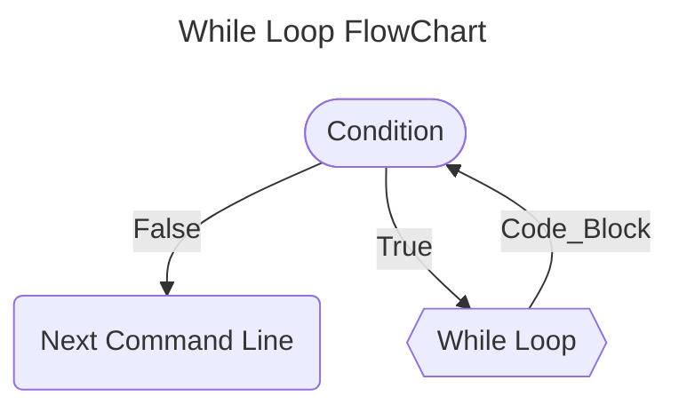
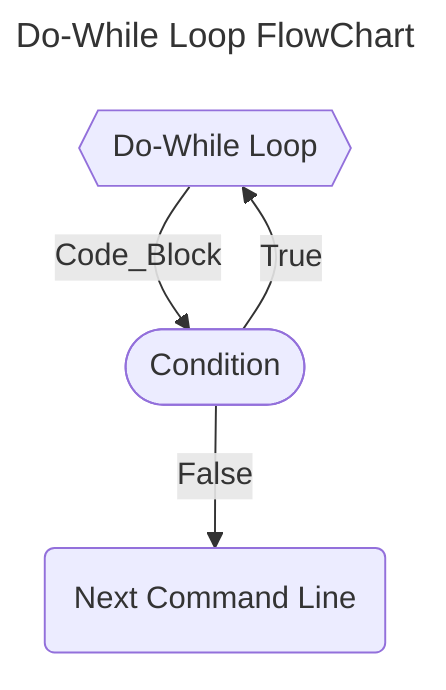
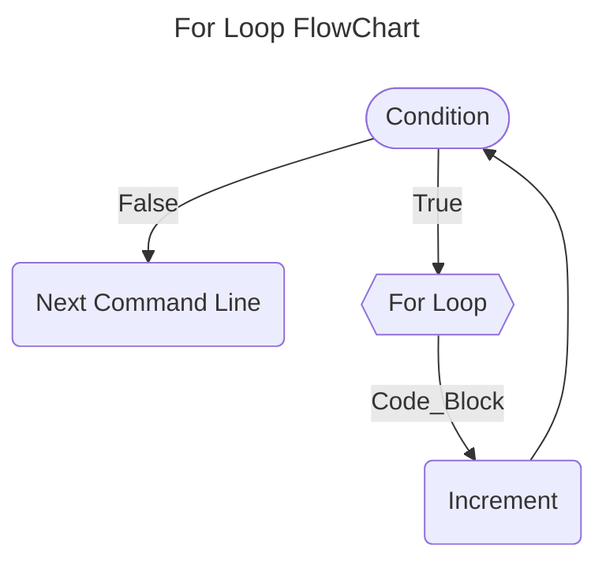

## Loop Structures

Loop structures are fundamental in C programming as they allow the iterative execution of code blocks based on specific conditions. The C language offers three main loop structures: *for*, *while*, and *do-while*. These structures provide efficiency and flexibility in implementing repetitive logic.

### Loop Structures - While Statement

The *while* statement executes a block of commands as long as the specified condition remains true (non-zero). It's used for looping tasks, and the block is executed only if the initial condition is met.

```c
while (condition)
{
  // code block
}
```

The *while* statement is a fundamental looping construct that repeatedly executes a block of commands as long as a specified condition holds *true*. This condition is evaluated at the *beginning of each iteration*, and the loop continues until the condition becomes *false*. 



#### Example: Adding Number Until the Condition is True
```c
#include <stdio.h>

int main(int argc, char *argv[])
{  
  int i, sum;

  sum = i = 0;
  while ( i <= 10 )
  {
    i++;
    sum += 1;
  }

  printf("%d\n", sum);
  return0;
}
```

If the tested condition is a number or a mathematical expression, the loop will be executed until the value of the number or expression becomes equal to zero. 

> *Similar to the if statement, if the command block consists of a single instruction, the curly braces are not necessary.*

#

### Loop Structures - Do-While Statement

The *do-while* loop in C is similar to the *while* loop, with the key distinction that it *executes the code block first before checking the test condition*. In this construct, the instructions within the loop are executed at least once. Moreover, if the tested condition remains true, *the code block will be repeatedly executed until the condition eventually evaluates to false*. 

This loop type ensures the initial execution of the block and is useful when you want to guarantee that the loop's code runs at least once, regardless of the condition's outcome.

```c
do{
  // code block
}while(condition);
```

> *The do-while loop in C ensures that the code block is executed at least once before checking the conditional expression. It's useful when you want to perform an action before testing the condition, ensuring initial execution followed by potential repetition based on the condition's outcome.*




#### Example: Add Numbers Until the User Enters Zero
```c
#include <stdio.h>

int main(int argc, char *argv[])
{  
  double number, sum = 0;

  do {
    printf("Enter a number: ");
    scanf("%lf", &number);
    sum += number;
  }while(number != 0.0);

  printf("%s %2.f", "Sum = ", sum);
  return 0;
}
```

#

### Loop Structures - For Statement

In the *for loop*, the initialization is executed once at the beginning. Then, the loop continues as long as the condition is true. After each iteration, the increment is performed before checking the condition for the next iteration.

```c
for (initialization; condition; increment) {
    // Code to be executed in each iteration
}
```
In the context of the *for loop* in C programming, three essential components work together to control the loop's behavior:

- **Initialization:** The initial value or setup of the loop variable before starting the loop.
- **Condition:** The expression that is evaluated before each iteration. If it's true, the loop continues; if false, the loop terminates.
- **Increment:** The operation that updates the loop variable after each iteration. It can be an increase or decrease in value.

> *These three sections should be separated by a semicolon (;).*

The *for loop* continues execution while the test result is true. As soon as the condition becomes false (equal to zero), the program's execution will be directed to the commands following the for loop.



#### Example: Add Numbers Until The Condition is True
```c
#include <stdio.h>

int main(int argc, char *argv[])
{
  int sum;
  
  sum = 0;
  for(int i = 0; i < 10; ++i)
    sum += i;
  
  printf("%d\n", sum);
  return 0;
}
```

> *Similar to the while and do-while statement, if the command block consists of a single instruction, the curly braces are not necessary.*

#

### Variation of Structure

If the condition is omitted, the loop will become infinite and can be interrupted by using a control statement (break, return, or goto) in the *for loop's* code block.

> *Any of the three instructions that form the *for loop* can be omitted, although the semicolons must remain.*

```c
#include <stdio.h>

int main(int argc, char *argv[])
{
  int n;
  for (;;)
  {
    scanf("%d", &n);
    if (n == 1)
      break;       // This command will be addressed later.
  }
  return 0;
} 
```

> *This code demonstrates how the break command can be used to prematurely exit a loop based on a specific condition.*

When the *increment part* is omitted, no change is made to the control variable. As a result, the loop will either run infinitely, or this modification should be performed within the *for loop's* command block, as shown in the following example:

```c
#include <stdio.h>

int main(int argc, char *argv[])
{
  int n;
  for (n = 0; n != 123;)
    scanf("%d", &n);
  return 0;
} 
```

> *The program uses a for loop with a condition n != 123. The loop continues until the input value n becomes equal to 123, at which point the loop terminates.*

The *for loop* command allows multiple arguments in all three sections. In this case, *the additional arguments should be separated by commas* (,), as illustrated in the example:

```c
#include <stdio.h>

int main(int argc, char *argv[])
{
  int a, b;
  for (a = 0, b = 20; a < b; ++a, --b)
    printf ("%s %d %s %d\n", "a =", a, "b =", b); 
  return 0;
} 
```

> *The loop condition a < b ensures that the loop runs as long as a is less than b. As the loop progresses, a is incremented while b is decremented, resulting in a change in the comparison between them. The loop continues to run until the condition a < b becomes false.*

Finally, both *initialization* and *increment* can be placed outside the *for loop's control parentheses*, as shown in the example:

```c
#include <stdio.h>

int main(int argc, char *argv[])
{
  int a ;

  a = 0;  
  for (; a < 10 ;){
    printf ("%s %d\n", "a =", a);
    a++;
  }
  return 0;
} 
```

> *The loop condition is specified as a < 10, meaning the loop will continue as long as a is less than 10. The a value is then incremented using the a++; statement, ensuring that the loop progresses toward the exit condition.*
