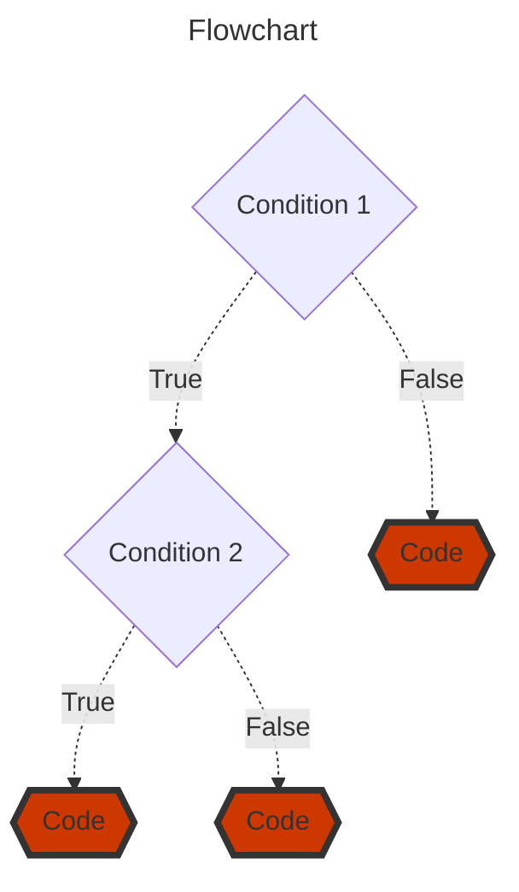

## Conditional Statements

Conditional Statements in programming enable the program to make decisions and execute specific code blocks based on certain conditions, enhancing its flexibility and adaptability.

### Conditional Statements and Truth Tables

Conditional Statements in programming enable diverse execution paths based on logical conditions using "if," "else if," and "else" statements. Utilizing truth tables to evaluate conditions, they systematically ensure precise decision-making, enhancing program functionality and reliability.

```c
int number = 10;    

if ( number > 0 )   
  printf("%s", "It's a positive number");  
```

> *For a better understanding, when a conditional statement is executed, two possible outcomes are provided: true and false. In the previous case, the compiler substitutes the variable "number" with its stored value, resulting in the following evaluation: "Is 10 greater than 0?" . In this instance, the answer is true. As a result, the compiler returns a value other than 0 to the "if()" function, permitting the execution of the subsequent command line.*

Boolean expressions are essential in programming, denoting true/false conditions. They employ logical operators (AND, OR, NOT) to combine or negate conditions, enabling intricate decision-making in code. Evaluating these expressions empowers programs to execute tailored actions based on outcomes, optimizing efficiency and functionality.

> *Any result from a comparison that is a non-zero value is treated as true, whereas 0 is interpreted as false.*

<table>
<tr><th>&nbsp;&nbsp;&nbsp;&nbsp;&nbsp;&nbsp;&nbsp;&nbsp;&nbsp;&nbsp;&nbsp;&nbsp;&nbsp;&nbsp;&nbsp;&nbsp;&nbsp;&nbsp;&nbsp;&nbsp;&nbsp;&nbsp;&nbsp;&nbsp;&nbsp;&nbsp;&nbsp;&nbsp;&nbsp;&nbsp;&nbsp;&nbsp;&nbsp;&nbsp;TRUTH TABLE FOR && &nbsp;&nbsp;&nbsp;&nbsp;&nbsp;&nbsp;&nbsp;&nbsp;&nbsp;&nbsp;&nbsp;&nbsp;&nbsp;&nbsp;&nbsp;&nbsp;&nbsp;&nbsp;&nbsp;&nbsp;&nbsp;&nbsp;&nbsp;&nbsp;&nbsp;&nbsp;&nbsp;&nbsp;&nbsp;&nbsp;&nbsp;&nbsp;&nbsp;&nbsp;&nbsp;&nbsp;&nbsp;</th><th>&nbsp;&nbsp;&nbsp;&nbsp;&nbsp;&nbsp;&nbsp;&nbsp;&nbsp;&nbsp;&nbsp;&nbsp;&nbsp;&nbsp;&nbsp;&nbsp;&nbsp;&nbsp;&nbsp;&nbsp;&nbsp;&nbsp;&nbsp;&nbsp;&nbsp;&nbsp;&nbsp;&nbsp;&nbsp;&nbsp;&nbsp;&nbsp;&nbsp;&nbsp;TRUTH TABLE FOR ||&nbsp;&nbsp;&nbsp;&nbsp;&nbsp;&nbsp;&nbsp;&nbsp;&nbsp;&nbsp;&nbsp;&nbsp;&nbsp;&nbsp;&nbsp;&nbsp;&nbsp;&nbsp;&nbsp;&nbsp;&nbsp;&nbsp;&nbsp;&nbsp;&nbsp;&nbsp;&nbsp;&nbsp;&nbsp;&nbsp;&nbsp;&nbsp;&nbsp;&nbsp;&nbsp;&nbsp;&nbsp;&nbsp;&nbsp;&nbsp;&nbsp;</th></tr>
<tr>
  <td>
  
| &nbsp; &nbsp;&nbsp;&nbsp;&nbsp;&nbsp;Operand 1&nbsp;&nbsp;&nbsp;&nbsp;&nbsp;&nbsp;  | &nbsp;&nbsp;&nbsp;&nbsp;&nbsp;&nbsp;Operand 2&nbsp;&nbsp;&nbsp;&nbsp;&nbsp;&nbsp; | &nbsp;&nbsp;&nbsp;&nbsp;&nbsp;Result (&&)&nbsp;&nbsp;&nbsp;&nbsp;&nbsp;|
|:-----------:|:-----------:|:-------------:|
|   **`false`**   |   **`false`**   |    **`false`**    |
|   **`false`**   |   **`true`**   |    **`false`**    |
|   **`true`**   |   **`false`**   |    **`false`**    |
|   **`true`**   |   **`true`**   |    **`true`**    |

</td>
<td>

| &nbsp; &nbsp;&nbsp;&nbsp;&nbsp;&nbsp;Operand 1&nbsp;&nbsp;&nbsp;&nbsp;&nbsp;&nbsp;  | &nbsp;&nbsp;&nbsp;&nbsp;&nbsp;&nbsp;Operand 2&nbsp;&nbsp;&nbsp;&nbsp;&nbsp;&nbsp; | &nbsp;&nbsp;&nbsp;&nbsp;&nbsp;Result ( \|\| )&nbsp;&nbsp;&nbsp;&nbsp;&nbsp;&nbsp;|
|:-----------:|:-----------:|:-------------:|
|   **`false`**   |   **`false`**   |    **`false`**    |
|   **`false`**   |   **`true`**    |     **`true`**    |
|   **`true`**    |   **`false`**   |     **`true`**    |
|   **`true`**    |   **`true`**    |     **`true`**    |

</td></tr> </table>

</td><td>

#

### Conditional Statement - IF Instruction
The *if* statement is the *primary decision-making* command in C programming. It evaluates the specified condition and, if the condition is true (non-zero), the program executes the following code block.
```c
if (condition)
{
  // code block
}
```
> *The code block should be delimited by an opening curly brace and a closing curly brace. However, if the block consists of only a single command, the curly braces become optional and can be omitted.*

#### Example: Negative Numbers
```c
#include <stdio.h>
int main (int argc, char *argv[])
{
  int a, b;
  
  scanf("%d %d", &a, &b);
  if ( (a < 0) && (b < 0) )
   printf("%s\n", "Both numbers are negative");
  return 0;
}
```

#

### Conditional Statement - ELSE Instruction

Including the *else* clause allows a *second code block* to be executed if the condition tested by the *if* statement is false (equal to zero).

```c
if (condition) {
    // code block 1; Executed when the condition is true
} else {
    // code block 2; Executed when the condition is false
}
```

#### Example: Is Even Number
```c
#include <stdio.h>

int main (int argc, char *argv[])
{
  int number;

  scanf("%d", &number);

  if ( number % 2 == 0 )
    printf("%s", "Even Number");
  else
    printf("%s", "Odd Number");
   return 0;
}
```

> *Note that the blocks of commands are indented (line indentation) within their respective structure. While not mandatory, this indentation is crucial for better code clarity, as it visually identifies the beginning and end of each block.*

#

### Conditional Statement - NESTED IF

Nested if statement in C is the nesting of if statement within another if statement and nesting of if statement with an else statement. Once an else statement gets failed there are times when the next execution of statement wants to return a true statement, there we need nesting of if statement to make the entire flow of code in a semantic order. 

```c
if (condition 1)
{
  if (condition 2){
    // if the statement is true, this code block is executed
  }else{
    // if the statement is false, this code block is executed
  }
}else{
  // if the condition 1 statement is false, this code block is executed
}
```

Nested if statement provides better decision making when other conditions are to be analyzed inside the first condition, and so we can include more than one nested if statement inside an if statement to get the required result.



#### Example: Analysis of People of Certain Age Groups 
```c
#include <stdio.h>
int main (int argc, char *argv[])
{
  int age;

  scanf("%d",&age);

  if ( age < 18 )
  {
    printf("Consider as minor \n");
    printf("Not fit for Working");
  }
  else
  {
    if (age >= 18 && age <= 50 )
    {
      printf("He/She is successfully eligible for Working \n");
      printf("Fill all the details and apply for it\n");
    }
    else
    {
      printf("Age is not satisfactory according to the organization norms\n");
      printf("Ready for retirement and can collect pension \n");
    }
  }
  return 0;
}
```

#

### Conditional Statement - ELSE IF Instruction

The *else if* statement is used to create multiple-choice decisions. It functions similarly to the nesting of if statements within the else clauses of higher-level if statements.

```c
if (condition1) {
  // executed if condition1 is true
} else if (condition2) {
  // executed if the condition1 is false and condition2 is true
} else {
  // executed if the condition1 is false and condition2 is false
}
```

In this structure, the conditional expressions are evaluated in order, and if any of them is true, the corresponding block of commands will be executed, and the chain will be terminated (no other conditions in the structure will be tested).

#### Example: Positive or Negative Number
```c
#include <stdio.h>

int main (int argc, char *argv[])
{
  int number = 10; 
  
  if (number > 0) 
    printf("The value is a positive number.");
  else if (number < 0)
    printf("The value is a negative number.");
  else 
    printf("The value is 0.");
return 0;
}
```

#

### Conditional Statement - Switch Statement  

In a *switch* statement, the computer sequentially compares a variable against a list of constants. If one of the constants described in the case clauses matches the current value of the variable, the computer executes the command or block of commands associated with that option.

This type of structure differs from *if* because it can only test for equality, while *if* can evaluate any type of logical expression.

```c
switch (variable)
{
  case condition:
    // code block
    break;
  case condition:
    // code block
    break;
  (...)
  default:
    // code block
}
```

> *The variable and the conditions must be of either int or char data type.*

The *break* command is used to terminate a sequence of commands. Technically, its usage is optional. However, when omitted, the execution will continue with the commands in the next *case* until the computer encounters a *break* or reaches the end of the *switch-case* structure.

The *deafult* clause is also optional and is used to handle cases that do not match any of the conditions tested in the *case* clauses. If not used, no command will be executed if all *case* options fail.

#### Example: Calculator Using The Switch Command
```c
#include <stdio.h>
#include <stdlib.h>

int main (int argc, char *argv[])
{
    char choice;
    int x, y;
 
    printf("Enter the Operator (+,-,*,/)");
    scanf(" %c", &choice);

    printf("Enter the two numbers: ");
    scanf("%d %d", &x, &y);

    switch (choice) 
    {
      case '+':
          printf("%d + %d = %d\n", x, y, x + y);
          break;
      case '-':
          printf("%d - %d = %d\n", x, y, x - y);
          break;
      case '*':
          printf("%d * %d = %d\n", x, y, x * y);
          break;
      case '/':
          printf("%d / %d = %d\n", x, y, x / y);
          break;
      default:
          printf("Invalid Operator Input\n");
    }
    return 0;
}
```