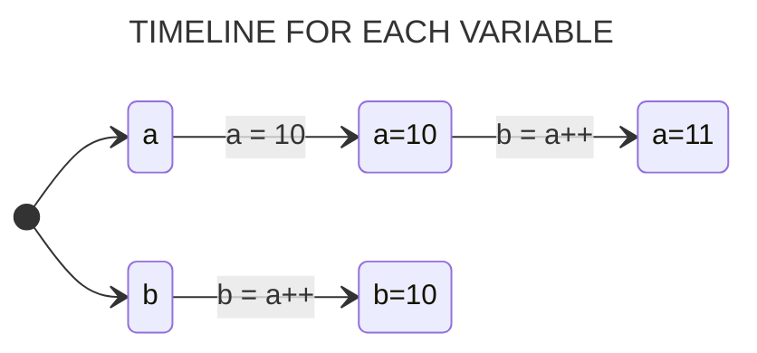

## Operators

C features an extensive set of operators that can be used in the manipulation of variables and constants during program execution.

### Arithmetic Operators

Arithmetic operators are mathematical operators that perform mathematical functions on numbers. 

* `+`  - **Addition Operator**
* `-`  - **Subtraction Operator**
* `*`  - **Multiplication Operator**
* `**` - **Power Operator**
* `/`  - **Division Operator**
* `%`  - **Modulo Division Operator**

A particularity of C relates to the fact that the value returned by an *arithmetic expression* is always of the largest *data type* used in the expression.

#### Example: Division by INTEGER and FLOAT Numbers.

```c
#include <stdio.h>

int main(int argc, char *argv[])
{
  int n1 = 2;
  float n2 = 3.3;

  // We are instructing the program to print an integer value resulting from a division involving a real number
  // which results an error.
  printf("%d", (a / b) );

  // The program will print correctly because it has been instructed to print the result within the realm of real numbers.
  printf("%f", (a / b) );
  return 0;
}
```

> [!NOTE]
> **It is possible to cast the result of some operations, which will be approached later.**

#

### Increment and Decrement Operators

The C language allows the use of the unary operators "++" and "--" to *increment* (add 1) or *decrement* (subtract 1) the value of a variable, respectively.
```julia
++X          // X = X + 1 
X++          // X = X + 1

--X          // X = X - 1 
X--          // X = X - 1 
```
As you can see, these operators can be either *prefixed* or *postfixed*. The difference is that when they are *prefixed*, they increment the variable before using its value. When they are *postfixed*, they use the value of the variable before incrementing it.

#### Example: PostFixed
```julia
int a, b;

a = 10;
b = a++;

FINAL RESULT: a = 11; b = 10;
```



#### Example: PreFixed
```julia
int a, b;

a = 10;
b = ++a;

FINAL RESULT: a = 11; b = 11;
```


#

### Reduced Expressions

Reduced expressions are applied in cases where the same variable is on both sides of the assignment statement. 

| &nbsp;&nbsp;&nbsp;&nbsp;&nbsp;&nbsp;&nbsp;&nbsp;&nbsp;&nbsp;&nbsp;&nbsp;&nbsp;&nbsp;&nbsp;&nbsp;&nbsp;&nbsp;&nbsp;&nbsp;&nbsp;&nbsp;&nbsp;&nbsp;&nbsp;&nbsp;&nbsp;&nbsp;&nbsp;&nbsp;&nbsp;&nbsp;&nbsp;&nbsp;&nbsp;**REDUCED EXPRESSION**&nbsp;&nbsp;&nbsp;&nbsp;&nbsp;&nbsp;&nbsp;&nbsp;&nbsp;&nbsp;&nbsp;&nbsp;&nbsp;&nbsp;&nbsp;&nbsp;&nbsp;&nbsp;&nbsp;&nbsp;&nbsp;&nbsp;&nbsp;&nbsp;&nbsp;&nbsp;&nbsp;&nbsp;&nbsp;&nbsp;&nbsp;&nbsp;&nbsp;&nbsp;&nbsp; | &nbsp;&nbsp;&nbsp;&nbsp;&nbsp;&nbsp;&nbsp;&nbsp;&nbsp;&nbsp;&nbsp;&nbsp;&nbsp;&nbsp;&nbsp;&nbsp;&nbsp;&nbsp;&nbsp;&nbsp;&nbsp;&nbsp;&nbsp;&nbsp;&nbsp;&nbsp;&nbsp;&nbsp;&nbsp;&nbsp;&nbsp;&nbsp;&nbsp;&nbsp;&nbsp;**NORMAL EXPRESSION**&nbsp;&nbsp;&nbsp;&nbsp;&nbsp;&nbsp;&nbsp;&nbsp;&nbsp;&nbsp;&nbsp;&nbsp;&nbsp;&nbsp;&nbsp;&nbsp;&nbsp;&nbsp;&nbsp;&nbsp;&nbsp;&nbsp;&nbsp;&nbsp;&nbsp;&nbsp;&nbsp;&nbsp;&nbsp;&nbsp;&nbsp;&nbsp;&nbsp;&nbsp;&nbsp; |
| :---:                | :---:               |
| **A += 5**          | **A = A + 5**       |
| **B - = 2**        | **B = B – 2**      |
| **C** ***=** **2**           | **C = C * 2**       |
| **D /= 7**           | **D = D / 7**      |
| **E %= 3**           | **E = E % 3**        |

> *Note that this type of expression is very useful for manipulating counting variables and/or accumulators.*

#

### Relational Operators 

Relational operators perform comparisons between expressions, their results are always logical values - *false* equals to 0 and *true* equals to 1.

| &nbsp;&nbsp;&nbsp;&nbsp;&nbsp;&nbsp;&nbsp;&nbsp;&nbsp;&nbsp;&nbsp;&nbsp;&nbsp;&nbsp;&nbsp;&nbsp;&nbsp;&nbsp;&nbsp;&nbsp;&nbsp;&nbsp;&nbsp;&nbsp;&nbsp;&nbsp;&nbsp;&nbsp;&nbsp;&nbsp;&nbsp;&nbsp;&nbsp;&nbsp;&nbsp;&nbsp;&nbsp;&nbsp;&nbsp;&nbsp;&nbsp;&nbsp;&nbsp;&nbsp;&nbsp;&nbsp;**OPERATOR**&nbsp;&nbsp;&nbsp;&nbsp;&nbsp;&nbsp;&nbsp;&nbsp;&nbsp;&nbsp;&nbsp;&nbsp;&nbsp;&nbsp;&nbsp;&nbsp;&nbsp;&nbsp;&nbsp;&nbsp;&nbsp;&nbsp;&nbsp;&nbsp;&nbsp;&nbsp;&nbsp;&nbsp;&nbsp;&nbsp;&nbsp;&nbsp;&nbsp;&nbsp;&nbsp;&nbsp;&nbsp;&nbsp;&nbsp;&nbsp;&nbsp;&nbsp;&nbsp;&nbsp;&nbsp; | &nbsp;&nbsp;&nbsp;&nbsp;&nbsp;&nbsp;&nbsp;&nbsp;&nbsp;&nbsp;&nbsp;&nbsp;&nbsp;&nbsp;&nbsp;&nbsp;&nbsp;&nbsp;&nbsp;&nbsp;&nbsp;&nbsp;&nbsp;&nbsp;&nbsp;&nbsp;&nbsp;&nbsp;&nbsp;&nbsp;&nbsp;&nbsp;&nbsp;&nbsp;&nbsp;&nbsp;&nbsp;&nbsp;&nbsp;&nbsp;&nbsp;&nbsp;&nbsp;&nbsp;&nbsp;&nbsp;**MEANING**&nbsp;&nbsp;&nbsp;&nbsp;&nbsp;&nbsp;&nbsp;&nbsp;&nbsp;&nbsp;&nbsp;&nbsp;&nbsp;&nbsp;&nbsp;&nbsp;&nbsp;&nbsp;&nbsp;&nbsp;&nbsp;&nbsp;&nbsp;&nbsp;&nbsp;&nbsp;&nbsp;&nbsp;&nbsp;&nbsp;&nbsp;&nbsp;&nbsp;&nbsp;&nbsp;&nbsp;&nbsp;&nbsp;&nbsp;&nbsp;&nbsp;&nbsp;&nbsp;&nbsp;&nbsp; |
| :---:                | :---:               |
| `==`         | **EQUAL TO**    |
| `>`         | **GREATER THAN**      |
| `<`          | **LESS THAN**     |
| `>=`          | **GREATER THAN OR EQUAL TO**     |
| `<=`          | **LESS THAN OR EQUAL TO**     |
| `!=`          | **NOT EQUAL TO**     |

> *When using any relational operator, there is always a return value that can either be true or false, otherwsie knokn as a **Boolean** value.*

#

### Logical Operators

Logical operators can be used to combine two or more relational operations into a single conditional test (binary operators AND and OR) or modify the result of a relational operation (unary operator NOT).

| &nbsp;&nbsp;&nbsp;&nbsp;&nbsp;&nbsp;&nbsp;&nbsp;&nbsp;&nbsp;&nbsp;&nbsp;&nbsp;&nbsp;&nbsp;&nbsp;&nbsp;&nbsp;&nbsp;&nbsp;&nbsp;&nbsp;&nbsp;&nbsp;&nbsp;&nbsp;&nbsp;&nbsp;&nbsp;&nbsp;&nbsp;&nbsp;&nbsp;&nbsp;&nbsp;&nbsp;&nbsp;&nbsp;&nbsp;&nbsp;&nbsp;&nbsp;&nbsp;&nbsp;&nbsp;&nbsp;**OPERATOR**&nbsp;&nbsp;&nbsp;&nbsp;&nbsp;&nbsp;&nbsp;&nbsp;&nbsp;&nbsp;&nbsp;&nbsp;&nbsp;&nbsp;&nbsp;&nbsp;&nbsp;&nbsp;&nbsp;&nbsp;&nbsp;&nbsp;&nbsp;&nbsp;&nbsp;&nbsp;&nbsp;&nbsp;&nbsp;&nbsp;&nbsp;&nbsp;&nbsp;&nbsp;&nbsp;&nbsp;&nbsp;&nbsp;&nbsp;&nbsp;&nbsp;&nbsp;&nbsp;&nbsp;&nbsp; | &nbsp;&nbsp;&nbsp;&nbsp;&nbsp;&nbsp;&nbsp;&nbsp;&nbsp;&nbsp;&nbsp;&nbsp;&nbsp;&nbsp;&nbsp;&nbsp;&nbsp;&nbsp;&nbsp;&nbsp;&nbsp;&nbsp;&nbsp;&nbsp;&nbsp;&nbsp;&nbsp;&nbsp;&nbsp;&nbsp;&nbsp;&nbsp;&nbsp;&nbsp;&nbsp;&nbsp;&nbsp;&nbsp;&nbsp;&nbsp;&nbsp;&nbsp;&nbsp;&nbsp;&nbsp;**MEANING**&nbsp;&nbsp;&nbsp;&nbsp;&nbsp;&nbsp;&nbsp;&nbsp;&nbsp;&nbsp;&nbsp;&nbsp;&nbsp;&nbsp;&nbsp;&nbsp;&nbsp;&nbsp;&nbsp;&nbsp;&nbsp;&nbsp;&nbsp;&nbsp;&nbsp;&nbsp;&nbsp;&nbsp;&nbsp;&nbsp;&nbsp;&nbsp;&nbsp;&nbsp;&nbsp;&nbsp;&nbsp;&nbsp;&nbsp;&nbsp;&nbsp;&nbsp;&nbsp;&nbsp;&nbsp;&nbsp; |
| :---:                | :---:               |
| `&&`         | **AND**    |
| `\|\|`       | **OR**      |
| `!`          | **NOT**     |


#### Example: Number Delimited By A Range
```c
#include <stdio.h>

int main(int argc, char *argv[])
{
  int a;
  
  a = 3;
  
  if ( (a > 0) && (a < 10) ) 
  {
      printf("%s", "The number is greater than 0 and less than 10 ");
  }
  return 0;
}
```
> *Operands on **both** the left and right sides of && need to be **true** for the condition to be true.*

#### Example: Checking a Negative Number
```c
#include <stdio.h>

int main(int argc, char *argv[])
{
  int a, b;
  
  a = 3;
  b = -2;
  
  if ( (a < 0) || (b < 0) )
    printf("%s", "At least one of the numbers are negative"); 
  return 0;
}
```
> *At least one or **both** of the operands on the right and left sides of || need to be **true** for the condition to be true.*


#### Example: Even Number Using NOT Operator
```c
#include <stdio.h>

int main(int argc, char *argv[])
{
  int a;

  a = 2;
    
  if ( !(a % 2 != 0) ) 
    printf("%s", "Even");
  return 0;
}
```
> *This **inverts** the value of the operand. If an operand is true, then the NOT operator makes the condition false and vice versa.*

#

### Ternary Operator 

The ternary operator `?` allows for conditional value assignment to a variable.

```julia
variable = condition ? expression1 (true) : expression2; (false)
```

In this structure, the condition is tested, and if it's **true**, *expression1* is taken; otherwise, *expression2* is adopted. To exemplify its usage, here's a snippet of a program that assigns the variable Z the greater value between variables A and B.

```julia
Z = (A > B) ? A : B;
```

Another way to write this command would be:

```julia
if (A > B)
  Z = A;
else
  Z = B;
```

#

### Casting Data Types 

When an expression combines variables of different *data types*, the C compiler checks whether conversions between these types are possible. If they are not, the compilation process is halted, and an error message is displayed. Otherwise, the compiler performs all necessary conversions, following the following rules:

1. *All *char* and *short int* values are converted to *int*. All *float* values are converted to *double*.*
2. *For pairs of operands with different types: those with *lower capacity* are converted to those with *higher capacity* (e.g., if one of them is *long double*, the other is also converted to *long double*).*

Furthermore, the programmer can force the result of an expression to be of a specific type. To do this, they should use *cast operators*.

```julia
variable = (datatype) expression;
```
#

#### Example: Explicit Type Casting in C
```c
#include <stdio.h>

int main(int argc, char *argv[])
{
  float number = 32.8;

  int a = (int) number + 10;

  printf("%d", a);
  return 0;
}
```

#### Example: The Conversion of Char to Int
```c
#include <stdio.h>

int main(int argc, char *argv[])
{
  char x;
  int number, total;

  x = 'x';
  number = 10;
  total = (int) x + number;  // total = x + number; also works (rule 1)
  
  printf("%d", total);
  return 0;
}
```

> *Although the compiler performs some conversions automatically as described previously, it's considered a good programming practice to explicitly declare and inform the program about the necessary casting to be done.*

#

### Operator Precedence

Operator precedence defines the order in which operators are evaluated in an expression. It determines how the terms are grouped and how the expression is calculated. Some operators have higher precedence than others. For instance, the *multiplication* operator has a **higher** precedence than the *addition* operator.

| &nbsp;&nbsp;&nbsp;&nbsp;&nbsp;&nbsp;&nbsp;&nbsp;&nbsp;&nbsp;&nbsp;&nbsp;&nbsp;&nbsp;&nbsp;&nbsp;**Category**&nbsp;&nbsp;&nbsp;&nbsp;&nbsp;&nbsp;&nbsp;&nbsp;&nbsp;&nbsp;&nbsp;&nbsp;&nbsp;&nbsp;&nbsp;&nbsp;|	  &nbsp;&nbsp;&nbsp;&nbsp;&nbsp;&nbsp;&nbsp;&nbsp;&nbsp;&nbsp;&nbsp;&nbsp;&nbsp;&nbsp;&nbsp;&nbsp;&nbsp;&nbsp;&nbsp;&nbsp;&nbsp;&nbsp;&nbsp;&nbsp;&nbsp;&nbsp;&nbsp;&nbsp;&nbsp;&nbsp;&nbsp;&nbsp;&nbsp;&nbsp;&nbsp;&nbsp;&nbsp;&nbsp;&nbsp;&nbsp;&nbsp;&nbsp;&nbsp;&nbsp;&nbsp;&nbsp;&nbsp;&nbsp;**Operator**&nbsp;&nbsp;&nbsp;&nbsp;&nbsp;&nbsp;&nbsp;&nbsp;&nbsp;&nbsp;&nbsp;&nbsp;&nbsp;&nbsp;&nbsp;&nbsp;&nbsp;&nbsp;&nbsp;&nbsp;&nbsp;&nbsp;&nbsp;&nbsp;&nbsp;&nbsp;&nbsp;&nbsp;&nbsp;&nbsp;&nbsp;&nbsp;&nbsp;&nbsp;&nbsp;&nbsp;&nbsp;&nbsp;&nbsp;&nbsp;&nbsp;&nbsp;&nbsp;&nbsp;&nbsp;&nbsp;&nbsp;&nbsp;                  | &nbsp;&nbsp;&nbsp;&nbsp;&nbsp;&nbsp;&nbsp;&nbsp;&nbsp;&nbsp;&nbsp;&nbsp;&nbsp;&nbsp;&nbsp;&nbsp;**Associativity**&nbsp;&nbsp;&nbsp;&nbsp;&nbsp;&nbsp;&nbsp;&nbsp;&nbsp;&nbsp;&nbsp;&nbsp;&nbsp;&nbsp;&nbsp;&nbsp;|
| :---:           |         :---:                         | :---:             |
| Postfix	        |   () [] -> . ++ - -                   | Left to right     |
| Unary	          |   + - ! ~ ++ - - (type)* & sizeof	    | Right to left     | 
| Multiplicative	|   * / %	                              | Left to right     | 
| Additive	      |   + -	                                | Left to right     | 
| Shift	          |   << >>	                              | Left to right     | 
| Relational	    |   < <= > >=                           | Left to right     | 
| Equality	      |    == !=	                            | Left to right     | 
| Logical AND	    |    &&	                                | Left to right     | 
| Logical OR	    |    \|\|	                              | Left to right     | 
| Conditional	    |   ?:	                                | Right to left     | 
| Assignment	    |   = += -= *= /= %=>>= <<= &= ^= \|=	  | Right to left     | 

> *Here, operators with the highest precedence appear at the top of the table, those with the lowest appear at the bottom. Within an expression, higher precedence operators will be evaluated first.*
