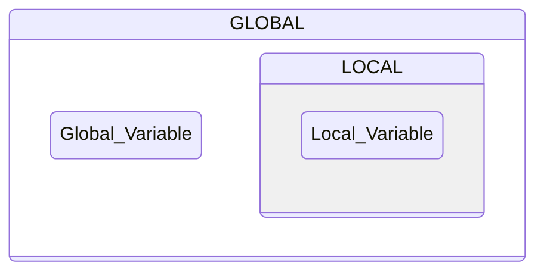

## The Scope of a Variable in C

The scope of a variable refers to where the variable can be referenced and accessed from. It is essentially where the variable lives and is valid and how visible it is to the rest of the program.



**Local Scope:** If a variable is declared within a set of culry braces, {}, that will be its scope and we can't access it and use it outside those braces in the rest of the program. 

> *Therefore it is not a good idea to declare variables that way since their scope and use is so limited which can lead to errors. This scope is called local scope.*

**Global Scope:** If variables are declared outside of functions, they have global scope. Having a global scope means they are visible within the whole program and can be accessed from anywhere.

> *But keep in mind that it can be difficult to keep track of them. Also, any changes we make to them along the way can get confusing since they can happen in any part and location of the program.*

```c
#include <stdio.h>

float mean, n1, n2;     // Declaration of global variables.

int main(int argc, char *argv[])
{
  n1 = 10;
  n2 = 8;

  mean = ( n1 + n2 ) / 2;
  printf("%s%f", "Mean: ", mean); 
  return 0;
}
```